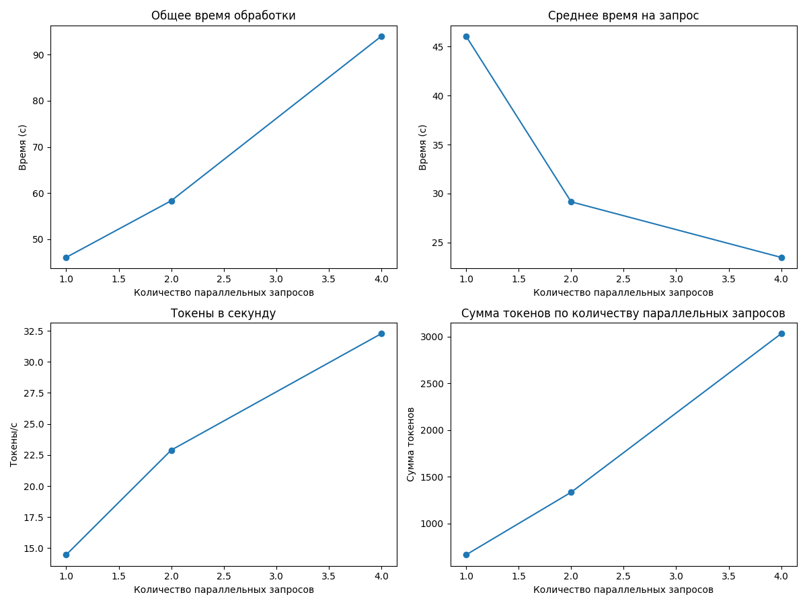
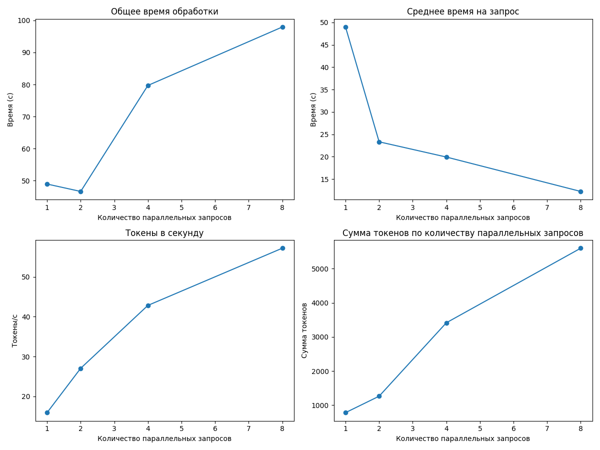
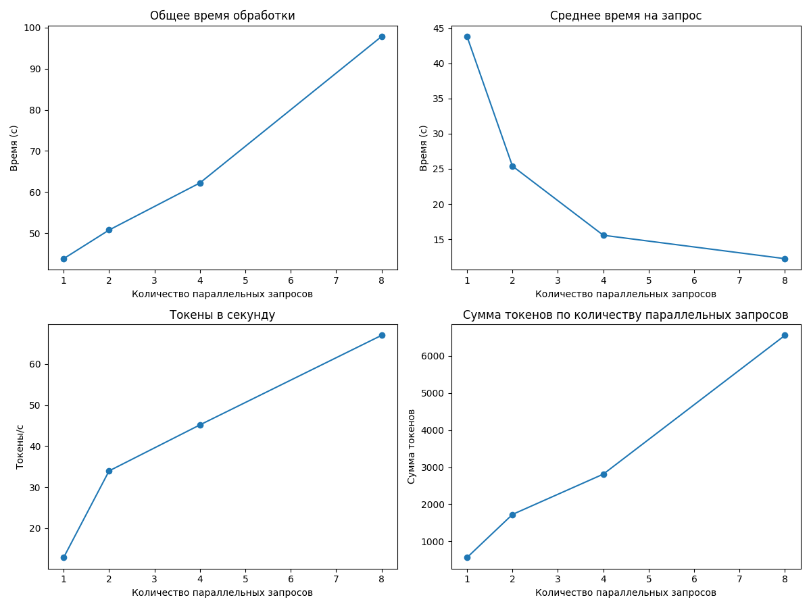
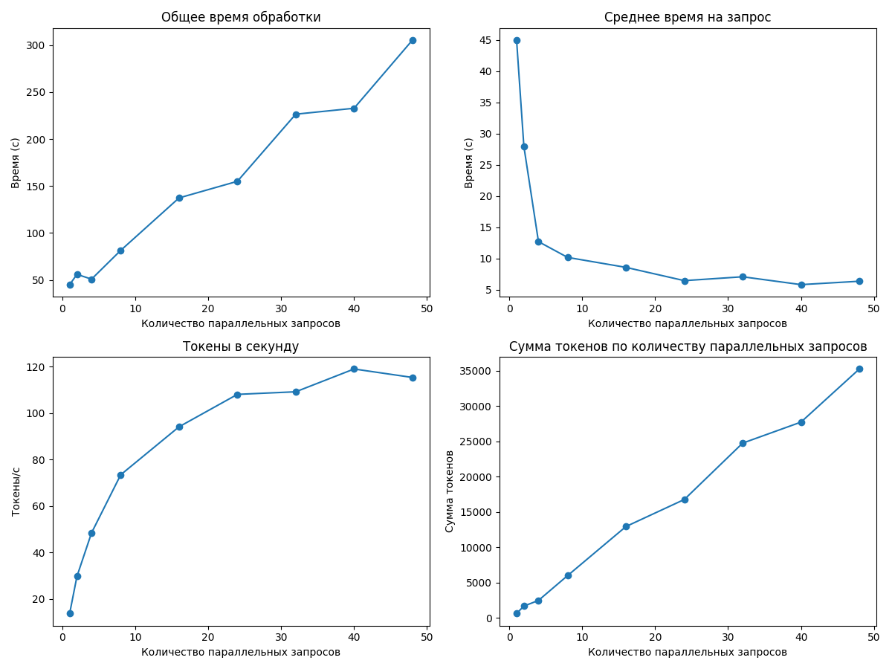
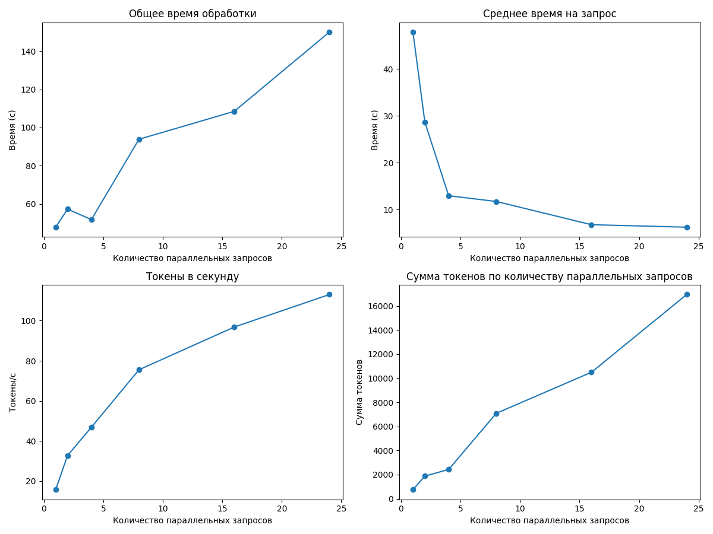
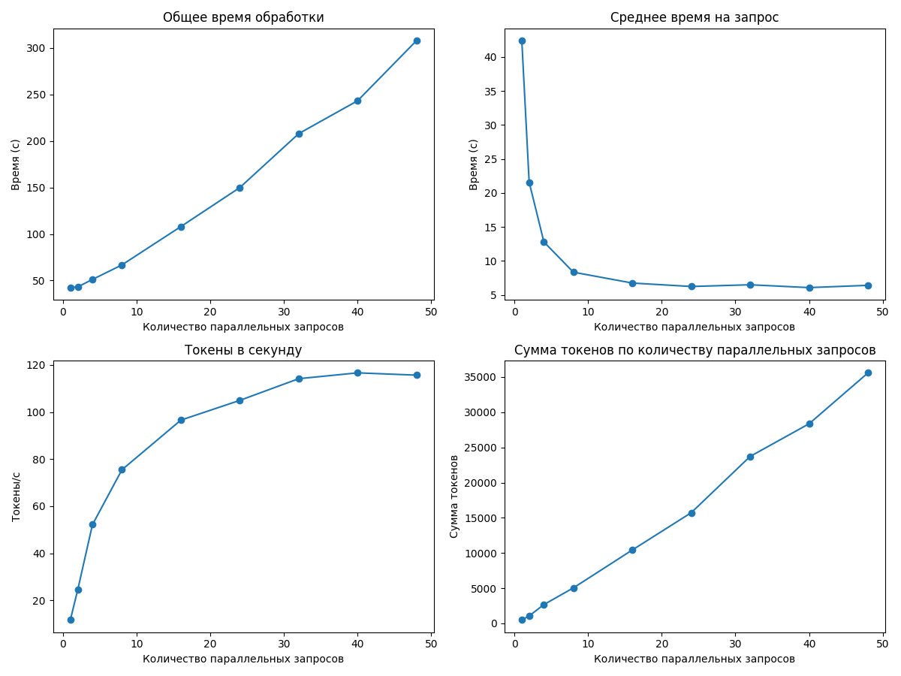
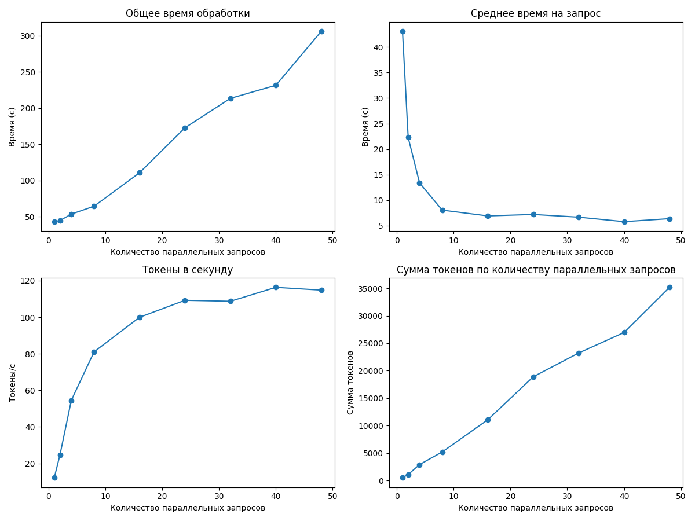
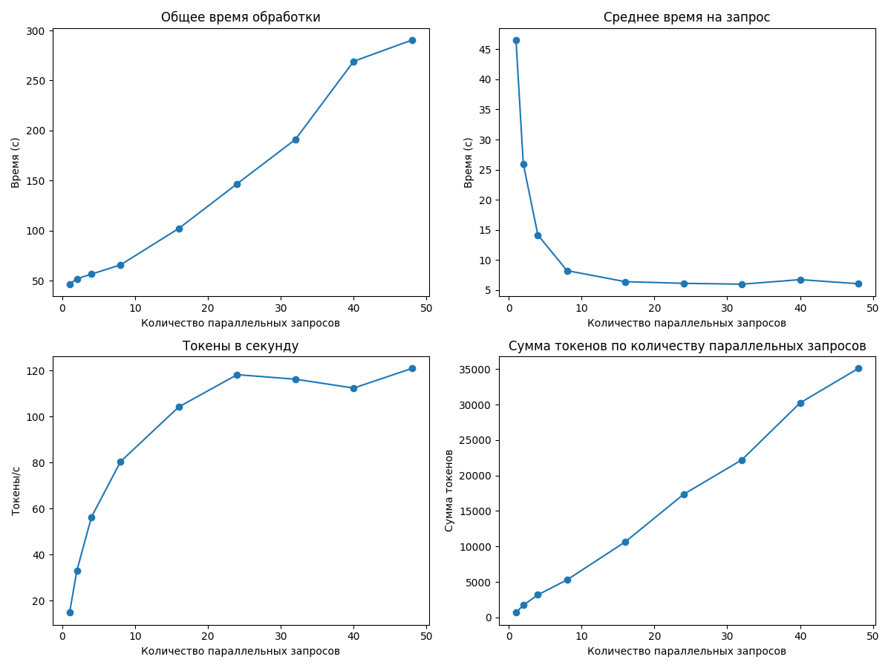

# Отчет о производительности для deepseek-r1:8b

## Итоговые выводы по всем прогонам

### Оптимальные параметры для разного количества параллельных запросов

|   Количество workers |   Оптимальный размер пакета |   Максимальная скорость (токены/сек) |
|---------------------:|----------------------------:|-------------------------------------:|
|                    1 |                           4 |                              32.2626 |
|                    2 |                           8 |                              57.1888 |
|                    3 |                           8 |                              67.014  |
|                    4 |                          40 |                             119.041  |
|                    5 |                          24 |                             113.023  |
|                    6 |                          40 |                             116.676  |
|                    8 |                          40 |                             116.369  |
|                   10 |                          48 |                             120.853  |
|                   12 |                          48 |                              31.8703 |
|                   15 |                          40 |                              22.9519 |

### Наилучшая конфигурация для данного оборудования

- **Количество workers:** 10
- **Оптимальный размер пакета:** 48
- **Скорость обработки:** 120.85 токенов/сек

---

## Детальные результаты по каждому прогону

### Результаты для 1 параллельных запросов

#### Таблица результатов

|   Количество параллельных запросов |   Общее время (с) |   Среднее время на запрос (с) |   Токены в секунду |   Сумма токенов |
|-----------------------------------:|------------------:|------------------------------:|-------------------:|----------------:|
|                                  1 |           46.0353 |                       46.0353 |            14.4672 |             666 |
|                                  2 |           58.3202 |                       29.1601 |            22.8909 |            1335 |
|                                  4 |           93.9786 |                       23.4947 |            32.2626 |            3032 |

**Оптимальный размер пакета:** 4

**Максимальная скорость обработки:** 32.26 токенов в секунду

---

### Результаты для 2 параллельных запросов

#### Таблица результатов

|   Количество параллельных запросов |   Общее время (с) |   Среднее время на запрос (с) |   Токены в секунду |   Сумма токенов |
|-----------------------------------:|------------------:|------------------------------:|-------------------:|----------------:|
|                                  1 |           48.9628 |                       48.9628 |            15.9509 |             781 |
|                                  2 |           46.6523 |                       23.3261 |            27.0726 |            1263 |
|                                  4 |           79.7098 |                       19.9274 |            42.8429 |            3415 |
|                                  8 |           97.9387 |                       12.2423 |            57.1888 |            5601 |

**Оптимальный размер пакета:** 8

**Максимальная скорость обработки:** 57.19 токенов в секунду

---

### Результаты для 3 параллельных запросов

#### Таблица результатов

|   Количество параллельных запросов |   Общее время (с) |   Среднее время на запрос (с) |   Токены в секунду |   Сумма токенов |
|-----------------------------------:|------------------:|------------------------------:|-------------------:|----------------:|
|                                  1 |           43.8268 |                       43.8268 |            12.846  |             563 |
|                                  2 |           50.7893 |                       25.3946 |            33.9639 |            1725 |
|                                  4 |           62.2388 |                       15.5597 |            45.1808 |            2812 |
|                                  8 |           97.8302 |                       12.2288 |            67.014  |            6556 |

**Оптимальный размер пакета:** 8

**Максимальная скорость обработки:** 67.01 токенов в секунду

---

### Результаты для 4 параллельных запросов

#### Таблица результатов

|   Количество параллельных запросов |   Общее время (с) |   Среднее время на запрос (с) |   Токены в секунду |   Сумма токенов |
|-----------------------------------:|------------------:|------------------------------:|-------------------:|----------------:|
|                                  1 |           44.9727 |                      44.9727  |            13.7194 |             617 |
|                                  2 |           55.8965 |                      27.9483  |            29.6977 |            1660 |
|                                  4 |           50.8174 |                      12.7044  |            48.4283 |            2461 |
|                                  8 |           81.4135 |                      10.1767  |            73.4645 |            5981 |
|                                 16 |          137.289  |                       8.58053 |            94.1375 |           12924 |
|                                 24 |          154.961  |                       6.45671 |           108.105  |           16752 |
|                                 32 |          226.435  |                       7.07608 |           109.219  |           24731 |
|                                 40 |          232.753  |                       5.81881 |           119.041  |           27707 |
|                                 48 |          305.269  |                       6.35976 |           115.393  |           35226 |

**Оптимальный размер пакета:** 40

**Максимальная скорость обработки:** 119.04 токенов в секунду

---

### Результаты для 5 параллельных запросов

#### Таблица результатов

|   Количество параллельных запросов |   Общее время (с) |   Среднее время на запрос (с) |   Токены в секунду |   Сумма токенов |
|-----------------------------------:|------------------:|------------------------------:|-------------------:|----------------:|
|                                  1 |           47.8669 |                      47.8669  |            15.7311 |             753 |
|                                  2 |           57.3252 |                      28.6626  |            32.7779 |            1879 |
|                                  4 |           51.8354 |                      12.9589  |            46.8405 |            2428 |
|                                  8 |           93.8714 |                      11.7339  |            75.5182 |            7089 |
|                                 16 |          108.446  |                       6.77789 |            96.7946 |           10497 |
|                                 24 |          149.952  |                       6.24801 |           113.023  |           16948 |

**Оптимальный размер пакета:** 24

**Максимальная скорость обработки:** 113.02 токенов в секунду

---

### Результаты для 6 параллельных запросов

#### Таблица результатов

|   Количество параллельных запросов |   Общее время (с) |   Среднее время на запрос (с) |   Токены в секунду |   Сумма токенов |
|-----------------------------------:|------------------:|------------------------------:|-------------------:|----------------:|
|                                  1 |           42.4215 |                      42.4215  |            11.6686 |             495 |
|                                  2 |           43.1697 |                      21.5848  |            24.4385 |            1055 |
|                                  4 |           51.179  |                      12.7948  |            52.1503 |            2669 |
|                                  8 |           66.7666 |                       8.34582 |            75.4719 |            5039 |
|                                 16 |          107.935  |                       6.74594 |            96.5766 |           10424 |
|                                 24 |          149.786  |                       6.2411  |           104.97   |           15723 |
|                                 32 |          207.726  |                       6.49145 |           114.194  |           23721 |
|                                 40 |          243.067  |                       6.07667 |           116.676  |           28360 |
|                                 48 |          307.671  |                       6.4098  |           115.695  |           35596 |

**Оптимальный размер пакета:** 40

**Максимальная скорость обработки:** 116.68 токенов в секунду

---

### Результаты для 8 параллельных запросов

#### Таблица результатов

|   Количество параллельных запросов |   Общее время (с) |   Среднее время на запрос (с) |   Токены в секунду |   Сумма токенов |
|-----------------------------------:|------------------:|------------------------------:|-------------------:|----------------:|
|                                  1 |           43.0963 |                      43.0963  |            12.1588 |             524 |
|                                  2 |           44.578  |                      22.289   |            24.6086 |            1097 |
|                                  4 |           53.5425 |                      13.3856  |            54.5174 |            2919 |
|                                  8 |           64.4223 |                       8.05279 |            81.0434 |            5221 |
|                                 16 |          110.683  |                       6.91768 |            99.9703 |           11065 |
|                                 24 |          172.873  |                       7.20306 |           109.259  |           18888 |
|                                 32 |          213.595  |                       6.67484 |           108.734  |           23225 |
|                                 40 |          231.651  |                       5.79128 |           116.369  |           26957 |
|                                 48 |          306.341  |                       6.3821  |           114.836  |           35179 |

**Оптимальный размер пакета:** 40

**Максимальная скорость обработки:** 116.37 токенов в секунду

---

### Результаты для 10 параллельных запросов

#### Таблица результатов

|   Количество параллельных запросов |   Общее время (с) |   Среднее время на запрос (с) |   Токены в секунду |   Сумма токенов |
|-----------------------------------:|------------------:|------------------------------:|-------------------:|----------------:|
|                                  1 |           46.5273 |                      46.5273  |            14.787  |             688 |
|                                  2 |           51.9743 |                      25.9872  |            32.9971 |            1715 |
|                                  4 |           56.5856 |                      14.1464  |            56.2511 |            3183 |
|                                  8 |           65.8353 |                       8.22941 |            80.3824 |            5292 |
|                                 16 |          102.244  |                       6.39022 |           104.163  |           10650 |
|                                 24 |          146.837  |                       6.11822 |           118.138  |           17347 |
|                                 32 |          191.12   |                       5.97251 |           116.189  |           22206 |
|                                 40 |          269.176  |                       6.7294  |           112.328  |           30236 |
|                                 48 |          290.369  |                       6.04935 |           120.853  |           35092 |

**Оптимальный размер пакета:** 48

**Максимальная скорость обработки:** 120.85 токенов в секунду

---

### Результаты для 12 параллельных запросов

#### Таблица результатов

|   Количество параллельных запросов |   Общее время (с) |   Среднее время на запрос (с) |   Токены в секунду |   Сумма токенов |
|-----------------------------------:|------------------:|------------------------------:|-------------------:|----------------:|
|                                  1 |           17.8981 |                      17.8981  |            12.0124 |             215 |
|                                  2 |           28.4375 |                      14.2188  |            14.9099 |             424 |
|                                  4 |           39.1095 |                       9.77738 |            21.6571 |             847 |
|                                  8 |           60.8652 |                       7.60815 |            27.9141 |            1699 |
|                                 16 |          123.253  |                       7.70333 |            27.5855 |            3400 |
|                                 24 |          162.716  |                       6.77983 |            31.1463 |            5068 |
|                                 32 |          222.851  |                       6.96408 |            30.5361 |            6805 |
|                                 40 |          283.183  |                       7.07958 |            30.0053 |            8497 |
|                                 48 |          320.267  |                       6.67222 |            31.8703 |           10207 |

**Оптимальный размер пакета:** 48

**Максимальная скорость обработки:** 31.87 токенов в секунду

---

### Результаты для 15 параллельных запросов

#### Таблица результатов

|   Количество параллельных запросов |   Общее время (с) |   Среднее время на запрос (с) |   Токены в секунду |   Сумма токенов |
|-----------------------------------:|------------------:|------------------------------:|-------------------:|----------------:|
|                                  1 |           20.5243 |                      20.5243  |            10.4267 |             214 |
|                                  2 |           41.7531 |                      20.8765  |            10.0591 |             420 |
|                                  4 |           55.4379 |                      13.8595  |            14.9176 |             827 |
|                                  8 |           89.0993 |                      11.1374  |            19.2706 |            1717 |
|                                 16 |          158.943  |                       9.93394 |            21.5549 |            3426 |
|                                 24 |          232.027  |                       9.66779 |            22.144  |            5138 |
|                                 32 |          312.401  |                       9.76255 |            21.7028 |            6780 |
|                                 40 |          370.993  |                       9.27483 |            22.9519 |            8515 |
|                                 48 |          449.017  |                       9.35453 |            22.6005 |           10148 |

**Оптимальный размер пакета:** 40

**Максимальная скорость обработки:** 22.95 токенов в секунду

---

