# Отчет о производительности для gemma3:4b-q8

## Итоговые выводы по всем прогонам

### Оптимальные параметры для разного количества параллельных запросов

|   Количество workers |   Оптимальный размер пакета |   Максимальная скорость (токены/сек) |
|-----------------------------------:|----------------------------:|-------------------------------------:|
|                                  4 |                          40 |                              255.415 |
|                                  6 |                          48 |                              201.193 |
|                                  8 |                          48 |                              220.49  |
|                                 10 |                          48 |                              249.895 |
|                                 12 |                          48 |                              282.1   |
|                                 15 |                          40 |                              282.864 |
|                                 18 |                          48 |                              303.586 |
|                                 20 |                          40 |                              340.454 |
|                                 22 |                          40 |                              323.981 |
|                                 24 |                          24 |                              345.392 |
|                                 30 |                          48 |                              233.584 |
|                                 35 |                          24 |                              286.761 |
|                                 40 |                          24 |                              287.555 |
|                                 50 |                          48 |                              117.812 |

### Наилучшая конфигурация для данного оборудования

- **Количество workers:** 24
- **Оптимальный размер пакета:** 24
- **Скорость обработки:** 345.39 токенов/сек

---

## Детальные результаты по каждому прогону

### Результаты для 4 параллельных запросов

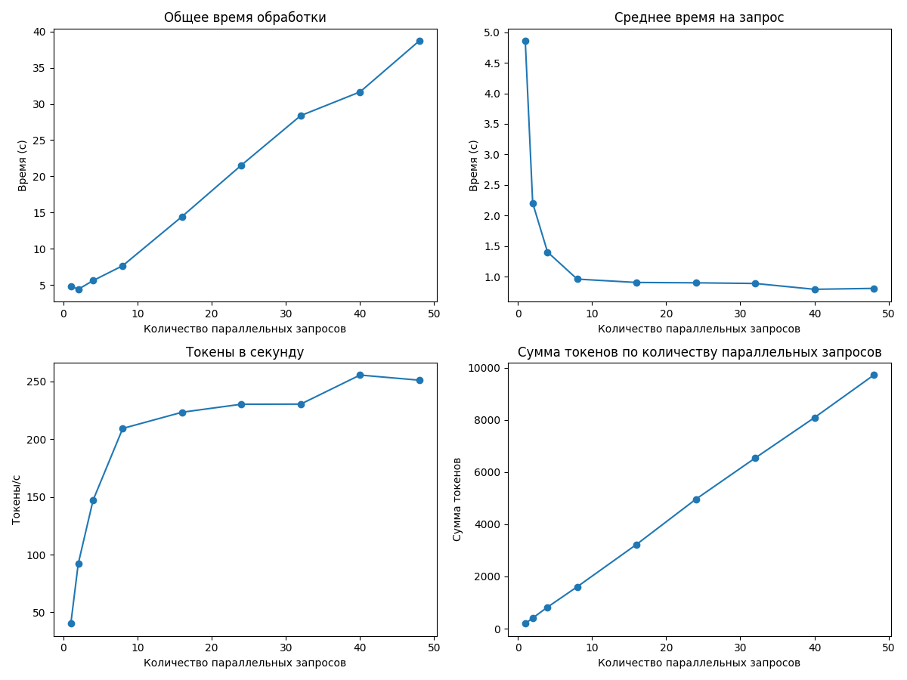

#### Таблица результатов

|   Количество параллельных запросов |   Общее время (с) |   Среднее время на запрос (с) |   Токены в секунду |   Сумма токенов |
|-----------------------------------:|------------------:|------------------------------:|-------------------:|----------------:|
|                                  1 |           4.86047 |                      4.86047  |            40.3253 |             196 |
|                                  2 |           4.40763 |                      2.20381  |            92.1131 |             406 |
|                                  4 |           5.60921 |                      1.4023   |           147.08   |             825 |
|                                  8 |           7.66725 |                      0.958406 |           209.202  |            1604 |
|                                 16 |          14.4558  |                      0.90349  |           223.232  |            3227 |
|                                 24 |          21.5454  |                      0.897725 |           230.165  |            4959 |
|                                 32 |          28.385   |                      0.887032 |           230.262  |            6536 |
|                                 40 |          31.6583  |                      0.791458 |           255.415  |            8086 |
|                                 48 |          38.7132  |                      0.806525 |           250.974  |            9716 |

**Оптимальный размер пакета:** 40

**Максимальная скорость обработки:** 255.41 токенов в секунду

---

### Результаты для 6 параллельных запросов

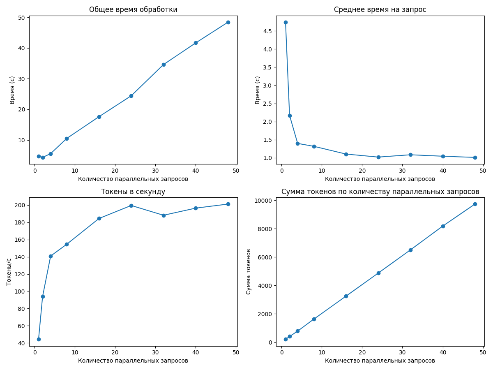

#### Таблица результатов

|   Количество параллельных запросов |   Общее время (с) |   Среднее время на запрос (с) |   Токены в секунду |   Сумма токенов |
|-----------------------------------:|------------------:|------------------------------:|-------------------:|----------------:|
|                                  1 |           4.74247 |                       4.74247 |            44.2807 |             210 |
|                                  2 |           4.33618 |                       2.16809 |            93.8613 |             407 |
|                                  4 |           5.57855 |                       1.39464 |           140.897  |             786 |
|                                  8 |          10.524   |                       1.3155  |           154.599  |            1627 |
|                                 16 |          17.6115  |                       1.10072 |           184.481  |            3249 |
|                                 24 |          24.4221  |                       1.01759 |           199.574  |            4874 |
|                                 32 |          34.5878  |                       1.08087 |           188.217  |            6510 |
|                                 40 |          41.6505  |                       1.04126 |           196.492  |            8184 |
|                                 48 |          48.3913  |                       1.00815 |           201.193  |            9736 |

**Оптимальный размер пакета:** 48

**Максимальная скорость обработки:** 201.19 токенов в секунду

---

### Результаты для 8 параллельных запросов

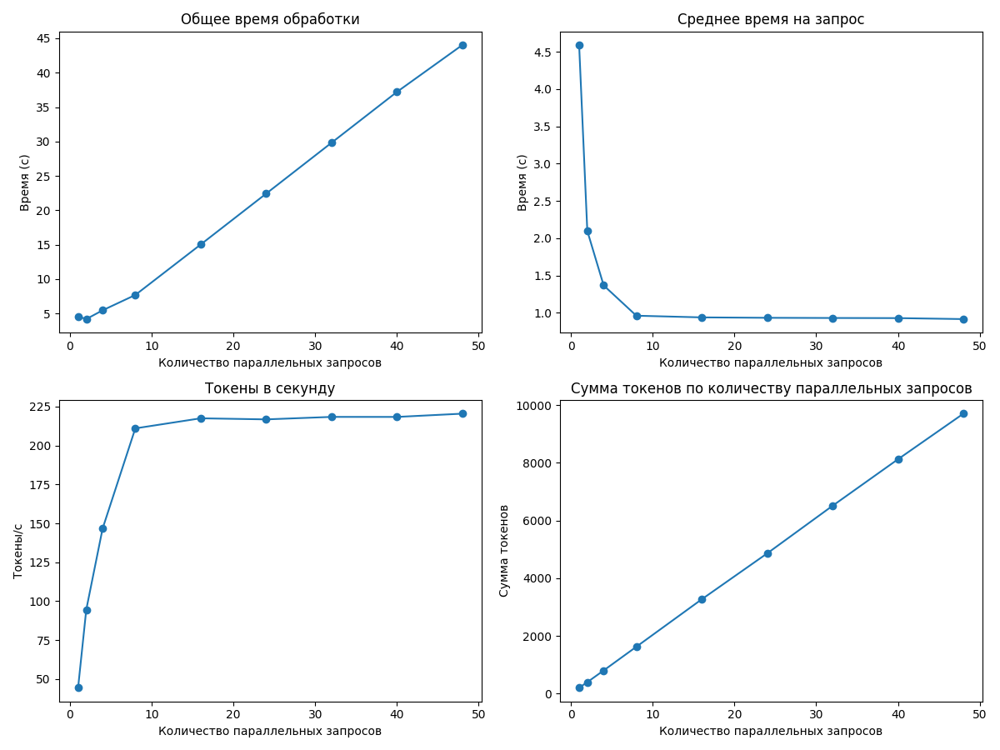

#### Таблица результатов

|   Количество параллельных запросов |   Общее время (с) |   Среднее время на запрос (с) |   Токены в секунду |   Сумма токенов |
|-----------------------------------:|------------------:|------------------------------:|-------------------:|----------------:|
|                                  1 |           4.58966 |                      4.58966  |            44.4477 |             204 |
|                                  2 |           4.19763 |                      2.09882  |            94.5771 |             397 |
|                                  4 |           5.47369 |                      1.36842  |           146.702  |             803 |
|                                  8 |           7.69981 |                      0.962477 |           211.044  |            1625 |
|                                 16 |          15.0381  |                      0.939882 |           217.514  |            3271 |
|                                 24 |          22.4243  |                      0.934346 |           216.818  |            4862 |
|                                 32 |          29.8197  |                      0.931867 |           218.412  |            6513 |
|                                 40 |          37.2079  |                      0.930197 |           218.395  |            8126 |
|                                 48 |          44.0246  |                      0.917179 |           220.49   |            9707 |

**Оптимальный размер пакета:** 48

**Максимальная скорость обработки:** 220.49 токенов в секунду

---

### Результаты для 10 параллельных запросов

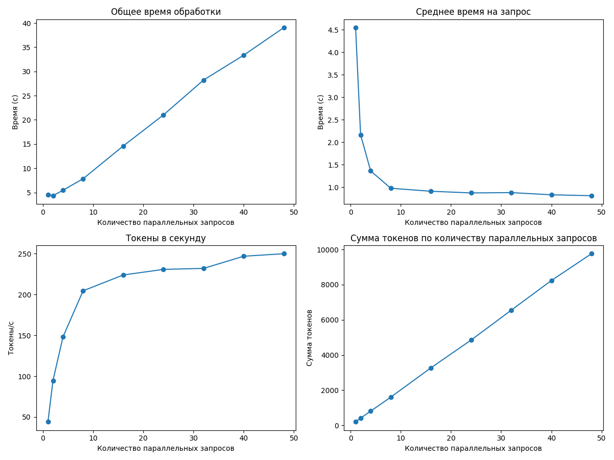

#### Таблица результатов

|   Количество параллельных запросов |   Общее время (с) |   Среднее время на запрос (с) |   Токены в секунду |   Сумма токенов |
|-----------------------------------:|------------------:|------------------------------:|-------------------:|----------------:|
|                                  1 |           4.54793 |                      4.54793  |            44.196  |             201 |
|                                  2 |           4.33095 |                      2.16547  |            94.6676 |             410 |
|                                  4 |           5.4595  |                      1.36487  |           148.182  |             809 |
|                                  8 |           7.83379 |                      0.979224 |           204.499  |            1602 |
|                                 16 |          14.6021  |                      0.912629 |           223.872  |            3269 |
|                                 24 |          21.0095  |                      0.875397 |           230.705  |            4847 |
|                                 32 |          28.2276  |                      0.882113 |           231.936  |            6547 |
|                                 40 |          33.366   |                      0.834151 |           246.808  |            8235 |
|                                 48 |          39.0564  |                      0.813675 |           249.895  |            9760 |

**Оптимальный размер пакета:** 48

**Максимальная скорость обработки:** 249.90 токенов в секунду

---

### Результаты для 12 параллельных запросов

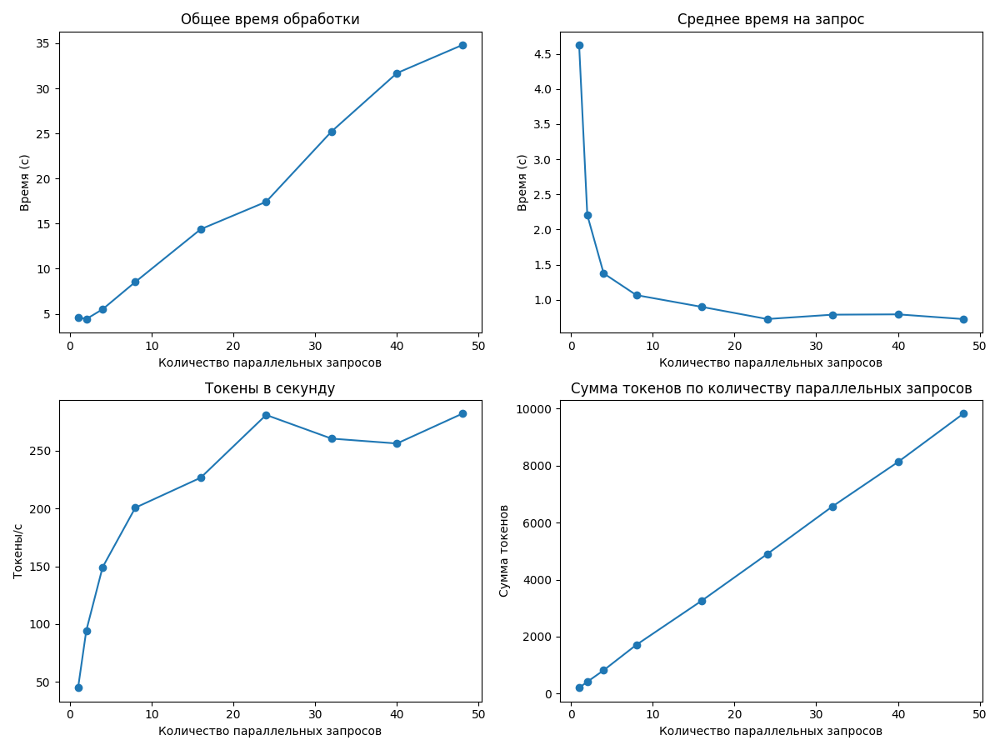

#### Таблица результатов

|   Количество параллельных запросов |   Общее время (с) |   Среднее время на запрос (с) |   Токены в секунду |   Сумма токенов |
|-----------------------------------:|------------------:|------------------------------:|-------------------:|----------------:|
|                                  1 |           4.62459 |                      4.62459  |            44.977  |             208 |
|                                  2 |           4.41083 |                      2.20542  |            94.3133 |             416 |
|                                  4 |           5.50119 |                      1.3753   |           149.241  |             821 |
|                                  8 |           8.52868 |                      1.06608  |           200.735  |            1712 |
|                                 16 |          14.3797  |                      0.89873  |           226.709  |            3260 |
|                                 24 |          17.4197  |                      0.725821 |           281.004  |            4895 |
|                                 32 |          25.2136  |                      0.787924 |           260.534  |            6569 |
|                                 40 |          31.6933  |                      0.792334 |           256.3    |            8123 |
|                                 48 |          34.8068  |                      0.725141 |           282.1    |            9819 |

**Оптимальный размер пакета:** 48

**Максимальная скорость обработки:** 282.10 токенов в секунду

---

### Результаты для 15 параллельных запросов

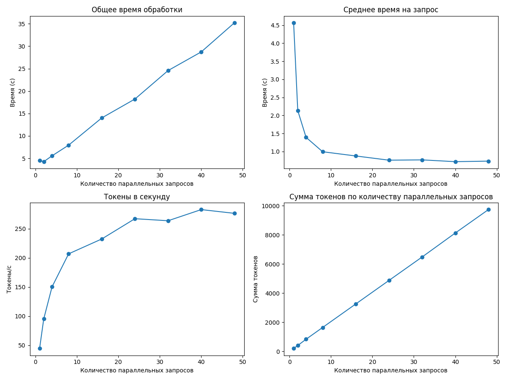

#### Таблица результатов

|   Количество параллельных запросов |   Общее время (с) |   Среднее время на запрос (с) |   Токены в секунду |   Сумма токенов |
|-----------------------------------:|------------------:|------------------------------:|-------------------:|----------------:|
|                                  1 |           4.5643  |                      4.5643   |            44.4756 |             203 |
|                                  2 |           4.26713 |                      2.13356  |            95.146  |             406 |
|                                  4 |           5.56743 |                      1.39186  |           150.159  |             836 |
|                                  8 |           7.94593 |                      0.993241 |           206.898  |            1644 |
|                                 16 |          14.0182  |                      0.876135 |           232.413  |            3258 |
|                                 24 |          18.228   |                      0.7595   |           267.226  |            4871 |
|                                 32 |          24.5751  |                      0.767973 |           263.722  |            6481 |
|                                 40 |          28.7311  |                      0.718278 |           282.864  |            8127 |
|                                 48 |          35.2184  |                      0.733718 |           276.418  |            9735 |

**Оптимальный размер пакета:** 40

**Максимальная скорость обработки:** 282.86 токенов в секунду

---

### Результаты для 18 параллельных запросов

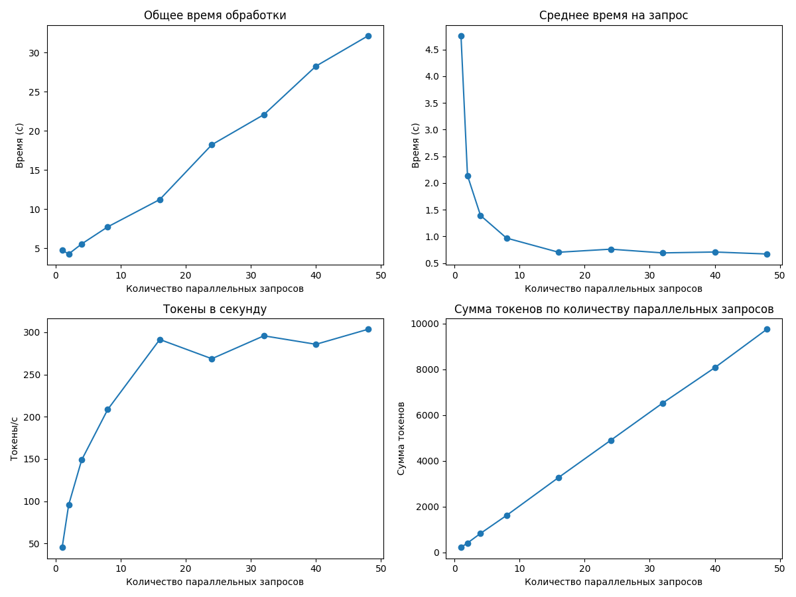

#### Таблица результатов

|   Количество параллельных запросов |   Общее время (с) |   Среднее время на запрос (с) |   Токены в секунду |   Сумма токенов |
|-----------------------------------:|------------------:|------------------------------:|-------------------:|----------------:|
|                                  1 |           4.75544 |                      4.75544  |            45.2113 |             215 |
|                                  2 |           4.27688 |                      2.13844  |            95.6305 |             409 |
|                                  4 |           5.56225 |                      1.39056  |           148.861  |             828 |
|                                  8 |           7.73786 |                      0.967232 |           208.585  |            1614 |
|                                 16 |          11.2281  |                      0.701755 |           291.501  |            3273 |
|                                 24 |          18.2245  |                      0.759354 |           268.704  |            4897 |
|                                 32 |          22.0659  |                      0.68956  |           295.841  |            6528 |
|                                 40 |          28.2514  |                      0.706286 |           285.791  |            8074 |
|                                 48 |          32.1194  |                      0.669155 |           303.586  |            9751 |

**Оптимальный размер пакета:** 48

**Максимальная скорость обработки:** 303.59 токенов в секунду

---

### Результаты для 20 параллельных запросов

#### Таблица результатов

|   Количество параллельных запросов |   Общее время (с) |   Среднее время на запрос (с) |   Токены в секунду |   Сумма токенов |
|-----------------------------------:|------------------:|------------------------------:|-------------------:|----------------:|
|                                  1 |           4.57802 |                      4.57802  |            44.5607 |             204 |
|                                  2 |           4.46636 |                      2.23318  |            91.7973 |             410 |
|                                  4 |           5.39342 |                      1.34835  |           147.773  |             797 |
|                                  8 |           7.82235 |                      0.977793 |           207.994  |            1627 |
|                                 16 |          11.2472  |                      0.702952 |           288.604  |            3246 |
|                                 24 |          18.2025  |                      0.75844  |           268.039  |            4879 |
|                                 32 |          21.4281  |                      0.669627 |           301.287  |            6456 |
|                                 40 |          23.9151  |                      0.597879 |           340.454  |            8142 |
|                                 48 |          31.9566  |                      0.665763 |           305.289  |            9756 |

**Оптимальный размер пакета:** 40

**Максимальная скорость обработки:** 340.45 токенов в секунду

---

### Результаты для 22 параллельных запросов

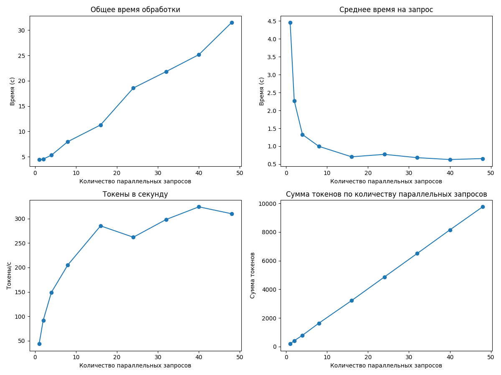

#### Таблица результатов

|   Количество параллельных запросов |   Общее время (с) |   Среднее время на запрос (с) |   Токены в секунду |   Сумма токенов |
|-----------------------------------:|------------------:|------------------------------:|-------------------:|----------------:|
|                                  1 |           4.45397 |                      4.45397  |            43.7812 |             195 |
|                                  2 |           4.54193 |                      2.27096  |            92.0314 |             418 |
|                                  4 |           5.30928 |                      1.32732  |           149.173  |             792 |
|                                  8 |           7.9865  |                      0.998312 |           205.096  |            1638 |
|                                 16 |          11.2845  |                      0.705279 |           285.082  |            3217 |
|                                 24 |          18.5728  |                      0.773867 |           261.835  |            4863 |
|                                 32 |          21.8139  |                      0.681684 |           298.067  |            6502 |
|                                 40 |          25.162   |                      0.629049 |           323.981  |            8152 |
|                                 48 |          31.5061  |                      0.656377 |           309.845  |            9762 |

**Оптимальный размер пакета:** 40

**Максимальная скорость обработки:** 323.98 токенов в секунду

---

### Результаты для 24 параллельных запросов

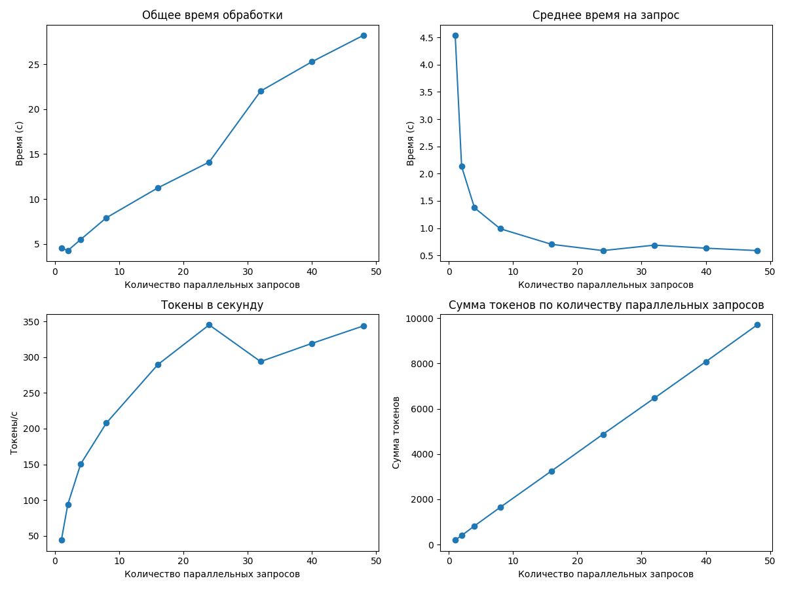

#### Таблица результатов

|   Количество параллельных запросов |   Общее время (с) |   Среднее время на запрос (с) |   Токены в секунду |   Сумма токенов |
|-----------------------------------:|------------------:|------------------------------:|-------------------:|----------------:|
|                                  1 |           4.53777 |                      4.53777  |            43.8541 |             199 |
|                                  2 |           4.26267 |                      2.13134  |            93.8378 |             400 |
|                                  4 |           5.49356 |                      1.37339  |           150.358  |             826 |
|                                  8 |           7.91444 |                      0.989305 |           207.848  |            1645 |
|                                 16 |          11.2344  |                      0.702152 |           289.645  |            3254 |
|                                 24 |          14.1115  |                      0.587979 |           345.392  |            4874 |
|                                 32 |          22.0047  |                      0.687646 |           293.983  |            6469 |
|                                 40 |          25.281   |                      0.632026 |           319.488  |            8077 |
|                                 48 |          28.2134  |                      0.587778 |           343.915  |            9703 |

**Оптимальный размер пакета:** 24

**Максимальная скорость обработки:** 345.39 токенов в секунду

---

### Результаты для 30 параллельных запросов

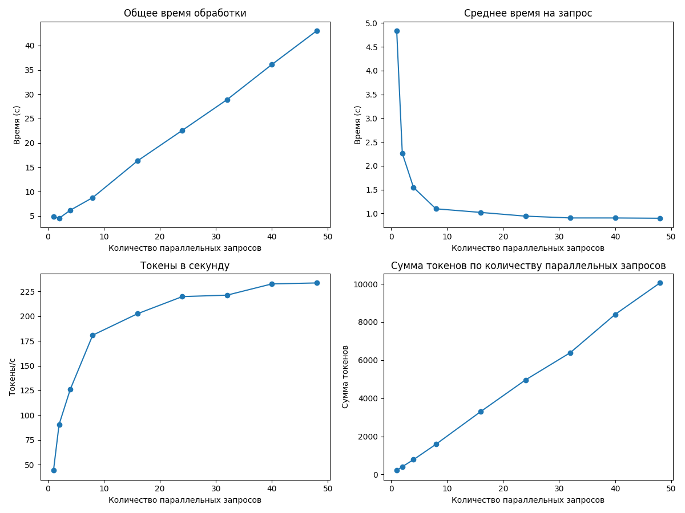

#### Таблица результатов

|   Количество параллельных запросов |   Общее время (с) |   Среднее время на запрос (с) |   Токены в секунду |   Сумма токенов |
|-----------------------------------:|------------------:|------------------------------:|-------------------:|----------------:|
|                                  1 |           4.83747 |                      4.83747  |            44.238  |             214 |
|                                  2 |           4.52137 |                      2.26068  |            90.6805 |             410 |
|                                  4 |           6.17369 |                      1.54342  |           126.181  |             779 |
|                                  8 |           8.76026 |                      1.09503  |           180.817  |            1584 |
|                                 16 |          16.3018  |                      1.01887  |           202.492  |            3301 |
|                                 24 |          22.572   |                      0.940499 |           219.786  |            4961 |
|                                 32 |          28.8878  |                      0.902743 |           221.27   |            6392 |
|                                 40 |          36.098   |                      0.902451 |           232.617  |            8397 |
|                                 48 |          43.021   |                      0.896271 |           233.584  |           10049 |

**Оптимальный размер пакета:** 48

**Максимальная скорость обработки:** 233.58 токенов в секунду

---

### Результаты для 35 параллельных запросов

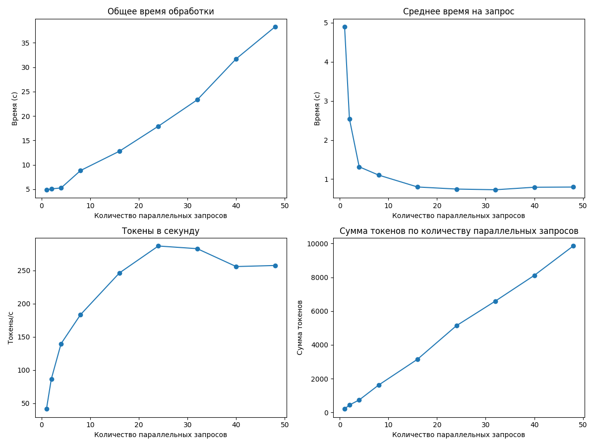

#### Таблица результатов

|   Количество параллельных запросов |   Общее время (с) |   Среднее время на запрос (с) |   Токены в секунду |   Сумма токенов |
|-----------------------------------:|------------------:|------------------------------:|-------------------:|----------------:|
|                                  1 |           4.896   |                      4.896    |            41.4624 |             203 |
|                                  2 |           5.07687 |                      2.53843  |            86.6676 |             440 |
|                                  4 |           5.26226 |                      1.31556  |           139.674  |             735 |
|                                  8 |           8.82726 |                      1.10341  |           183.409  |            1619 |
|                                 16 |          12.7899  |                      0.799369 |           246.21   |            3149 |
|                                 24 |          17.9104  |                      0.746265 |           286.761  |            5136 |
|                                 32 |          23.3169  |                      0.728652 |           282.714  |            6592 |
|                                 40 |          31.7144  |                      0.792861 |           255.814  |            8113 |
|                                 48 |          38.2756  |                      0.797409 |           257.422  |            9853 |

**Оптимальный размер пакета:** 24

**Максимальная скорость обработки:** 286.76 токенов в секунду

---

### Результаты для 40 параллельных запросов

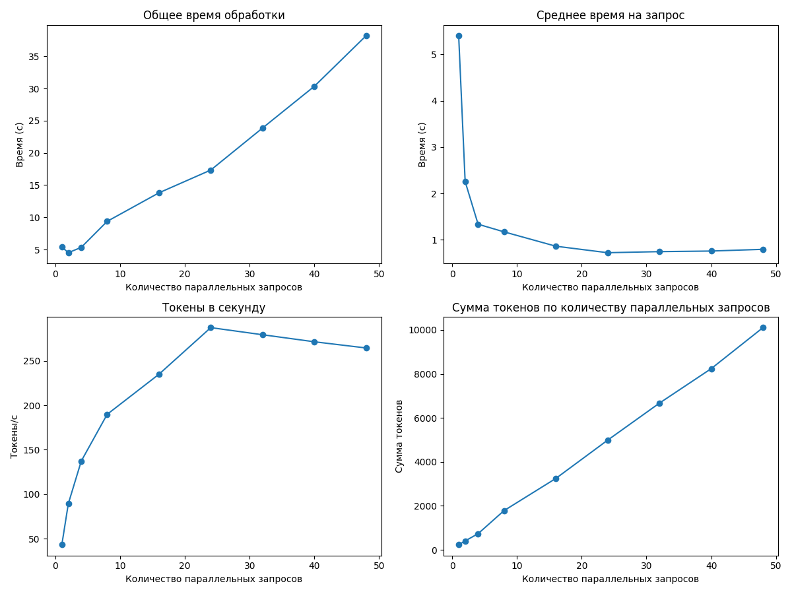

#### Таблица результатов

|   Количество параллельных запросов |   Общее время (с) |   Среднее время на запрос (с) |   Токены в секунду |   Сумма токенов |
|-----------------------------------:|------------------:|------------------------------:|-------------------:|----------------:|
|                                  1 |           5.40169 |                      5.40169  |            43.1346 |             233 |
|                                  2 |           4.51282 |                      2.25641  |            89.3011 |             403 |
|                                  4 |           5.3457  |                      1.33643  |           137.307  |             734 |
|                                  8 |           9.37787 |                      1.17223  |           189.915  |            1781 |
|                                 16 |          13.8049  |                      0.862805 |           235.062  |            3245 |
|                                 24 |          17.3393  |                      0.722471 |           287.555  |            4986 |
|                                 32 |          23.8641  |                      0.745754 |           279.541  |            6671 |
|                                 40 |          30.3375  |                      0.758437 |           271.611  |            8240 |
|                                 48 |          38.1927  |                      0.79568  |           264.632  |           10107 |

**Оптимальный размер пакета:** 24

**Максимальная скорость обработки:** 287.55 токенов в секунду

---

### Результаты для 50 параллельных запросов

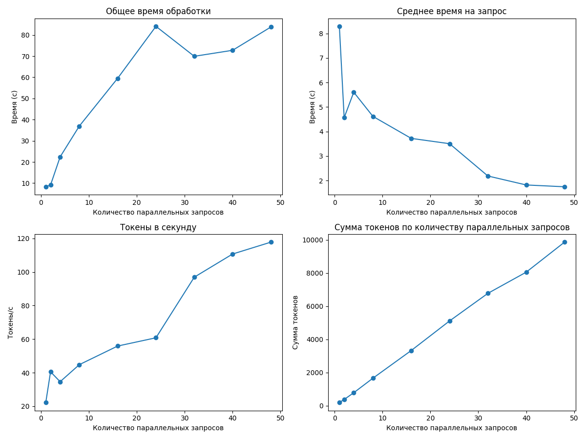

#### Таблица результатов

|   Количество параллельных запросов |   Общее время (с) |   Среднее время на запрос (с) |   Токены в секунду |   Сумма токенов |
|-----------------------------------:|------------------:|------------------------------:|-------------------:|----------------:|
|                                  1 |           8.29197 |                       8.29197 |            22.1902 |             184 |
|                                  2 |           9.13088 |                       4.56544 |            40.5218 |             370 |
|                                  4 |          22.4168  |                       5.6042  |            34.6169 |             776 |
|                                  8 |          36.9467  |                       4.61834 |            44.7672 |            1654 |
|                                 16 |          59.5163  |                       3.71977 |            55.8671 |            3325 |
|                                 24 |          84.0686  |                       3.50286 |            60.7956 |            5111 |
|                                 32 |          69.9187  |                       2.18496 |            96.9268 |            6777 |
|                                 40 |          72.7561  |                       1.8189  |           110.726  |            8056 |
|                                 48 |          83.7689  |                       1.74518 |           117.812  |            9869 |

**Оптимальный размер пакета:** 48

**Максимальная скорость обработки:** 117.81 токенов в секунду

---

