# Отчет о производительности для qwen3:0.6b

## Итоговые выводы по всем прогонам

### Оптимальные параметры для разного количества параллельных запросов

|   Количество workers |   Оптимальный размер пакета |   Максимальная скорость (токены/сек) |
|---------------------:|----------------------------:|-------------------------------------:|
|                    1 |                           4 |                              34.4888 |
|                    2 |                           8 |                             342.879  |
|                    3 |                           8 |                             353.834  |
|                    4 |                           8 |                             302.597  |
|                    5 |                           8 |                             295.418  |
|                    6 |                          16 |                             351.251  |
|                    8 |                          24 |                             396.29   |
|                   10 |                           8 |                             386.792  |
|                   15 |                          24 |                             388.646  |
|                   22 |                          40 |                             434.922  |
|                   24 |                          48 |                             444.871  |
|                   28 |                          48 |                             414.205  |
|                   50 |                          48 |                             129.698  |

### Наилучшая конфигурация для данного оборудования

- **Количество workers:** 24
- **Оптимальный размер пакета:** 48
- **Скорость обработки:** 444.87 токенов/сек

---

## Детальные результаты по каждому прогону

### Результаты для 1 параллельных запросов

#### Таблица результатов

|   Количество параллельных запросов |   Общее время (с) |   Среднее время на запрос (с) |   Токены в секунду |   Сумма токенов |
|-----------------------------------:|------------------:|------------------------------:|-------------------:|----------------:|
|                                  1 |           8.63194 |                       8.63194 |            22.8222 |             197 |
|                                  2 |          12.3973  |                       6.19864 |            32.9911 |             409 |
|                                  4 |          23.6889  |                       5.92221 |            34.4888 |             817 |

**Оптимальный размер пакета:** 4

**Максимальная скорость обработки:** 34.49 токенов в секунду

---

### Результаты для 2 параллельных запросов

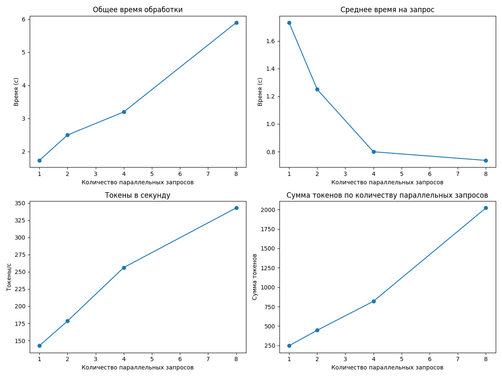

#### Таблица результатов

|   Количество параллельных запросов |   Общее время (с) |   Среднее время на запрос (с) |   Токены в секунду |   Сумма токенов |
|-----------------------------------:|------------------:|------------------------------:|-------------------:|----------------:|
|                                  1 |           1.73252 |                      1.73252  |            142.567 |             247 |
|                                  2 |           2.49943 |                      1.24971  |            178.441 |             446 |
|                                  4 |           3.19612 |                      0.799029 |            256.248 |             819 |
|                                  8 |           5.89421 |                      0.736776 |            342.879 |            2021 |

**Оптимальный размер пакета:** 8

**Максимальная скорость обработки:** 342.88 токенов в секунду

---

### Результаты для 3 параллельных запросов

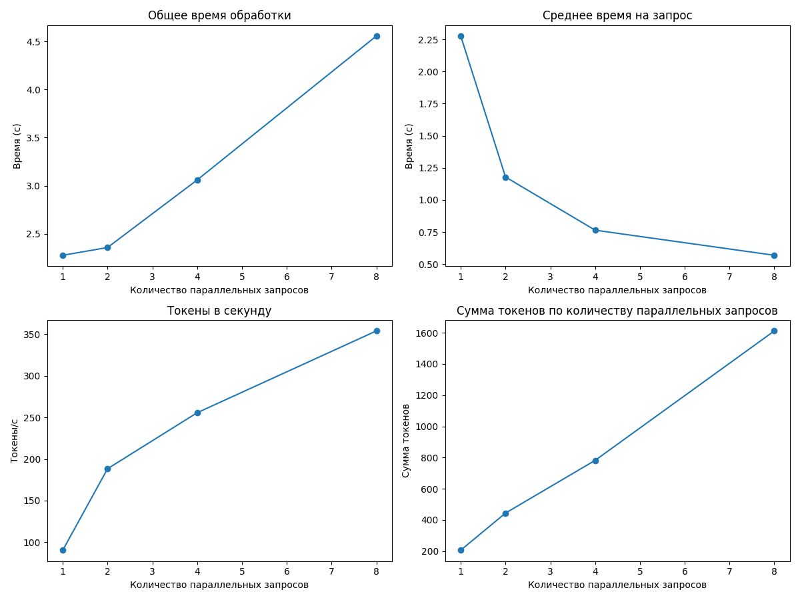

#### Таблица результатов

|   Количество параллельных запросов |   Общее время (с) |   Среднее время на запрос (с) |   Токены в секунду |   Сумма токенов |
|-----------------------------------:|------------------:|------------------------------:|-------------------:|----------------:|
|                                  1 |           2.27683 |                      2.27683  |            90.4765 |             206 |
|                                  2 |           2.35752 |                      1.17876  |           188.334  |             444 |
|                                  4 |           3.0596  |                      0.764899 |           255.589  |             782 |
|                                  8 |           4.55581 |                      0.569476 |           353.834  |            1612 |

**Оптимальный размер пакета:** 8

**Максимальная скорость обработки:** 353.83 токенов в секунду

---

### Результаты для 4 параллельных запросов

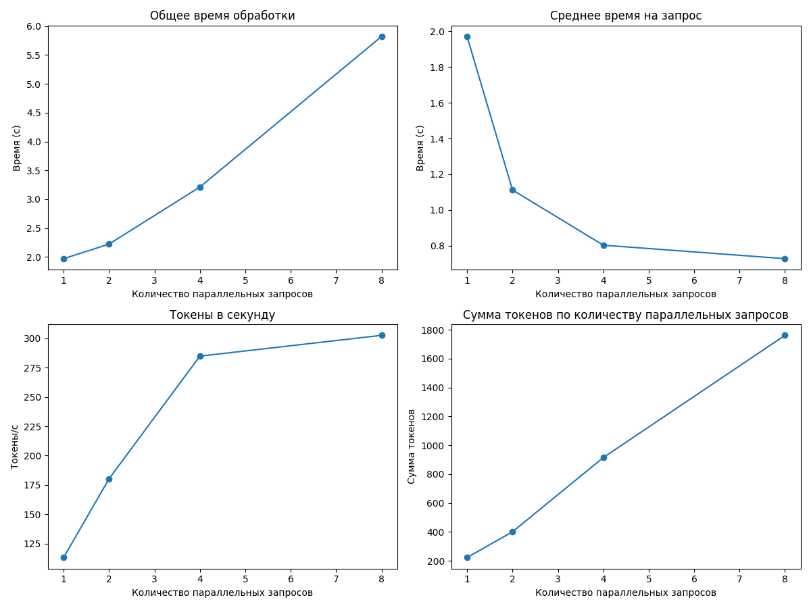

#### Таблица результатов

|   Количество параллельных запросов |   Общее время (с) |   Среднее время на запрос (с) |   Токены в секунду |   Сумма токенов |
|-----------------------------------:|------------------:|------------------------------:|-------------------:|----------------:|
|                                  1 |           1.97113 |                      1.97113  |            113.133 |             223 |
|                                  2 |           2.22388 |                      1.11194  |            180.316 |             401 |
|                                  4 |           3.21217 |                      0.803043 |            284.854 |             915 |
|                                  8 |           5.81962 |                      0.727453 |            302.597 |            1761 |

**Оптимальный размер пакета:** 8

**Максимальная скорость обработки:** 302.60 токенов в секунду

---

### Результаты для 5 параллельных запросов

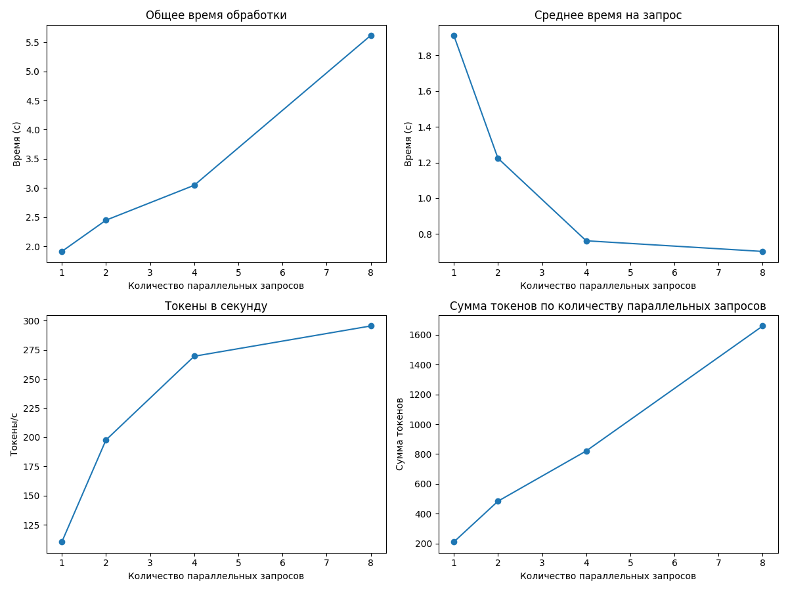

#### Таблица результатов

|   Количество параллельных запросов |   Общее время (с) |   Среднее время на запрос (с) |   Токены в секунду |   Сумма токенов |
|-----------------------------------:|------------------:|------------------------------:|-------------------:|----------------:|
|                                  1 |           1.91194 |                      1.91194  |            110.359 |             211 |
|                                  2 |           2.44779 |                      1.22389  |            197.729 |             484 |
|                                  4 |           3.04664 |                      0.76166  |            269.477 |             821 |
|                                  8 |           5.61577 |                      0.701971 |            295.418 |            1659 |

**Оптимальный размер пакета:** 8

**Максимальная скорость обработки:** 295.42 токенов в секунду

---

### Результаты для 6 параллельных запросов

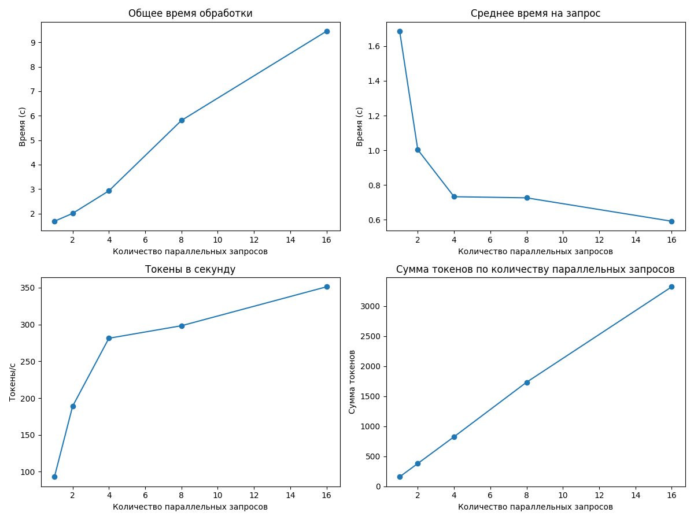

#### Таблица результатов

|   Количество параллельных запросов |   Общее время (с) |   Среднее время на запрос (с) |   Токены в секунду |   Сумма токенов |
|-----------------------------------:|------------------:|------------------------------:|-------------------:|----------------:|
|                                  1 |           1.68635 |                      1.68635  |            93.1003 |             157 |
|                                  2 |           2.00573 |                      1.00286  |           188.959  |             379 |
|                                  4 |           2.92872 |                      0.732181 |           281.351  |             824 |
|                                  8 |           5.80494 |                      0.725617 |           298.367  |            1732 |
|                                 16 |           9.45192 |                      0.590745 |           351.251  |            3320 |

**Оптимальный размер пакета:** 16

**Максимальная скорость обработки:** 351.25 токенов в секунду

---

### Результаты для 8 параллельных запросов

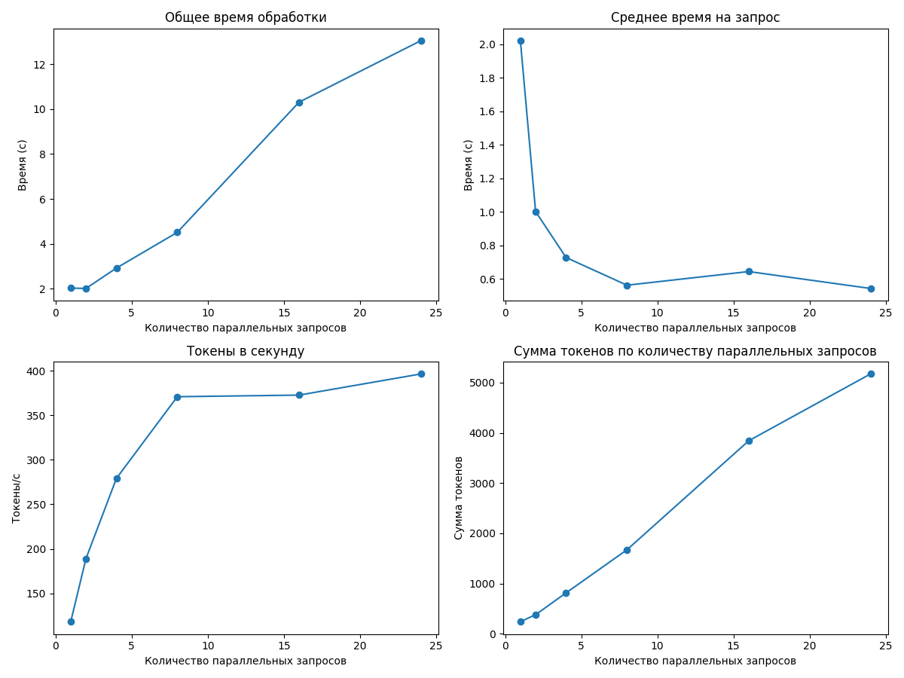

#### Таблица результатов

|   Количество параллельных запросов |   Общее время (с) |   Среднее время на запрос (с) |   Токены в секунду |   Сумма токенов |
|-----------------------------------:|------------------:|------------------------------:|-------------------:|----------------:|
|                                  1 |           2.02118 |                      2.02118  |            118.248 |             239 |
|                                  2 |           2.00544 |                      1.00272  |            188.986 |             379 |
|                                  4 |           2.91371 |                      0.728427 |            279.026 |             813 |
|                                  8 |           4.50717 |                      0.563397 |            370.742 |            1671 |
|                                 16 |          10.3153  |                      0.644705 |            372.554 |            3843 |
|                                 24 |          13.0561  |                      0.544004 |            396.29  |            5174 |

**Оптимальный размер пакета:** 24

**Максимальная скорость обработки:** 396.29 токенов в секунду

---

### Результаты для 10 параллельных запросов

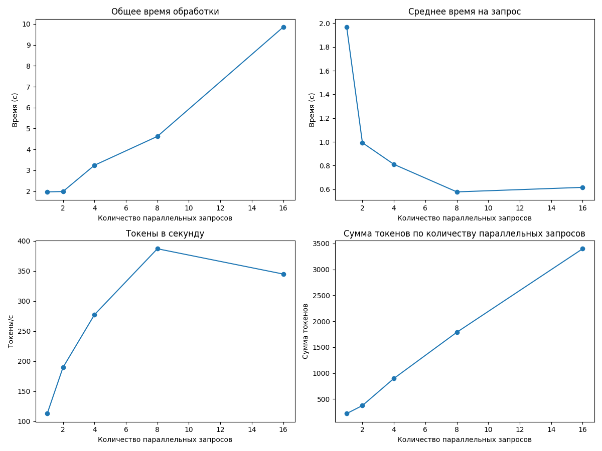

#### Таблица результатов

|   Количество параллельных запросов |   Общее время (с) |   Среднее время на запрос (с) |   Токены в секунду |   Сумма токенов |
|-----------------------------------:|------------------:|------------------------------:|-------------------:|----------------:|
|                                  1 |           1.96785 |                      1.96785  |            112.813 |             222 |
|                                  2 |           1.98494 |                      0.992469 |            189.427 |             376 |
|                                  4 |           3.24036 |                      0.810091 |            277.129 |             898 |
|                                  8 |           4.62264 |                      0.57783  |            386.792 |            1788 |
|                                 16 |           9.85363 |                      0.615852 |            344.746 |            3397 |

**Оптимальный размер пакета:** 8

**Максимальная скорость обработки:** 386.79 токенов в секунду

---

### Результаты для 15 параллельных запросов

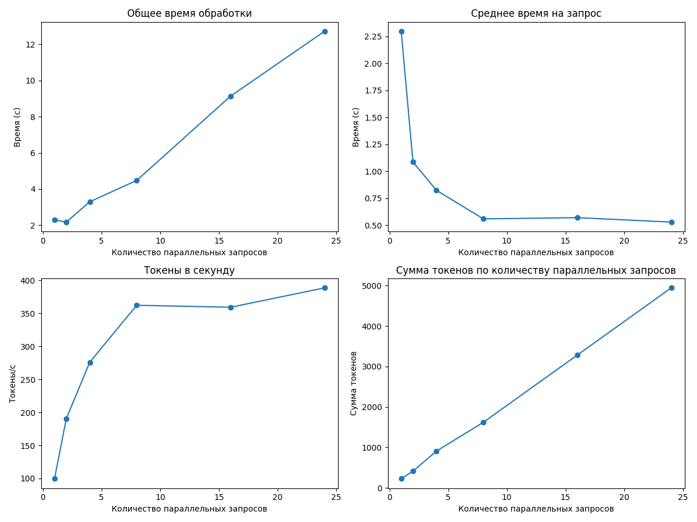

#### Таблица результатов

|   Количество параллельных запросов |   Общее время (с) |   Среднее время на запрос (с) |   Токены в секунду |   Сумма токенов |
|-----------------------------------:|------------------:|------------------------------:|-------------------:|----------------:|
|                                  1 |           2.29741 |                      2.29741  |            99.6776 |             229 |
|                                  2 |           2.17333 |                      1.08666  |           190.491  |             414 |
|                                  4 |           3.29671 |                      0.824177 |           276.033  |             910 |
|                                  8 |           4.47605 |                      0.559506 |           362.373  |            1622 |
|                                 16 |           9.13614 |                      0.571009 |           359.342  |            3283 |
|                                 24 |          12.7185  |                      0.529938 |           388.646  |            4943 |

**Оптимальный размер пакета:** 24

**Максимальная скорость обработки:** 388.65 токенов в секунду

---

### Результаты для 22 параллельных запросов

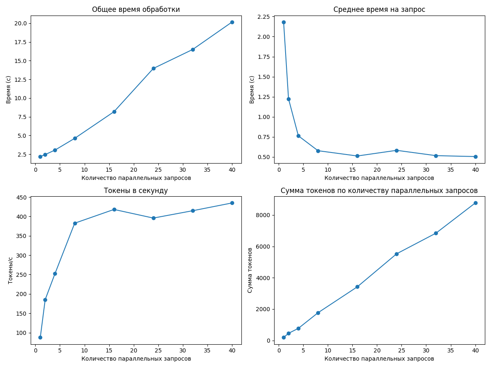

#### Таблица результатов

|   Количество параллельных запросов |   Общее время (с) |   Среднее время на запрос (с) |   Токены в секунду |   Сумма токенов |
|-----------------------------------:|------------------:|------------------------------:|-------------------:|----------------:|
|                                  1 |           2.1808  |                      2.1808   |            87.5824 |             191 |
|                                  2 |           2.4492  |                      1.2246   |           185.367  |             454 |
|                                  4 |           3.05009 |                      0.762523 |           252.779  |             771 |
|                                  8 |           4.61719 |                      0.577149 |           382.7    |            1767 |
|                                 16 |           8.18037 |                      0.511273 |           418.196  |            3421 |
|                                 24 |          13.9618  |                      0.581741 |           395.938  |            5528 |
|                                 32 |          16.4962  |                      0.515507 |           414.883  |            6844 |
|                                 40 |          20.1622  |                      0.504055 |           434.922  |            8769 |

**Оптимальный размер пакета:** 40

**Максимальная скорость обработки:** 434.92 токенов в секунду

---

### Результаты для 24 параллельных запросов

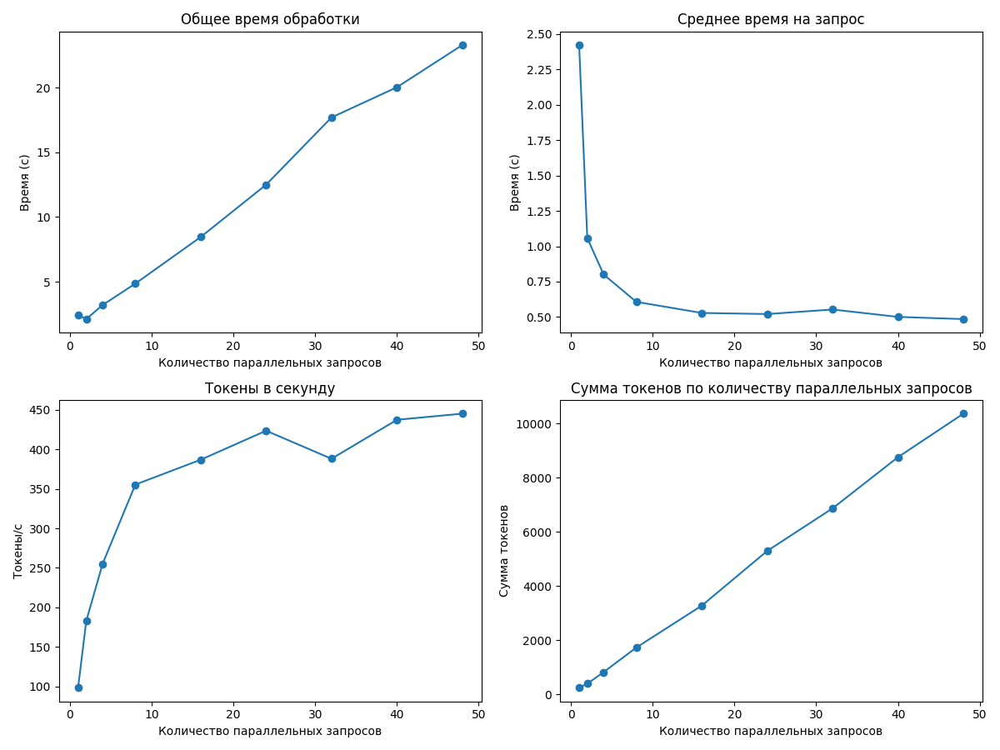

#### Таблица результатов

|   Количество параллельных запросов |   Общее время (с) |   Среднее время на запрос (с) |   Токены в секунду |   Сумма токенов |
|-----------------------------------:|------------------:|------------------------------:|-------------------:|----------------:|
|                                  1 |           2.42308 |                      2.42308  |            98.6347 |             239 |
|                                  2 |           2.11506 |                      1.05753  |           182.974  |             387 |
|                                  4 |           3.20092 |                      0.800229 |           255.239  |             817 |
|                                  8 |           4.85552 |                      0.60694  |           355.266  |            1725 |
|                                 16 |           8.45916 |                      0.528698 |           386.681  |            3271 |
|                                 24 |          12.5009  |                      0.520869 |           423.331  |            5292 |
|                                 32 |          17.6973  |                      0.55304  |           387.913  |            6865 |
|                                 40 |          20.0307  |                      0.500769 |           437.128  |            8756 |
|                                 48 |          23.2944  |                      0.4853   |           444.871  |           10363 |

**Оптимальный размер пакета:** 48

**Максимальная скорость обработки:** 444.87 токенов в секунду

---

### Результаты для 28 параллельных запросов

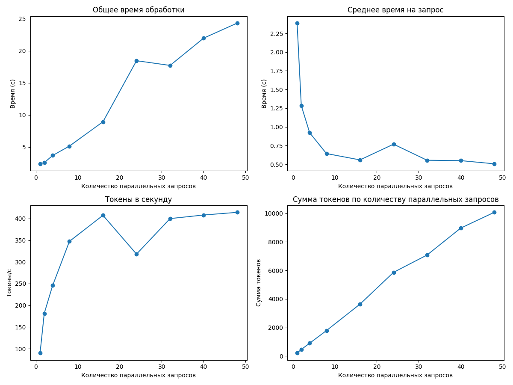

#### Таблица результатов

|   Количество параллельных запросов |   Общее время (с) |   Среднее время на запрос (с) |   Токены в секунду |   Сумма токенов |
|-----------------------------------:|------------------:|------------------------------:|-------------------:|----------------:|
|                                  1 |           2.38732 |                      2.38732  |             90.059 |             215 |
|                                  2 |           2.5675  |                      1.28375  |            181.499 |             466 |
|                                  4 |           3.68385 |                      0.920964 |            245.667 |             905 |
|                                  8 |           5.14506 |                      0.643133 |            347.323 |            1787 |
|                                 16 |           8.93576 |                      0.558485 |            407.352 |            3640 |
|                                 24 |          18.445   |                      0.768542 |            318.027 |            5866 |
|                                 32 |          17.7125  |                      0.553515 |            399.831 |            7082 |
|                                 40 |          21.9616  |                      0.549039 |            408.077 |            8962 |
|                                 48 |          24.3044  |                      0.506342 |            414.205 |           10067 |

**Оптимальный размер пакета:** 48

**Максимальная скорость обработки:** 414.20 токенов в секунду

---

### Результаты для 50 параллельных запросов

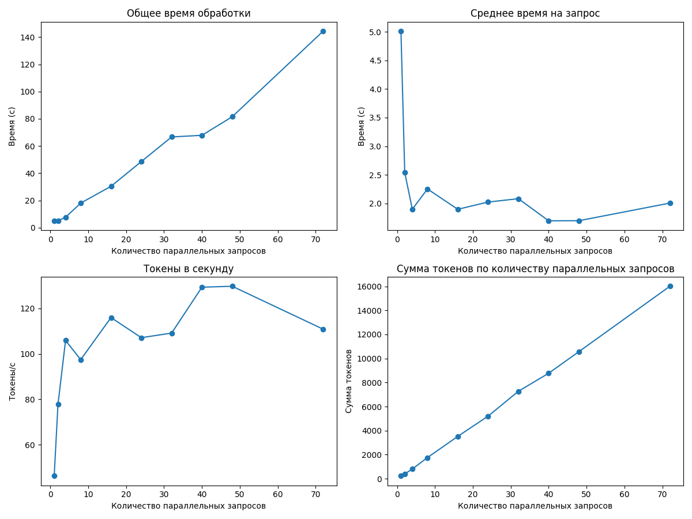

#### Таблица результатов

|   Количество параллельных запросов |   Общее время (с) |   Среднее время на запрос (с) |   Токены в секунду |   Сумма токенов |
|-----------------------------------:|------------------:|------------------------------:|-------------------:|----------------:|
|                                  1 |           5.0101  |                       5.0101  |            46.3065 |             232 |
|                                  2 |           5.07919 |                       2.53959 |            77.7684 |             395 |
|                                  4 |           7.59584 |                       1.89896 |           105.847  |             804 |
|                                  8 |          18.0215  |                       2.25268 |            97.4394 |            1756 |
|                                 16 |          30.3624  |                       1.89765 |           115.933  |            3520 |
|                                 24 |          48.5768  |                       2.02403 |           107.088  |            5202 |
|                                 32 |          66.649   |                       2.08278 |           109.109  |            7272 |
|                                 40 |          67.8585  |                       1.69646 |           129.284  |            8773 |
|                                 48 |          81.5203  |                       1.69834 |           129.698  |           10573 |
|                                 72 |         144.43    |                       2.00598 |           110.829  |           16007 |

**Оптимальный размер пакета:** 48

**Максимальная скорость обработки:** 129.70 токенов в секунду

---

