# Отчет о производительности для qwen3:1.7b

## Итоговые выводы по всем прогонам

### Оптимальные параметры для разного количества параллельных запросов

|   Количество workers |   Оптимальный размер пакета |   Максимальная скорость (токены/сек) |
|---------------------:|----------------------------:|-------------------------------------:|
|                    1 |                           2 |                              159.139 |
|                    2 |                           2 |                              162.946 |
|                    3 |                           2 |                              162.925 |
|                    4 |                           8 |                              197.515 |
|                    5 |                           8 |                              193.52  |
|                    6 |                          16 |                              224.912 |
|                    8 |                          16 |                              247.968 |
|                   10 |                          16 |                              243.612 |
|                   15 |                          24 |                              272.418 |
|                   22 |                          40 |                              370.761 |
|                   24 |                          48 |                              387.139 |
|                   28 |                          48 |                              365.558 |
|                   32 |                          24 |                              354.22  |
|                   36 |                          24 |                              353.507 |

### Наилучшая конфигурация для данного оборудования

- **Количество workers:** 24
- **Оптимальный размер пакета:** 48
- **Скорость обработки:** 387.14 токенов/сек

---

## Детальные результаты по каждому прогону

### Результаты для 1 параллельных запросов

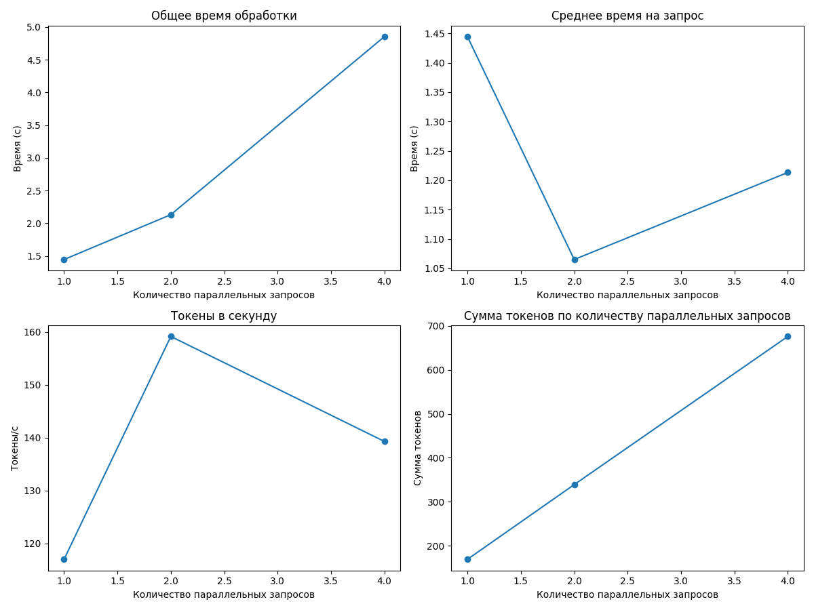

#### Таблица результатов

|   Количество параллельных запросов |   Общее время (с) |   Среднее время на запрос (с) |   Токены в секунду |   Сумма токенов |
|-----------------------------------:|------------------:|------------------------------:|-------------------:|----------------:|
|                                  1 |           1.44443 |                       1.44443 |            117.001 |             169 |
|                                  2 |           2.13022 |                       1.06511 |            159.139 |             339 |
|                                  4 |           4.85316 |                       1.21329 |            139.291 |             676 |

**Оптимальный размер пакета:** 2

**Максимальная скорость обработки:** 159.14 токенов в секунду

---

### Результаты для 2 параллельных запросов

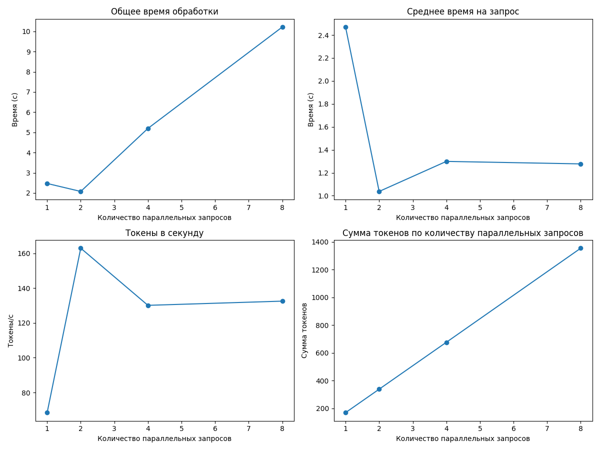

#### Таблица результатов

|   Количество параллельных запросов |   Общее время (с) |   Среднее время на запрос (с) |   Токены в секунду |   Сумма токенов |
|-----------------------------------:|------------------:|------------------------------:|-------------------:|----------------:|
|                                  1 |           2.46967 |                       2.46967 |            68.4301 |             169 |
|                                  2 |           2.07431 |                       1.03715 |           162.946  |             338 |
|                                  4 |           5.19581 |                       1.29895 |           130.105  |             676 |
|                                  8 |          10.2177  |                       1.27722 |           132.515  |            1354 |

**Оптимальный размер пакета:** 2

**Максимальная скорость обработки:** 162.95 токенов в секунду

---

### Результаты для 3 параллельных запросов

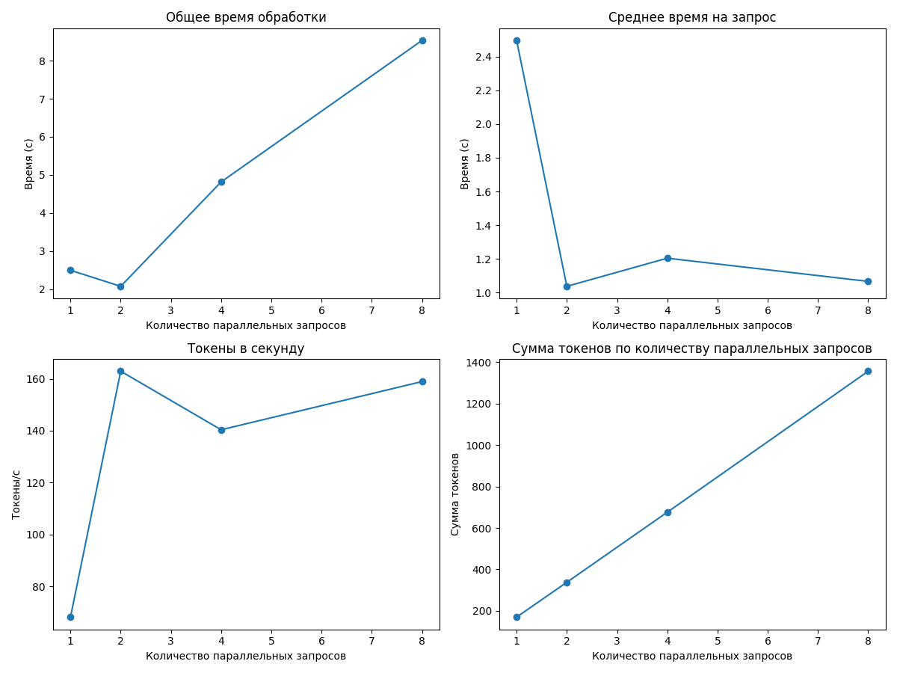

#### Таблица результатов

|   Количество параллельных запросов |   Общее время (с) |   Среднее время на запрос (с) |   Токены в секунду |   Сумма токенов |
|-----------------------------------:|------------------:|------------------------------:|-------------------:|----------------:|
|                                  1 |           2.49595 |                       2.49595 |            68.1102 |             170 |
|                                  2 |           2.07458 |                       1.03729 |           162.925  |             338 |
|                                  4 |           4.81671 |                       1.20418 |           140.345  |             676 |
|                                  8 |           8.53221 |                       1.06653 |           158.927  |            1356 |

**Оптимальный размер пакета:** 2

**Максимальная скорость обработки:** 162.92 токенов в секунду

---

### Результаты для 4 параллельных запросов

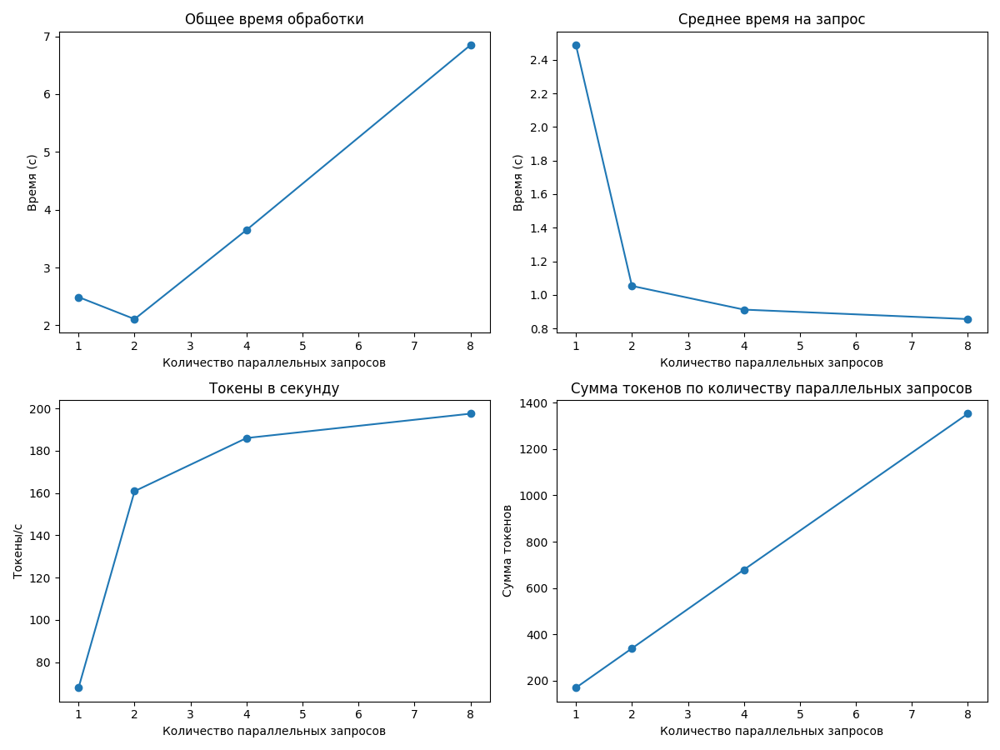

#### Таблица результатов

|   Количество параллельных запросов |   Общее время (с) |   Среднее время на запрос (с) |   Токены в секунду |   Сумма токенов |
|-----------------------------------:|------------------:|------------------------------:|-------------------:|----------------:|
|                                  1 |           2.48804 |                      2.48804  |             67.925 |             169 |
|                                  2 |           2.10747 |                      1.05374  |            160.856 |             339 |
|                                  4 |           3.65062 |                      0.912654 |            185.996 |             679 |
|                                  8 |           6.85011 |                      0.856264 |            197.515 |            1353 |

**Оптимальный размер пакета:** 8

**Максимальная скорость обработки:** 197.51 токенов в секунду

---

### Результаты для 5 параллельных запросов

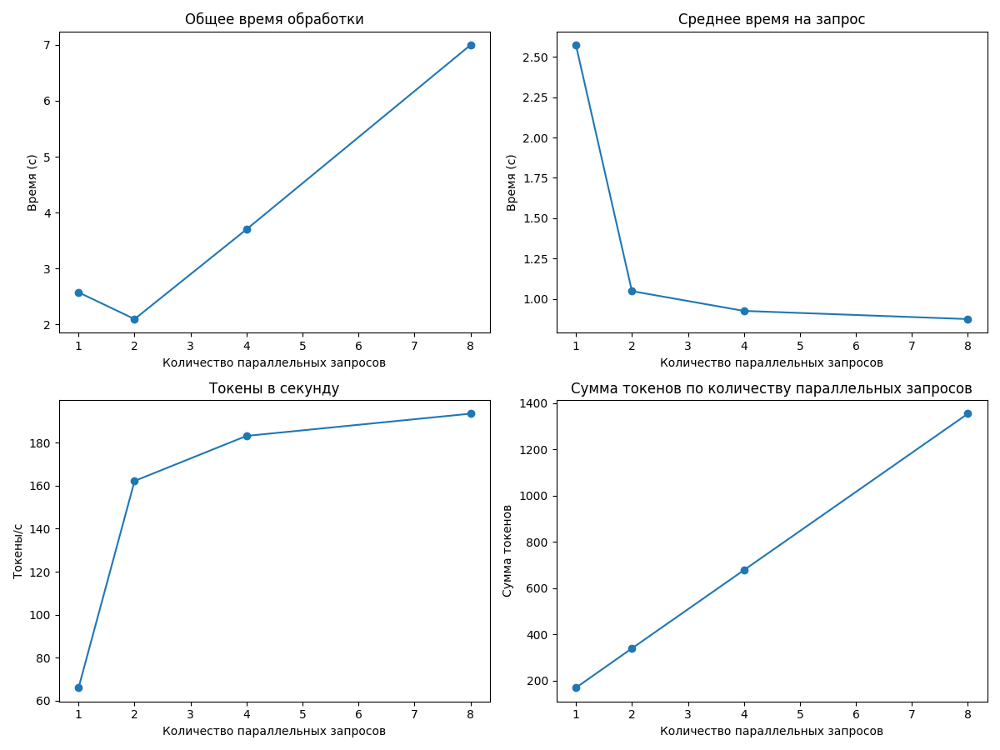

#### Таблица результатов

|   Количество параллельных запросов |   Общее время (с) |   Среднее время на запрос (с) |   Токены в секунду |   Сумма токенов |
|-----------------------------------:|------------------:|------------------------------:|-------------------:|----------------:|
|                                  1 |           2.57359 |                      2.57359  |            66.0557 |             170 |
|                                  2 |           2.0958  |                      1.0479   |           162.229  |             340 |
|                                  4 |           3.70127 |                      0.925317 |           183.18   |             678 |
|                                  8 |           6.99668 |                      0.874584 |           193.52   |            1354 |

**Оптимальный размер пакета:** 8

**Максимальная скорость обработки:** 193.52 токенов в секунду

---

### Результаты для 6 параллельных запросов

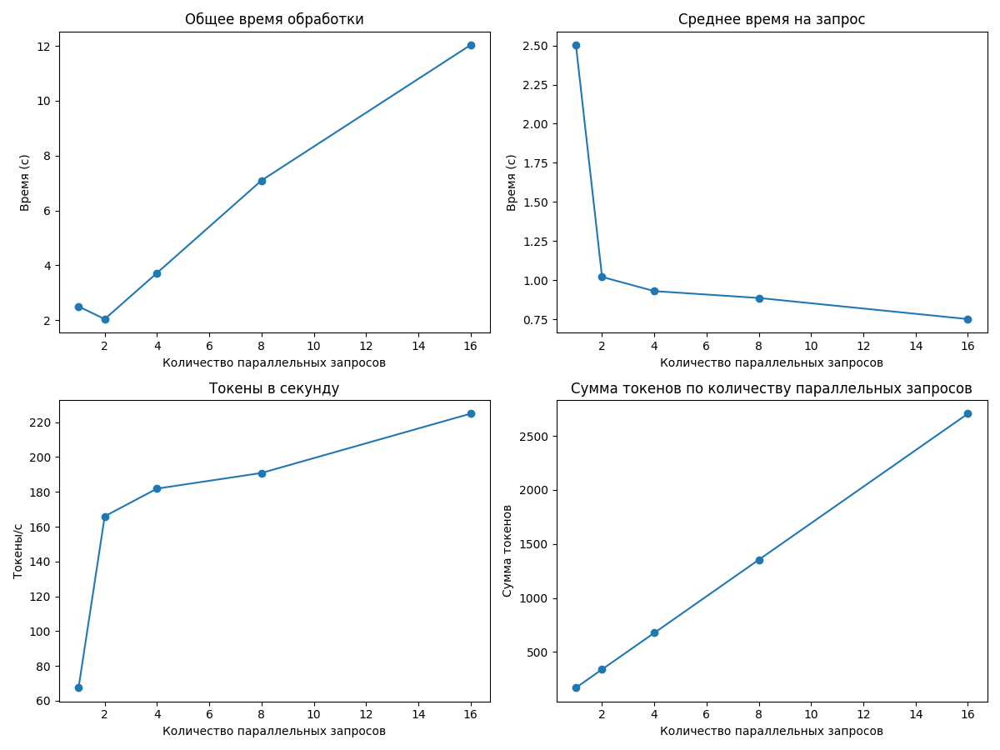

#### Таблица результатов

|   Количество параллельных запросов |   Общее время (с) |   Среднее время на запрос (с) |   Токены в секунду |   Сумма токенов |
|-----------------------------------:|------------------:|------------------------------:|-------------------:|----------------:|
|                                  1 |           2.50304 |                      2.50304  |            67.5178 |             169 |
|                                  2 |           2.04245 |                      1.02122  |           165.977  |             339 |
|                                  4 |           3.72263 |                      0.930658 |           181.86   |             677 |
|                                  8 |           7.09434 |                      0.886792 |           190.856  |            1354 |
|                                 16 |          12.0314  |                      0.751961 |           224.912  |            2706 |

**Оптимальный размер пакета:** 16

**Максимальная скорость обработки:** 224.91 токенов в секунду

---

### Результаты для 8 параллельных запросов

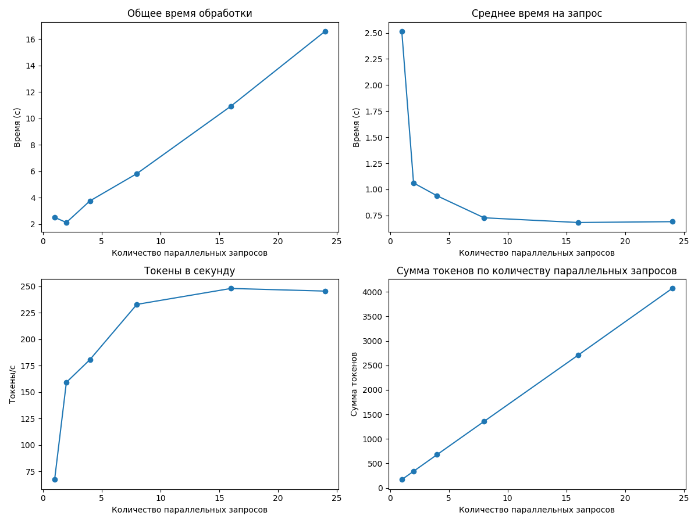

#### Таблица результатов

|   Количество параллельных запросов |   Общее время (с) |   Среднее время на запрос (с) |   Токены в секунду |   Сумма токенов |
|-----------------------------------:|------------------:|------------------------------:|-------------------:|----------------:|
|                                  1 |           2.51416 |                      2.51416  |            67.2192 |             169 |
|                                  2 |           2.12352 |                      1.06176  |           159.17   |             338 |
|                                  4 |           3.75384 |                      0.938459 |           180.615  |             678 |
|                                  8 |           5.82189 |                      0.727736 |           232.914  |            1356 |
|                                 16 |          10.9207  |                      0.682547 |           247.968  |            2708 |
|                                 24 |          16.575   |                      0.690623 |           245.491  |            4069 |

**Оптимальный размер пакета:** 16

**Максимальная скорость обработки:** 247.97 токенов в секунду

---

### Результаты для 10 параллельных запросов

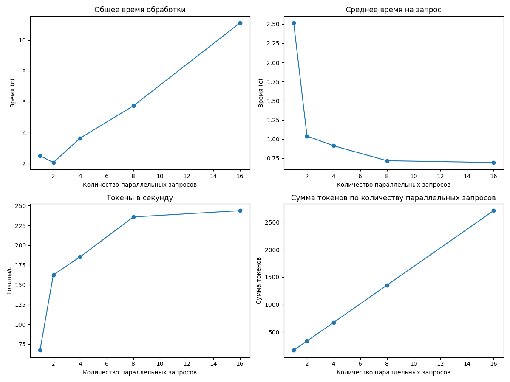

#### Таблица результатов

|   Количество параллельных запросов |   Общее время (с) |   Среднее время на запрос (с) |   Токены в секунду |   Сумма токенов |
|-----------------------------------:|------------------:|------------------------------:|-------------------:|----------------:|
|                                  1 |           2.51531 |                      2.51531  |            67.1884 |             169 |
|                                  2 |           2.0797  |                      1.03985  |           162.523  |             338 |
|                                  4 |           3.65137 |                      0.912843 |           185.136  |             676 |
|                                  8 |           5.74502 |                      0.718127 |           235.683  |            1354 |
|                                 16 |          11.116   |                      0.694752 |           243.612  |            2708 |

**Оптимальный размер пакета:** 16

**Максимальная скорость обработки:** 243.61 токенов в секунду

---

### Результаты для 15 параллельных запросов

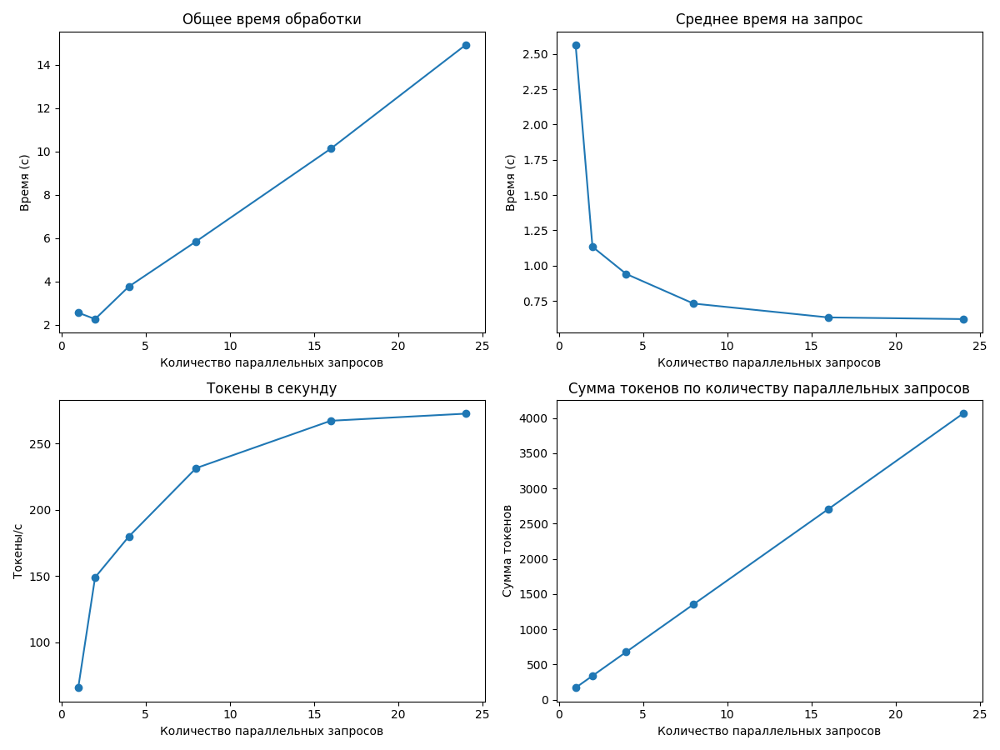

#### Таблица результатов

|   Количество параллельных запросов |   Общее время (с) |   Среднее время на запрос (с) |   Токены в секунду |   Сумма токенов |
|-----------------------------------:|------------------:|------------------------------:|-------------------:|----------------:|
|                                  1 |           2.56387 |                      2.56387  |            65.9161 |             169 |
|                                  2 |           2.26788 |                      1.13394  |           149.038  |             338 |
|                                  4 |           3.76592 |                      0.941479 |           179.77   |             677 |
|                                  8 |           5.85157 |                      0.731446 |           231.391  |            1354 |
|                                 16 |          10.132   |                      0.633253 |           267.073  |            2706 |
|                                 24 |          14.9146  |                      0.62144  |           272.418  |            4063 |

**Оптимальный размер пакета:** 24

**Максимальная скорость обработки:** 272.42 токенов в секунду

---

### Результаты для 22 параллельных запросов

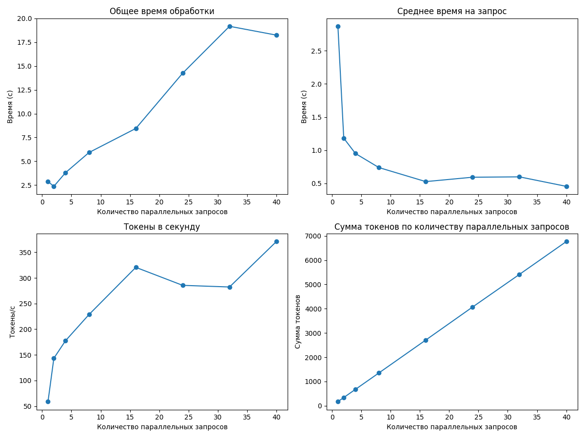

#### Таблица результатов

|   Количество параллельных запросов |   Общее время (с) |   Среднее время на запрос (с) |   Токены в секунду |   Сумма токенов |
|-----------------------------------:|------------------:|------------------------------:|-------------------:|----------------:|
|                                  1 |           2.86899 |                      2.86899  |            58.9058 |             169 |
|                                  2 |           2.36392 |                      1.18196  |           143.406  |             339 |
|                                  4 |           3.80374 |                      0.950935 |           177.72   |             676 |
|                                  8 |           5.91561 |                      0.739451 |           228.548  |            1352 |
|                                 16 |           8.44516 |                      0.527823 |           320.538  |            2707 |
|                                 24 |          14.2529  |                      0.59387  |           285.486  |            4069 |
|                                 32 |          19.1795  |                      0.599359 |           282.281  |            5414 |
|                                 40 |          18.2517  |                      0.456291 |           370.761  |            6767 |

**Оптимальный размер пакета:** 40

**Максимальная скорость обработки:** 370.76 токенов в секунду

---

### Результаты для 24 параллельных запросов

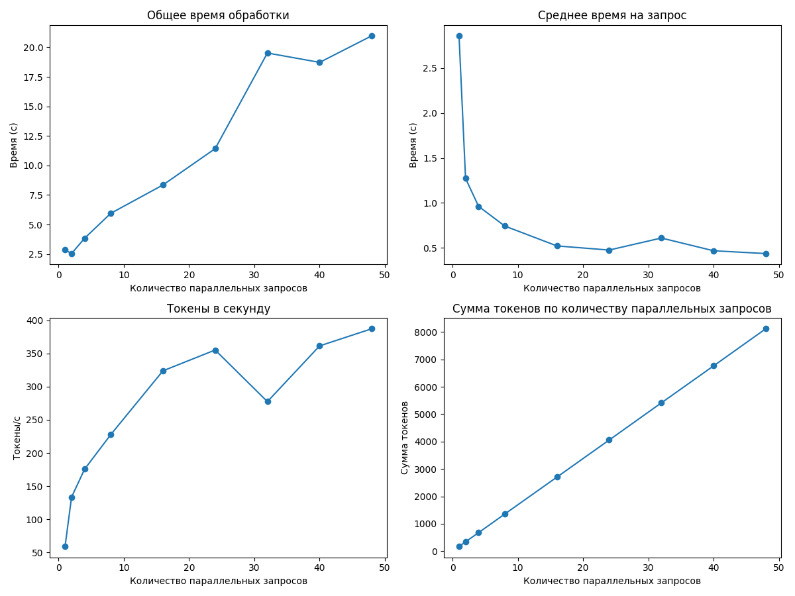

#### Таблица результатов

|   Количество параллельных запросов |   Общее время (с) |   Среднее время на запрос (с) |   Токены в секунду |   Сумма токенов |
|-----------------------------------:|------------------:|------------------------------:|-------------------:|----------------:|
|                                  1 |           2.86013 |                      2.86013  |            59.0882 |             169 |
|                                  2 |           2.54594 |                      1.27297  |           133.546  |             340 |
|                                  4 |           3.84823 |                      0.962057 |           175.665  |             676 |
|                                  8 |           5.94823 |                      0.743528 |           227.631  |            1354 |
|                                 16 |           8.35253 |                      0.522033 |           323.734  |            2704 |
|                                 24 |          11.4258  |                      0.476075 |           355.074  |            4057 |
|                                 32 |          19.5191  |                      0.609971 |           277.37   |            5414 |
|                                 40 |          18.7249  |                      0.468121 |           361.285  |            6765 |
|                                 48 |          20.977   |                      0.43702  |           387.139  |            8121 |

**Оптимальный размер пакета:** 48

**Максимальная скорость обработки:** 387.14 токенов в секунду

---

### Результаты для 28 параллельных запросов

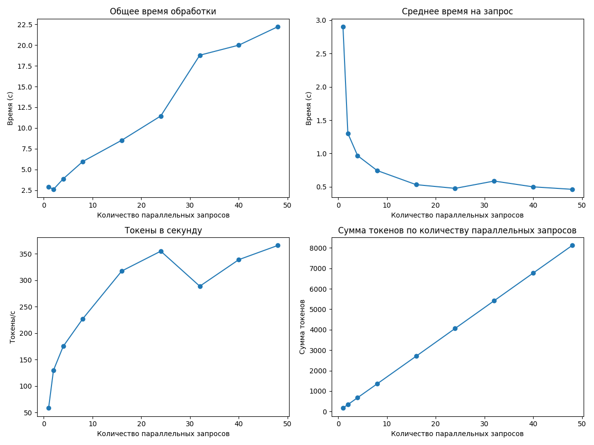

#### Таблица результатов

|   Количество параллельных запросов |   Общее время (с) |   Среднее время на запрос (с) |   Токены в секунду |   Сумма токенов |
|-----------------------------------:|------------------:|------------------------------:|-------------------:|----------------:|
|                                  1 |           2.90198 |                      2.90198  |            58.2361 |             169 |
|                                  2 |           2.60679 |                      1.30339  |           129.662  |             338 |
|                                  4 |           3.87107 |                      0.967768 |           174.887  |             677 |
|                                  8 |           5.95865 |                      0.744831 |           226.897  |            1352 |
|                                 16 |           8.52424 |                      0.532765 |           317.213  |            2704 |
|                                 24 |          11.4535  |                      0.477228 |           354.739  |            4063 |
|                                 32 |          18.7805  |                      0.58689  |           288.491  |            5418 |
|                                 40 |          19.9907  |                      0.499768 |           338.707  |            6771 |
|                                 48 |          22.2154  |                      0.46282  |           365.558  |            8121 |

**Оптимальный размер пакета:** 48

**Максимальная скорость обработки:** 365.56 токенов в секунду

---

### Результаты для 32 параллельных запросов

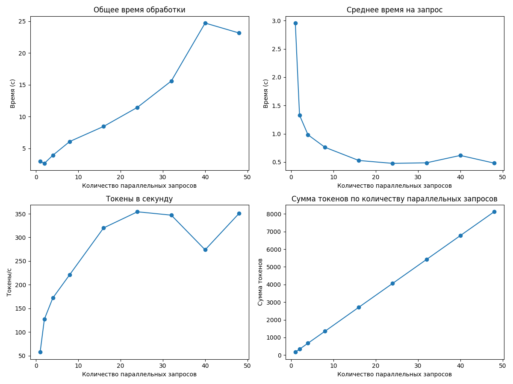

#### Таблица результатов

|   Количество параллельных запросов |   Общее время (с) |   Среднее время на запрос (с) |   Токены в секунду |   Сумма токенов |
|-----------------------------------:|------------------:|------------------------------:|-------------------:|----------------:|
|                                  1 |           2.95587 |                      2.95587  |            57.5127 |             170 |
|                                  2 |           2.65679 |                      1.3284   |           127.221  |             338 |
|                                  4 |           3.92783 |                      0.981957 |           172.105  |             676 |
|                                  8 |           6.09638 |                      0.762048 |           221.443  |            1350 |
|                                 16 |           8.46166 |                      0.528854 |           320.15   |            2709 |
|                                 24 |          11.4646  |                      0.477693 |           354.22   |            4061 |
|                                 32 |          15.5989  |                      0.487466 |           347.14   |            5415 |
|                                 40 |          24.7139  |                      0.617848 |           273.854  |            6768 |
|                                 48 |          23.156   |                      0.482417 |           350.578  |            8118 |

**Оптимальный размер пакета:** 24

**Максимальная скорость обработки:** 354.22 токенов в секунду

---

### Результаты для 36 параллельных запросов

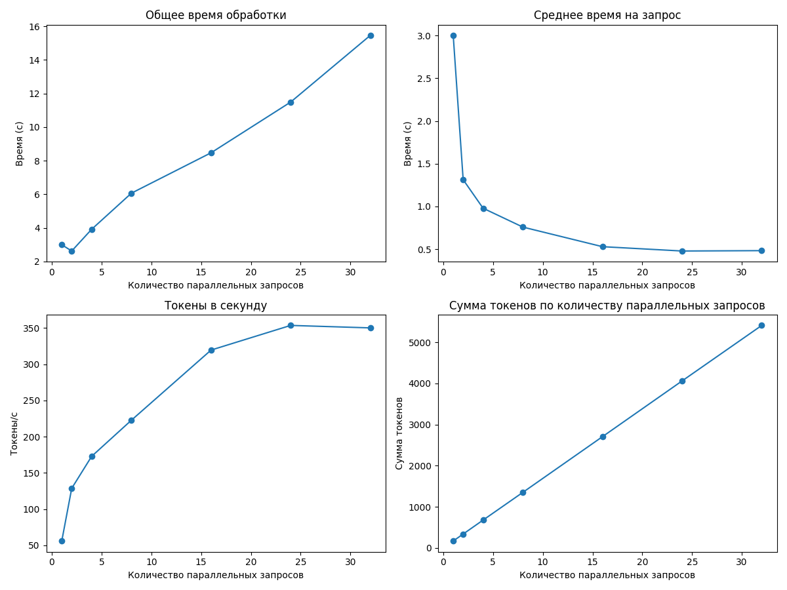

#### Таблица результатов

|   Количество параллельных запросов |   Общее время (с) |   Среднее время на запрос (с) |   Токены в секунду |   Сумма токенов |
|-----------------------------------:|------------------:|------------------------------:|-------------------:|----------------:|
|                                  1 |           3.00172 |                      3.00172  |            55.9679 |             168 |
|                                  2 |           2.62719 |                      1.31359  |           128.655  |             338 |
|                                  4 |           3.91857 |                      0.979643 |           172.767  |             677 |
|                                  8 |           6.0706  |                      0.758824 |           222.713  |            1352 |
|                                 16 |           8.4734  |                      0.529587 |           319.47   |            2707 |
|                                 24 |          11.4934  |                      0.478892 |           353.507  |            4063 |
|                                 32 |          15.4614  |                      0.483169 |           350.097  |            5413 |

**Оптимальный размер пакета:** 24

**Максимальная скорость обработки:** 353.51 токенов в секунду

---

