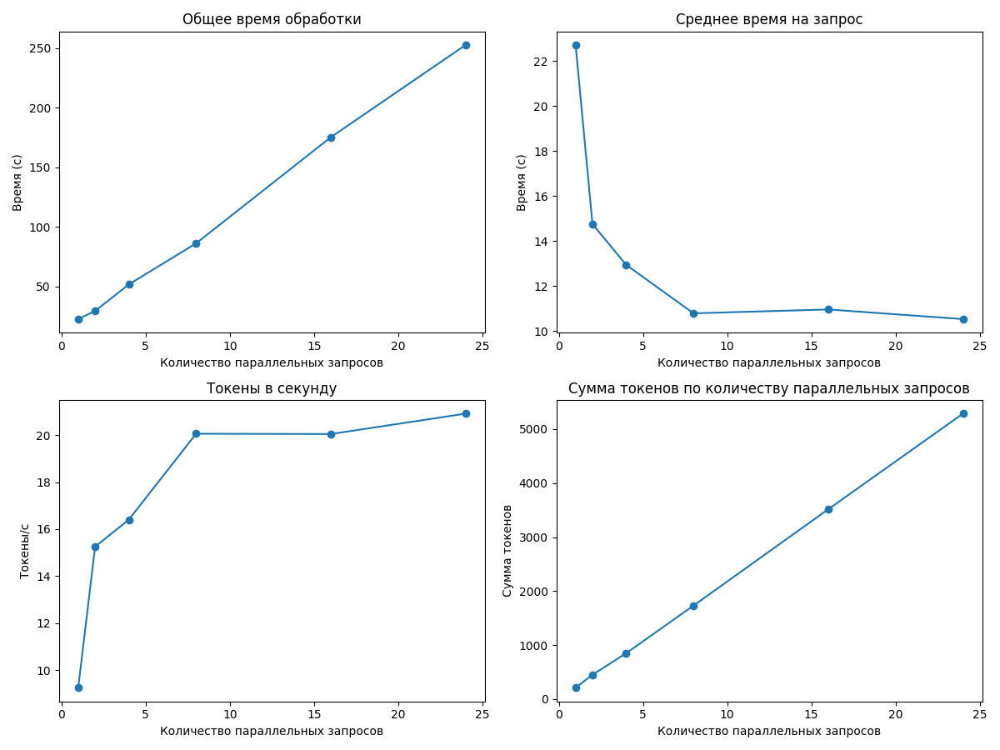

# Отчет о производительности для qwen3:14b

## Итоговые выводы по всем прогонам

### Оптимальные параметры для разного количества параллельных запросов

|   Количество workers |   Оптимальный размер пакета |   Максимальная скорость (токены/сек) |
|---------------------:|----------------------------:|-------------------------------------:|
|                    1 |                           4 |                              34.4888 |
|                    2 |                           8 |                              84.7813 |
|                    3 |                           8 |                              61.1122 |
|                    4 |                           8 |                              85.0007 |
|                    5 |                           8 |                              81.7345 |
|                    6 |                          16 |                              99.2701 |
|                    8 |                          16 |                             114.458  |
|                   10 |                           8 |                              50.5393 |
|                   15 |                          24 |                              20.9199 |
|                   22 |                          16 |                              13.0079 |
|                   24 |                          16 |                              11.8361 |
|                   28 |                           8 |                              10.2155 |

### Наилучшая конфигурация для данного оборудования

- **Количество workers:** 8
- **Оптимальный размер пакета:** 16
- **Скорость обработки:** 114.46 токенов/сек

---

## Детальные результаты по каждому прогону

### Результаты для 1 параллельных запросов

#### Таблица результатов

|   Количество параллельных запросов |   Общее время (с) |   Среднее время на запрос (с) |   Токены в секунду |   Сумма токенов |
|-----------------------------------:|------------------:|------------------------------:|-------------------:|----------------:|
|                                  1 |           8.63194 |                       8.63194 |            22.8222 |             197 |
|                                  2 |          12.3973  |                       6.19864 |            32.9911 |             409 |
|                                  4 |          23.6889  |                       5.92221 |            34.4888 |             817 |

**Оптимальный размер пакета:** 4

**Максимальная скорость обработки:** 34.49 токенов в секунду

---

### Результаты для 2 параллельных запросов

#### Таблица результатов

|   Количество параллельных запросов |   Общее время (с) |   Среднее время на запрос (с) |   Токены в секунду |   Сумма токенов |
|-----------------------------------:|------------------:|------------------------------:|-------------------:|----------------:|
|                                  1 |           8.92231 |                       8.92231 |            24.6573 |             220 |
|                                  2 |          10.0027  |                       5.00135 |            45.1878 |             452 |
|                                  4 |          10.5478  |                       2.63695 |            81.9129 |             864 |
|                                  8 |          20.6295  |                       2.57869 |            84.7813 |            1749 |

**Оптимальный размер пакета:** 8

**Максимальная скорость обработки:** 84.78 токенов в секунду

---

### Результаты для 3 параллельных запросов

#### Таблица результатов

|   Количество параллельных запросов |   Общее время (с) |   Среднее время на запрос (с) |   Токены в секунду |   Сумма токенов |
|-----------------------------------:|------------------:|------------------------------:|-------------------:|----------------:|
|                                  1 |           11.0138 |                      11.0138  |            19.6117 |             216 |
|                                  2 |           10.0737 |                       5.03687 |            42.983  |             433 |
|                                  4 |           18.1353 |                       4.53383 |            47.8072 |             867 |
|                                  8 |           28.6358 |                       3.57948 |            61.1122 |            1750 |

**Оптимальный размер пакета:** 8

**Максимальная скорость обработки:** 61.11 токенов в секунду

---

### Результаты для 4 параллельных запросов

#### Таблица результатов

|   Количество параллельных запросов |   Общее время (с) |   Среднее время на запрос (с) |   Токены в секунду |   Сумма токенов |
|-----------------------------------:|------------------:|------------------------------:|-------------------:|----------------:|
|                                  1 |           10.7402 |                      10.7402  |            19.3665 |             208 |
|                                  2 |           10.2683 |                       5.13415 |            43.6294 |             448 |
|                                  4 |           11.1367 |                       2.78418 |            79.0177 |             880 |
|                                  8 |           21.1645 |                       2.64557 |            85.0007 |            1799 |

**Оптимальный размер пакета:** 8

**Максимальная скорость обработки:** 85.00 токенов в секунду

---

### Результаты для 5 параллельных запросов

#### Таблица результатов

|   Количество параллельных запросов |   Общее время (с) |   Среднее время на запрос (с) |   Токены в секунду |   Сумма токенов |
|-----------------------------------:|------------------:|------------------------------:|-------------------:|----------------:|
|                                  1 |           11.3055 |                      11.3055  |            19.725  |             223 |
|                                  2 |           10.3854 |                       5.19271 |            44.4854 |             462 |
|                                  4 |           10.8405 |                       2.71013 |            80.3468 |             871 |
|                                  8 |           21.423  |                       2.67788 |            81.7345 |            1751 |

**Оптимальный размер пакета:** 8

**Максимальная скорость обработки:** 81.73 токенов в секунду

---

### Результаты для 6 параллельных запросов

#### Таблица результатов

|   Количество параллельных запросов |   Общее время (с) |   Среднее время на запрос (с) |   Токены в секунду |   Сумма токенов |
|-----------------------------------:|------------------:|------------------------------:|-------------------:|----------------:|
|                                  1 |          11.0036  |                      11.0036  |            19.5391 |             215 |
|                                  2 |           9.89163 |                       4.94582 |            44.6842 |             442 |
|                                  4 |          11.0748  |                       2.7687  |            79.3695 |             879 |
|                                  8 |          21.8652  |                       2.73315 |            78.7554 |            1722 |
|                                 16 |          36.3251  |                       2.27032 |            99.2701 |            3606 |

**Оптимальный размер пакета:** 16

**Максимальная скорость обработки:** 99.27 токенов в секунду

---

### Результаты для 8 параллельных запросов

#### Таблица результатов

|   Количество параллельных запросов |   Общее время (с) |   Среднее время на запрос (с) |   Токены в секунду |   Сумма токенов |
|-----------------------------------:|------------------:|------------------------------:|-------------------:|----------------:|
|                                  1 |          11.3587  |                      11.3587  |            19.7206 |             224 |
|                                  2 |           9.91778 |                       4.95889 |            44.4656 |             441 |
|                                  4 |          11.1433  |                       2.78582 |            79.5995 |             887 |
|                                  8 |          16.6905  |                       2.08631 |           105.809  |            1766 |
|                                 16 |          30.2293  |                       1.88933 |           114.458  |            3460 |
|                                 24 |          47.9477  |                       1.99782 |           112.644  |            5401 |

**Оптимальный размер пакета:** 16

**Максимальная скорость обработки:** 114.46 токенов в секунду

---

### Результаты для 10 параллельных запросов

#### Таблица результатов

|   Количество параллельных запросов |   Общее время (с) |   Среднее время на запрос (с) |   Токены в секунду |   Сумма токенов |
|-----------------------------------:|------------------:|------------------------------:|-------------------:|----------------:|
|                                  1 |           15.1503 |                      15.1503  |            13.8612 |             210 |
|                                  2 |           16.5996 |                       8.29982 |            25.4825 |             423 |
|                                  4 |           20.8375 |                       5.20936 |            41.6558 |             868 |
|                                  8 |           34.4682 |                       4.30853 |            50.5393 |            1742 |
|                                 16 |           70.3099 |                       4.39437 |            50.3486 |            3540 |

**Оптимальный размер пакета:** 8

**Максимальная скорость обработки:** 50.54 токенов в секунду

---

### Результаты для 15 параллельных запросов

#### Таблица результатов

|   Количество параллельных запросов |   Общее время (с) |   Среднее время на запрос (с) |   Токены в секунду |   Сумма токенов |
|-----------------------------------:|------------------:|------------------------------:|-------------------:|----------------:|
|                                  1 |           22.7158 |                       22.7158 |            9.24468 |             210 |
|                                  2 |           29.5065 |                       14.7533 |           15.2509  |             450 |
|                                  4 |           51.7603 |                       12.9401 |           16.4025  |             849 |
|                                  8 |           86.2722 |                       10.784  |           20.0644  |            1731 |
|                                 16 |          175.294  |                       10.9559 |           20.0521  |            3515 |
|                                 24 |          252.679  |                       10.5283 |           20.9199  |            5286 |

**Оптимальный размер пакета:** 24

**Максимальная скорость обработки:** 20.92 токенов в секунду

---

### Результаты для 22 параллельных запросов

#### Таблица результатов

|   Количество параллельных запросов |   Общее время (с) |   Среднее время на запрос (с) |   Токены в секунду |   Сумма токенов |
|-----------------------------------:|------------------:|------------------------------:|-------------------:|----------------:|
|                                  1 |           41.5309 |                       41.5309 |            5.46581 |             227 |
|                                  2 |           53.3856 |                       26.6928 |            8.31686 |             444 |
|                                  4 |           79.8775 |                       19.9694 |           10.7665  |             860 |
|                                  8 |          141.297  |                       17.6621 |           12.4631  |            1761 |
|                                 16 |          271.297  |                       16.9561 |           13.0079  |            3529 |
|                                 24 |          468.953  |                       19.5397 |           11.2506  |            5276 |
|                                 32 |          622.133  |                       19.4417 |           11.4124  |            7100 |
|                                 40 |          764.81   |                       19.1203 |           11.4787  |            8779 |

**Оптимальный размер пакета:** 16

**Максимальная скорость обработки:** 13.01 токенов в секунду

---

### Результаты для 24 параллельных запросов

#### Таблица результатов

|   Количество параллельных запросов |   Общее время (с) |   Среднее время на запрос (с) |   Токены в секунду |   Сумма токенов |
|-----------------------------------:|------------------:|------------------------------:|-------------------:|----------------:|
|                                  1 |           44.6771 |                       44.6771 |            4.90184 |             219 |
|                                  2 |           54.7436 |                       27.3718 |            7.81827 |             428 |
|                                  4 |           89.1827 |                       22.2957 |            9.84496 |             878 |
|                                  8 |          157.138  |                       19.6422 |           11.5249  |            1811 |
|                                 16 |          301.959  |                       18.8724 |           11.8361  |            3574 |
|                                 24 |          482.658  |                       20.1108 |           10.8586  |            5241 |
|                                 32 |          684.07   |                       21.3772 |           10.1583  |            6949 |
|                                 40 |          858.904  |                       21.4726 |           10.2724  |            8823 |
|                                 48 |         1001.87   |                       20.8724 |           10.5872  |           10607 |

**Оптимальный размер пакета:** 16

**Максимальная скорость обработки:** 11.84 токенов в секунду

---

### Результаты для 28 параллельных запросов

#### Таблица результатов

|   Количество параллельных запросов |   Общее время (с) |   Среднее время на запрос (с) |   Токены в секунду |   Сумма токенов |
|-----------------------------------:|------------------:|------------------------------:|-------------------:|----------------:|
|                                  1 |           45.8828 |                       45.8828 |            4.62047 |             212 |
|                                  2 |           62.3403 |                       31.1702 |            7.23448 |             451 |
|                                  4 |           95.3725 |                       23.8431 |            9.37377 |             894 |
|                                  8 |          168.764  |                       21.0955 |           10.2155  |            1724 |
|                                 16 |          346.996  |                       21.6872 |           10.1269  |            3514 |
|                                 24 |          566.482  |                       23.6034 |            9.35246 |            5298 |
|                                 32 |          837.697  |                       26.178  |            8.45771 |            7085 |
|                                 40 |         1039.95   |                       25.9987 |            8.49275 |            8832 |
|                                 48 |         1255.94   |                       26.1655 |            8.42793 |           10585 |

**Оптимальный размер пакета:** 8

**Максимальная скорость обработки:** 10.22 токенов в секунду

---

