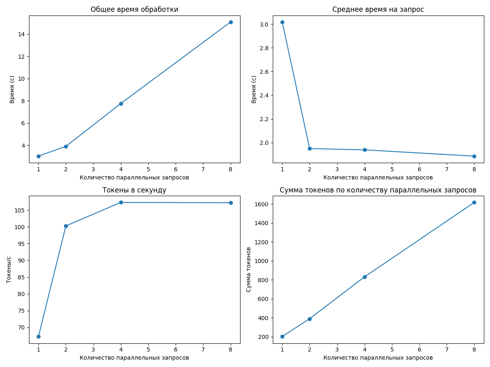
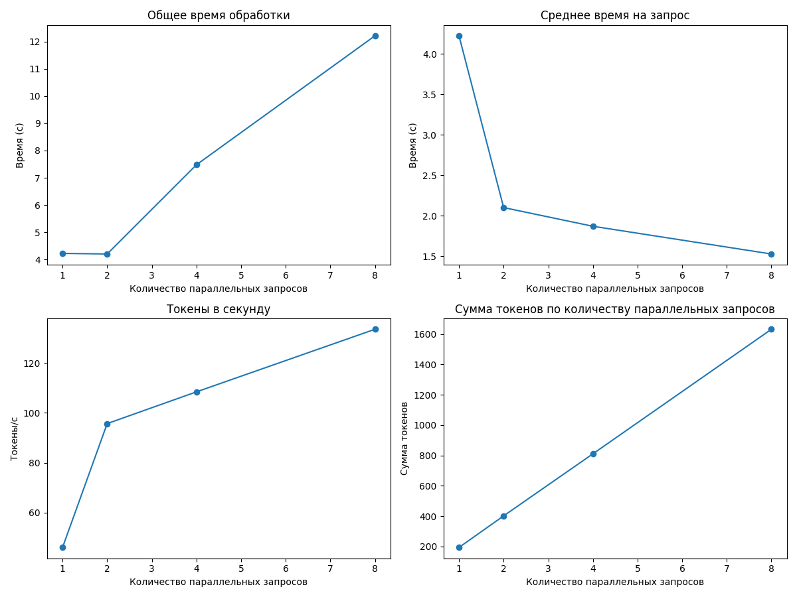
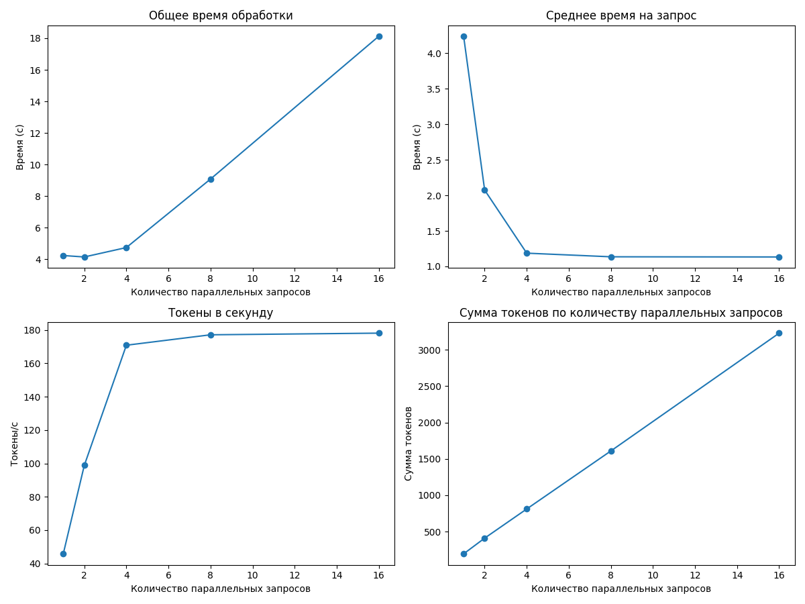
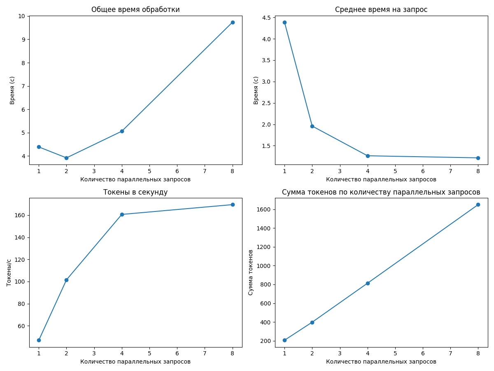
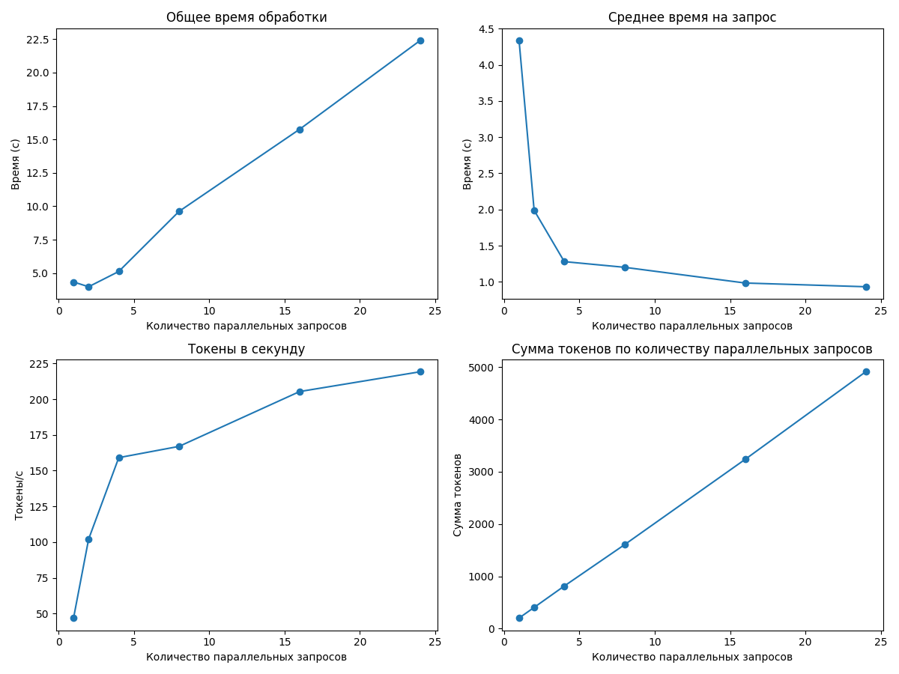
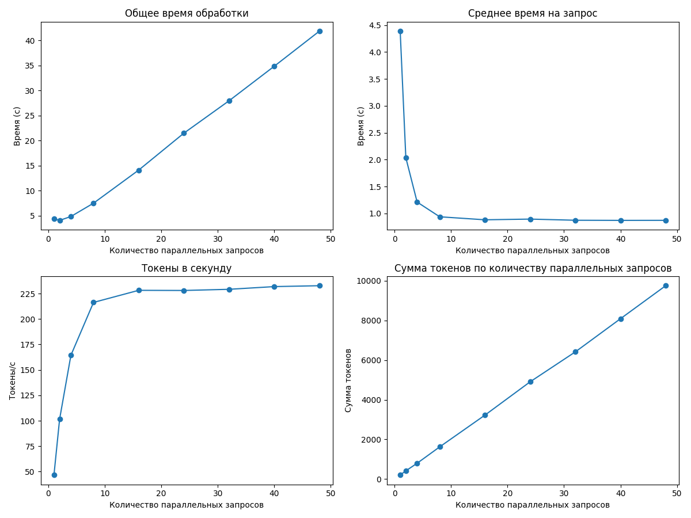
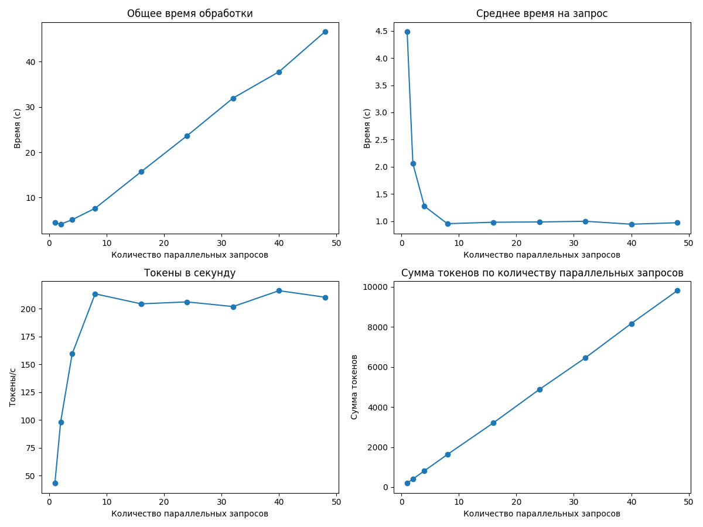
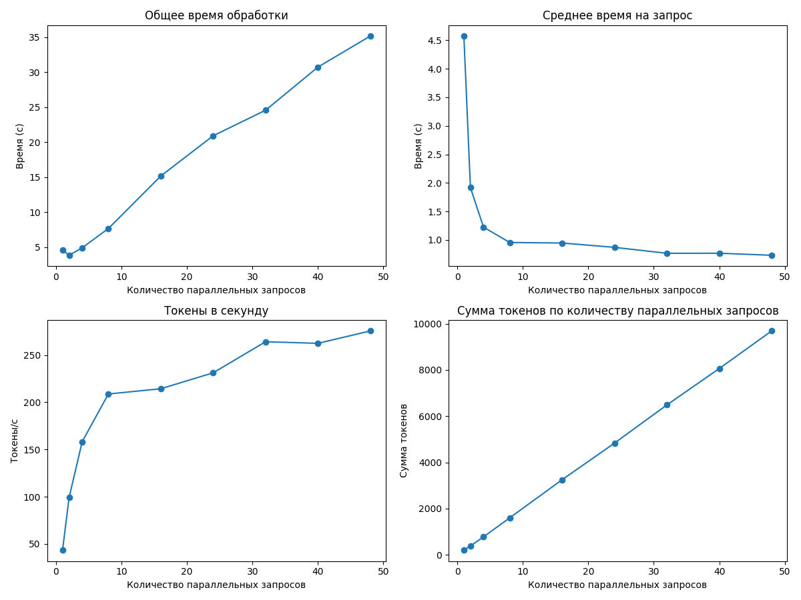
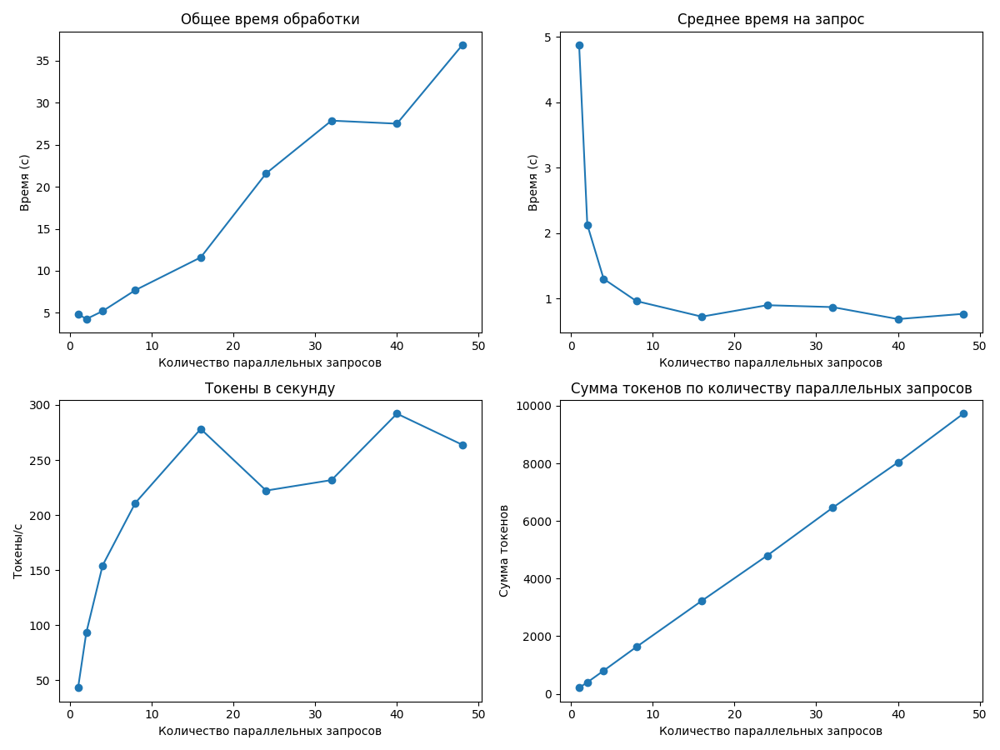
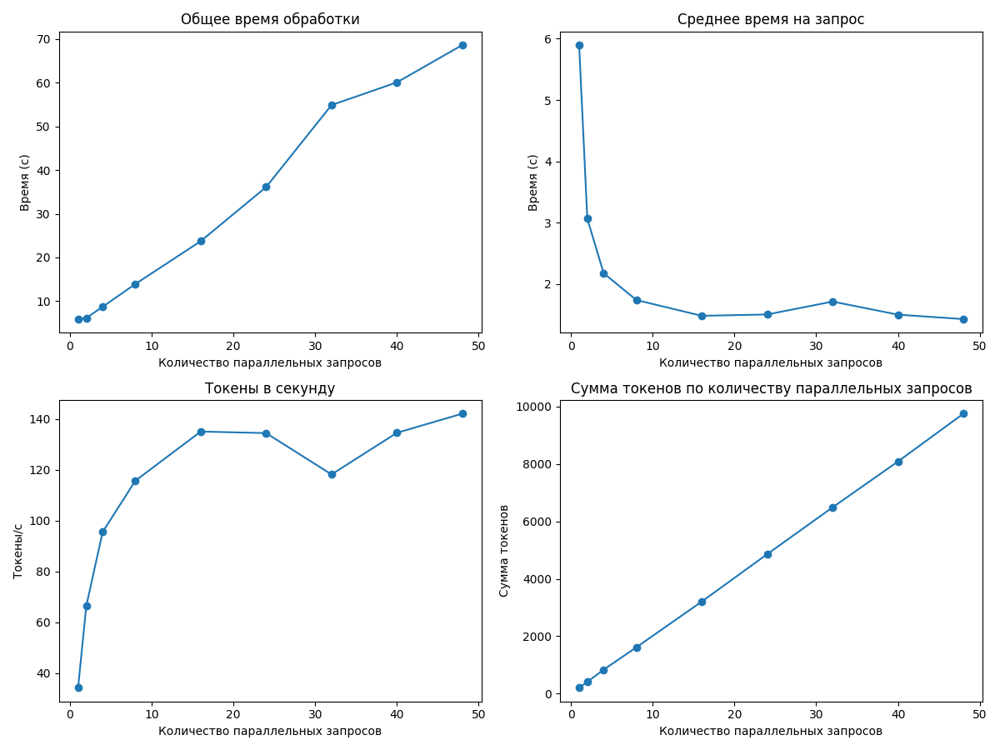

# Отчет о производительности для qwen3:4b

## Итоговые выводы по всем прогонам

### Оптимальные параметры для разного количества параллельных запросов

|   Количество workers |   Оптимальный размер пакета |   Максимальная скорость (токены/сек) |
|---------------------:|----------------------------:|-------------------------------------:|
|                    1 |                           4 |                              34.4888 |
|                    2 |                           4 |                             107.279  |
|                    3 |                           8 |                             133.61   |
|                    4 |                          16 |                             178.155  |
|                    5 |                           8 |                             169.521  |
|                    6 |                          24 |                             219.264  |
|                    8 |                          48 |                             232.755  |
|                   10 |                          40 |                             216.312  |
|                   15 |                          48 |                             275.678  |
|                   22 |                          40 |                             292.109  |
|                   24 |                          48 |                             142.162  |

### Наилучшая конфигурация для данного оборудования

- **Количество workers:** 22
- **Оптимальный размер пакета:** 40
- **Скорость обработки:** 292.11 токенов/сек

---

## Детальные результаты по каждому прогону

### Результаты для 1 параллельных запросов

#### Таблица результатов

|   Количество параллельных запросов |   Общее время (с) |   Среднее время на запрос (с) |   Токены в секунду |   Сумма токенов |
|-----------------------------------:|------------------:|------------------------------:|-------------------:|----------------:|
|                                  1 |           8.63194 |                       8.63194 |            22.8222 |             197 |
|                                  2 |          12.3973  |                       6.19864 |            32.9911 |             409 |
|                                  4 |          23.6889  |                       5.92221 |            34.4888 |             817 |

**Оптимальный размер пакета:** 4

**Максимальная скорость обработки:** 34.49 токенов в секунду

---

### Результаты для 2 параллельных запросов

#### Таблица результатов

|   Количество параллельных запросов |   Общее время (с) |   Среднее время на запрос (с) |   Токены в секунду |   Сумма токенов |
|-----------------------------------:|------------------:|------------------------------:|-------------------:|----------------:|
|                                  1 |           3.0176  |                       3.0176  |             67.272 |             203 |
|                                  2 |           3.89925 |                       1.94963 |            100.276 |             391 |
|                                  4 |           7.75545 |                       1.93886 |            107.279 |             832 |
|                                  8 |          15.0863  |                       1.88579 |            107.183 |            1617 |

**Оптимальный размер пакета:** 4

**Максимальная скорость обработки:** 107.28 токенов в секунду

---

### Результаты для 3 параллельных запросов

#### Таблица результатов

|   Количество параллельных запросов |   Общее время (с) |   Среднее время на запрос (с) |   Токены в секунду |   Сумма токенов |
|-----------------------------------:|------------------:|------------------------------:|-------------------:|----------------:|
|                                  1 |           4.22205 |                       4.22205 |            45.9493 |             194 |
|                                  2 |           4.20036 |                       2.10018 |            95.7061 |             402 |
|                                  4 |           7.47737 |                       1.86934 |           108.461  |             811 |
|                                  8 |          12.2146  |                       1.52683 |           133.61   |            1632 |

**Оптимальный размер пакета:** 8

**Максимальная скорость обработки:** 133.61 токенов в секунду

---

### Результаты для 4 параллельных запросов

#### Таблица результатов

|   Количество параллельных запросов |   Общее время (с) |   Среднее время на запрос (с) |   Токены в секунду |   Сумма токенов |
|-----------------------------------:|------------------:|------------------------------:|-------------------:|----------------:|
|                                  1 |           4.24073 |                       4.24073 |            45.7468 |             194 |
|                                  2 |           4.14928 |                       2.07464 |            98.8124 |             410 |
|                                  4 |           4.74536 |                       1.18634 |           170.904  |             811 |
|                                  8 |           9.08217 |                       1.13527 |           177.16   |            1609 |
|                                 16 |          18.1247  |                       1.13279 |           178.155  |            3229 |

**Оптимальный размер пакета:** 16

**Максимальная скорость обработки:** 178.15 токенов в секунду

---

### Результаты для 5 параллельных запросов

#### Таблица результатов

|   Количество параллельных запросов |   Общее время (с) |   Среднее время на запрос (с) |   Токены в секунду |   Сумма токенов |
|-----------------------------------:|------------------:|------------------------------:|-------------------:|----------------:|
|                                  1 |           4.38563 |                       4.38563 |            46.9716 |             206 |
|                                  2 |           3.91898 |                       1.95949 |           101.557  |             398 |
|                                  4 |           5.06014 |                       1.26503 |           160.668  |             813 |
|                                  8 |           9.73332 |                       1.21666 |           169.521  |            1650 |

**Оптимальный размер пакета:** 8

**Максимальная скорость обработки:** 169.52 токенов в секунду

---

### Результаты для 6 параллельных запросов

#### Таблица результатов

|   Количество параллельных запросов |   Общее время (с) |   Среднее время на запрос (с) |   Токены в секунду |   Сумма токенов |
|-----------------------------------:|------------------:|------------------------------:|-------------------:|----------------:|
|                                  1 |           4.33631 |                      4.33631  |             46.814 |             203 |
|                                  2 |           3.97912 |                      1.98956  |            102.033 |             406 |
|                                  4 |           5.12207 |                      1.28052  |            159.115 |             815 |
|                                  8 |           9.61654 |                      1.20207  |            167.004 |            1606 |
|                                 16 |          15.7598  |                      0.984986 |            205.396 |            3237 |
|                                 24 |          22.4023  |                      0.933427 |            219.264 |            4912 |

**Оптимальный размер пакета:** 24

**Максимальная скорость обработки:** 219.26 токенов в секунду

---

### Результаты для 8 параллельных запросов

#### Таблица результатов

|   Количество параллельных запросов |   Общее время (с) |   Среднее время на запрос (с) |   Токены в секунду |   Сумма токенов |
|-----------------------------------:|------------------:|------------------------------:|-------------------:|----------------:|
|                                  1 |           4.38936 |                      4.38936  |            46.7038 |             205 |
|                                  2 |           4.07445 |                      2.03722  |           101.609  |             414 |
|                                  4 |           4.84862 |                      1.21215  |           164.377  |             797 |
|                                  8 |           7.50744 |                      0.93843  |           216.319  |            1624 |
|                                 16 |          14.1226  |                      0.882664 |           228.215  |            3223 |
|                                 24 |          21.4976  |                      0.895731 |           228.072  |            4903 |
|                                 32 |          27.9729  |                      0.874154 |           229.222  |            6412 |
|                                 40 |          34.8719  |                      0.871797 |           231.877  |            8086 |
|                                 48 |          41.8896  |                      0.8727   |           232.755  |            9750 |

**Оптимальный размер пакета:** 48

**Максимальная скорость обработки:** 232.75 токенов в секунду

---

### Результаты для 10 параллельных запросов

#### Таблица результатов

|   Количество параллельных запросов |   Общее время (с) |   Среднее время на запрос (с) |   Токены в секунду |   Сумма токенов |
|-----------------------------------:|------------------:|------------------------------:|-------------------:|----------------:|
|                                  1 |           4.48498 |                      4.48498  |            43.2555 |             194 |
|                                  2 |           4.11848 |                      2.05924  |            98.3373 |             405 |
|                                  4 |           5.1051  |                      1.27627  |           159.448  |             814 |
|                                  8 |           7.63115 |                      0.953894 |           213.467  |            1629 |
|                                 16 |          15.6942  |                      0.980885 |           204.471  |            3209 |
|                                 24 |          23.6536  |                      0.985568 |           206.226  |            4878 |
|                                 32 |          31.9552  |                      0.998601 |           202.033  |            6456 |
|                                 40 |          37.7742  |                      0.944354 |           216.312  |            8171 |
|                                 48 |          46.6277  |                      0.97141  |           210.433  |            9812 |

**Оптимальный размер пакета:** 40

**Максимальная скорость обработки:** 216.31 токенов в секунду

---

### Результаты для 15 параллельных запросов

#### Таблица результатов

|   Количество параллельных запросов |   Общее время (с) |   Среднее время на запрос (с) |   Токены в секунду |   Сумма токенов |
|-----------------------------------:|------------------:|------------------------------:|-------------------:|----------------:|
|                                  1 |           4.57341 |                      4.57341  |            43.2937 |             198 |
|                                  2 |           3.83321 |                      1.9166   |            99.1337 |             380 |
|                                  4 |           4.89613 |                      1.22403  |           158.288  |             775 |
|                                  8 |           7.65159 |                      0.956448 |           208.846  |            1598 |
|                                 16 |          15.1495  |                      0.946843 |           214.397  |            3248 |
|                                 24 |          20.897   |                      0.870708 |           231.277  |            4833 |
|                                 32 |          24.544   |                      0.766999 |           264.22   |            6485 |
|                                 40 |          30.7078  |                      0.767695 |           262.539  |            8062 |
|                                 48 |          35.1461  |                      0.732209 |           275.678  |            9689 |

**Оптимальный размер пакета:** 48

**Максимальная скорость обработки:** 275.68 токенов в секунду

---

### Результаты для 22 параллельных запросов

#### Таблица результатов

|   Количество параллельных запросов |   Общее время (с) |   Среднее время на запрос (с) |   Токены в секунду |   Сумма токенов |
|-----------------------------------:|------------------:|------------------------------:|-------------------:|----------------:|
|                                  1 |           4.87646 |                      4.87646  |            43.064  |             210 |
|                                  2 |           4.26033 |                      2.13017  |            92.9505 |             396 |
|                                  4 |           5.2072  |                      1.3018   |           154.209  |             803 |
|                                  8 |           7.70241 |                      0.962801 |           210.973  |            1625 |
|                                 16 |          11.5981  |                      0.724881 |           278.235  |            3227 |
|                                 24 |          21.5917  |                      0.899656 |           222.215  |            4798 |
|                                 32 |          27.865   |                      0.870781 |           231.76   |            6458 |
|                                 40 |          27.5034  |                      0.687585 |           292.109  |            8034 |
|                                 48 |          36.86    |                      0.767918 |           263.836  |            9725 |

**Оптимальный размер пакета:** 40

**Максимальная скорость обработки:** 292.11 токенов в секунду

---

### Результаты для 24 параллельных запросов

#### Таблица результатов

|   Количество параллельных запросов |   Общее время (с) |   Среднее время на запрос (с) |   Токены в секунду |   Сумма токенов |
|-----------------------------------:|------------------:|------------------------------:|-------------------:|----------------:|
|                                  1 |           5.89669 |                       5.89669 |            34.2565 |             202 |
|                                  2 |           6.13382 |                       3.06691 |            66.3534 |             407 |
|                                  4 |           8.70761 |                       2.1769  |            95.5486 |             832 |
|                                  8 |          13.92    |                       1.73999 |           115.733  |            1611 |
|                                 16 |          23.728   |                       1.483   |           135.114  |            3206 |
|                                 24 |          36.1088  |                       1.50453 |           134.51   |            4857 |
|                                 32 |          54.8743  |                       1.71482 |           118.234  |            6488 |
|                                 40 |          60.0753  |                       1.50188 |           134.631  |            8088 |
|                                 48 |          68.619   |                       1.42956 |           142.162  |            9755 |

**Оптимальный размер пакета:** 48

**Максимальная скорость обработки:** 142.16 токенов в секунду

---

