# Отчет о производительности для qwen3:8b

## Итоговые выводы по всем прогонам

### Оптимальные параметры для разного количества параллельных запросов

|   Количество workers |   Оптимальный размер пакета |   Максимальная скорость (токены/сек) |
|---------------------:|----------------------------:|-------------------------------------:|
|                    1 |                           4 |                              34.4888 |
|                    2 |                           8 |                              69.3159 |
|                    3 |                           8 |                              95.0651 |
|                    4 |                          16 |                             133.253  |
|                    5 |                          16 |                             133.411  |
|                    6 |                          24 |                             164.86   |
|                    8 |                          32 |                             179.079  |
|                   10 |                           8 |                             164.95   |
|                   15 |                          24 |                             194.62   |
|                   22 |                          40 |                              47.3361 |
|                   24 |                          16 |                              36.5994 |
|                   28 |                          16 |                              26.7359 |

### Наилучшая конфигурация для данного оборудования

- **Количество workers:** 15
- **Оптимальный размер пакета:** 24
- **Скорость обработки:** 194.62 токенов/сек

---

## Детальные результаты по каждому прогону

### Результаты для 1 параллельных запросов

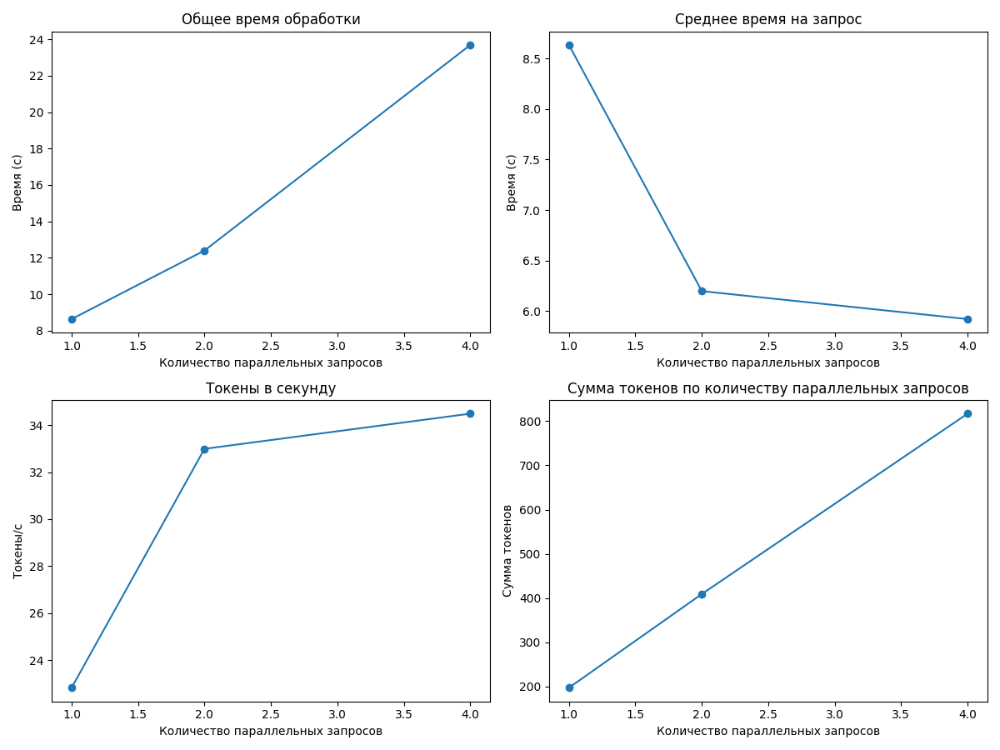

#### Таблица результатов

|   Количество параллельных запросов |   Общее время (с) |   Среднее время на запрос (с) |   Токены в секунду |   Сумма токенов |
|-----------------------------------:|------------------:|------------------------------:|-------------------:|----------------:|
|                                  1 |           8.63194 |                       8.63194 |            22.8222 |             197 |
|                                  2 |          12.3973  |                       6.19864 |            32.9911 |             409 |
|                                  4 |          23.6889  |                       5.92221 |            34.4888 |             817 |

**Оптимальный размер пакета:** 4

**Максимальная скорость обработки:** 34.49 токенов в секунду

---

### Результаты для 2 параллельных запросов

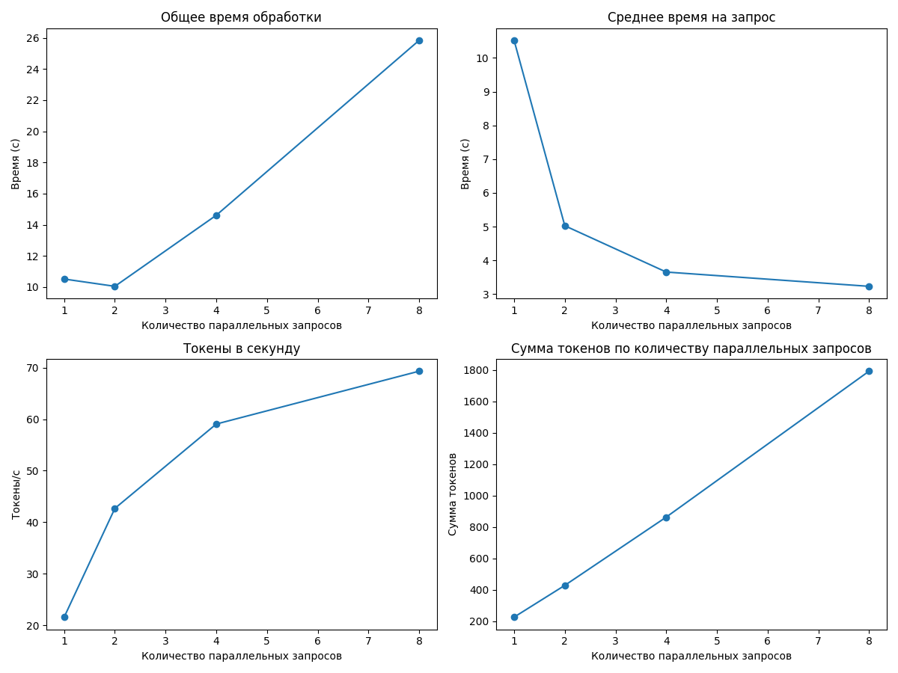

#### Таблица результатов

|   Количество параллельных запросов |   Общее время (с) |   Среднее время на запрос (с) |   Токены в секунду |   Сумма токенов |
|-----------------------------------:|------------------:|------------------------------:|-------------------:|----------------:|
|                                  1 |           10.5179 |                      10.5179  |            21.5822 |             227 |
|                                  2 |           10.0498 |                       5.02489 |            42.6875 |             429 |
|                                  4 |           14.6123 |                       3.65306 |            59.06   |             863 |
|                                  8 |           25.8382 |                       3.22978 |            69.3159 |            1791 |

**Оптимальный размер пакета:** 8

**Максимальная скорость обработки:** 69.32 токенов в секунду

---

### Результаты для 3 параллельных запросов

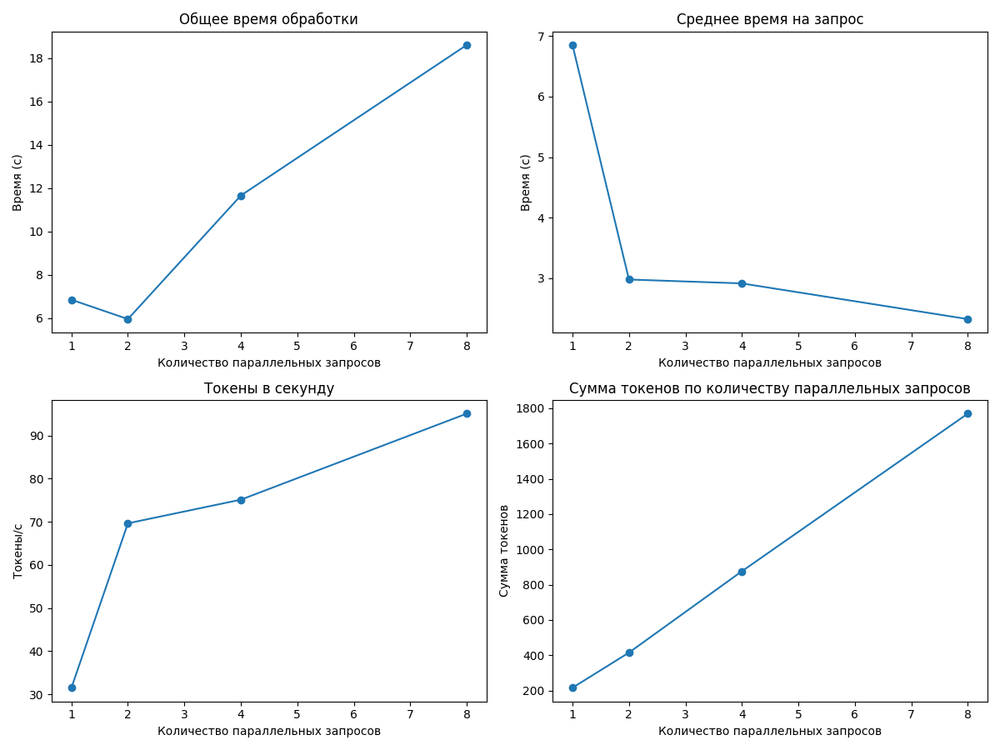

#### Таблица результатов

|   Количество параллельных запросов |   Общее время (с) |   Среднее время на запрос (с) |   Токены в секунду |   Сумма токенов |
|-----------------------------------:|------------------:|------------------------------:|-------------------:|----------------:|
|                                  1 |           6.8517  |                       6.8517  |            31.525  |             216 |
|                                  2 |           5.95885 |                       2.97943 |            69.6443 |             415 |
|                                  4 |          11.6609  |                       2.91524 |            75.1226 |             876 |
|                                  8 |          18.6083  |                       2.32604 |            95.0651 |            1769 |

**Оптимальный размер пакета:** 8

**Максимальная скорость обработки:** 95.07 токенов в секунду

---

### Результаты для 4 параллельных запросов

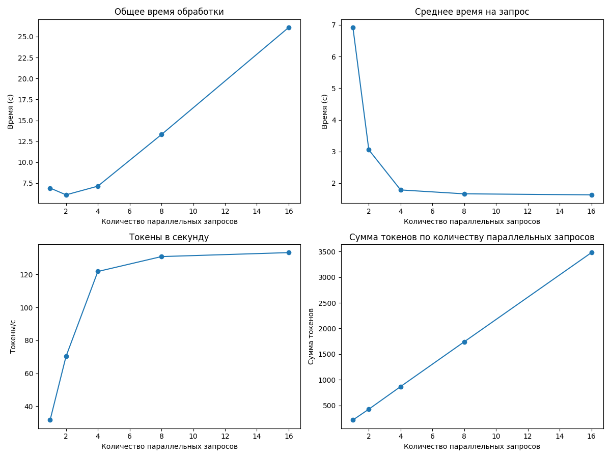

#### Таблица результатов

|   Количество параллельных запросов |   Общее время (с) |   Среднее время на запрос (с) |   Токены в секунду |   Сумма токенов |
|-----------------------------------:|------------------:|------------------------------:|-------------------:|----------------:|
|                                  1 |           6.91792 |                       6.91792 |            31.6569 |             219 |
|                                  2 |           6.10536 |                       3.05268 |            70.2661 |             429 |
|                                  4 |           7.14318 |                       1.7858  |           121.794  |             870 |
|                                  8 |          13.3065  |                       1.66331 |           130.839  |            1741 |
|                                 16 |          26.0932  |                       1.63083 |           133.253  |            3477 |

**Оптимальный размер пакета:** 16

**Максимальная скорость обработки:** 133.25 токенов в секунду

---

### Результаты для 5 параллельных запросов

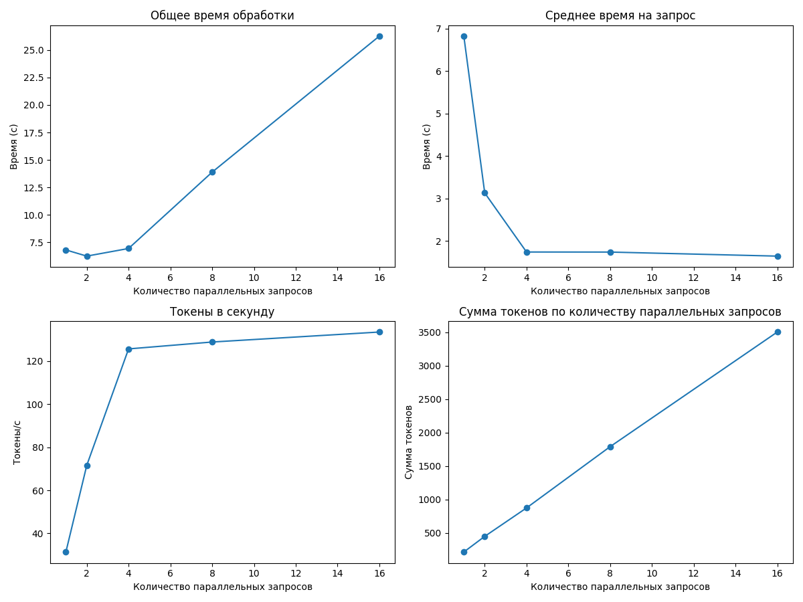

#### Таблица результатов

|   Количество параллельных запросов |   Общее время (с) |   Среднее время на запрос (с) |   Токены в секунду |   Сумма токенов |
|-----------------------------------:|------------------:|------------------------------:|-------------------:|----------------:|
|                                  1 |           6.82085 |                       6.82085 |            31.3744 |             214 |
|                                  2 |           6.25735 |                       3.12867 |            71.5958 |             448 |
|                                  4 |           6.95123 |                       1.73781 |           125.589  |             873 |
|                                  8 |          13.8918  |                       1.73647 |           128.781  |            1789 |
|                                 16 |          26.2572  |                       1.64108 |           133.411  |            3503 |

**Оптимальный размер пакета:** 16

**Максимальная скорость обработки:** 133.41 токенов в секунду

---

### Результаты для 6 параллельных запросов

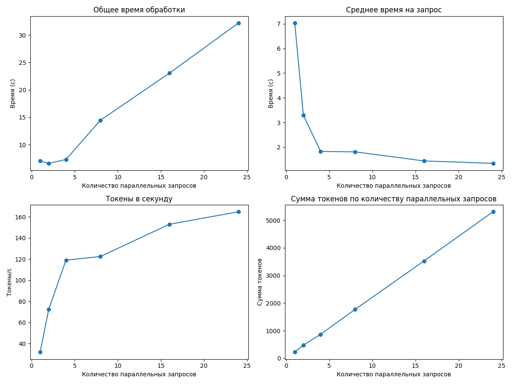

#### Таблица результатов

|   Количество параллельных запросов |   Общее время (с) |   Среднее время на запрос (с) |   Токены в секунду |   Сумма токенов |
|-----------------------------------:|------------------:|------------------------------:|-------------------:|----------------:|
|                                  1 |           7.03099 |                       7.03099 |            31.859  |             224 |
|                                  2 |           6.5905  |                       3.29525 |            72.5286 |             478 |
|                                  4 |           7.30221 |                       1.82555 |           119.005  |             869 |
|                                  8 |          14.4641  |                       1.80801 |           122.51   |            1772 |
|                                 16 |          23.0507  |                       1.44067 |           153.054  |            3528 |
|                                 24 |          32.191   |                       1.34129 |           164.86   |            5307 |

**Оптимальный размер пакета:** 24

**Максимальная скорость обработки:** 164.86 токенов в секунду

---

### Результаты для 8 параллельных запросов

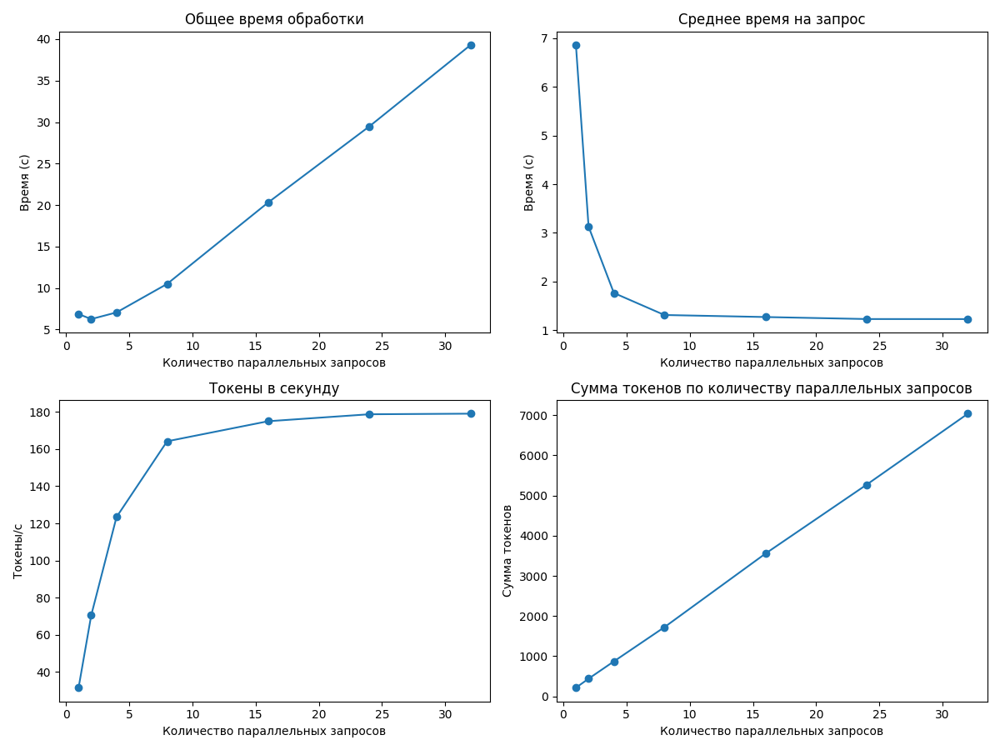

#### Таблица результатов

|   Количество параллельных запросов |   Общее время (с) |   Среднее время на запрос (с) |   Токены в секунду |   Сумма токенов |
|-----------------------------------:|------------------:|------------------------------:|-------------------:|----------------:|
|                                  1 |           6.86181 |                       6.86181 |            31.4786 |             216 |
|                                  2 |           6.25803 |                       3.12902 |            70.4694 |             441 |
|                                  4 |           7.05909 |                       1.76477 |           123.387  |             871 |
|                                  8 |          10.4936  |                       1.3117  |           164.195  |            1723 |
|                                 16 |          20.3182  |                       1.26989 |           175.016  |            3556 |
|                                 24 |          29.4869  |                       1.22862 |           178.757  |            5271 |
|                                 32 |          39.2899  |                       1.22781 |           179.079  |            7036 |

**Оптимальный размер пакета:** 32

**Максимальная скорость обработки:** 179.08 токенов в секунду

---

### Результаты для 10 параллельных запросов

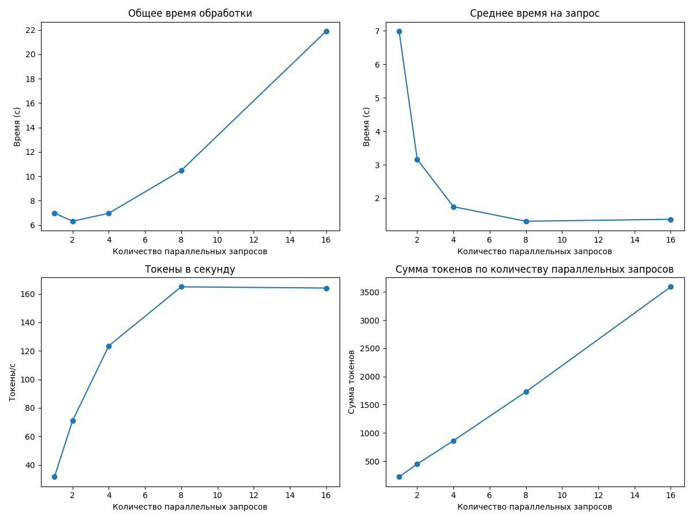

#### Таблица результатов

|   Количество параллельных запросов |   Общее время (с) |   Среднее время на запрос (с) |   Токены в секунду |   Сумма токенов |
|-----------------------------------:|------------------:|------------------------------:|-------------------:|----------------:|
|                                  1 |           6.9911  |                       6.9911  |            31.6116 |             221 |
|                                  2 |           6.32436 |                       3.16218 |            70.9953 |             449 |
|                                  4 |           6.9774  |                       1.74435 |           123.542  |             862 |
|                                  8 |          10.482   |                       1.31025 |           164.95   |            1729 |
|                                 16 |          21.8921  |                       1.36825 |           164.078  |            3592 |

**Оптимальный размер пакета:** 8

**Максимальная скорость обработки:** 164.95 токенов в секунду

---

### Результаты для 15 параллельных запросов

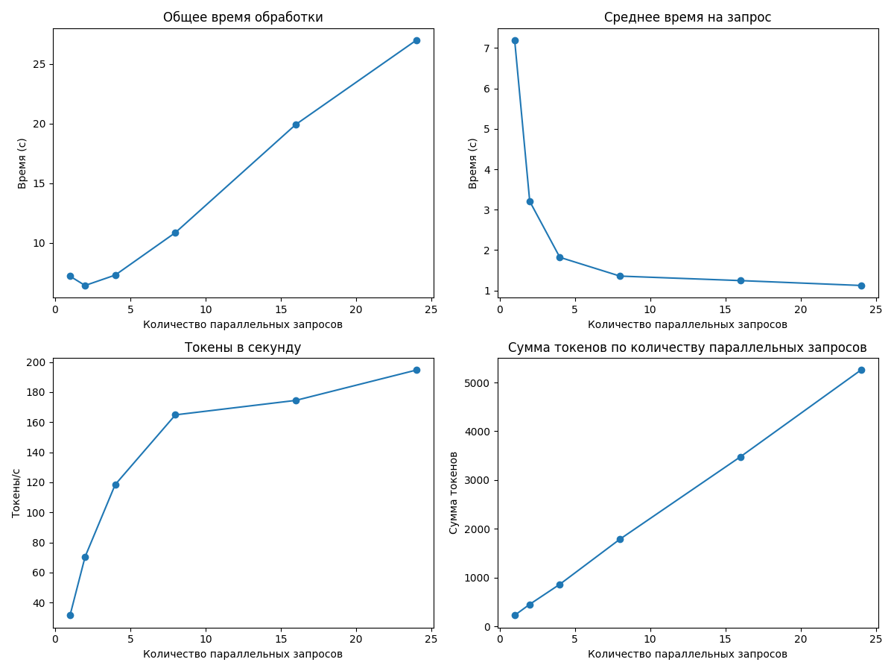

#### Таблица результатов

|   Количество параллельных запросов |   Общее время (с) |   Среднее время на запрос (с) |   Токены в секунду |   Сумма токенов |
|-----------------------------------:|------------------:|------------------------------:|-------------------:|----------------:|
|                                  1 |           7.19059 |                       7.19059 |            31.569  |             227 |
|                                  2 |           6.41413 |                       3.20707 |            70.4694 |             452 |
|                                  4 |           7.28443 |                       1.82111 |           118.472  |             863 |
|                                  8 |          10.8524  |                       1.35655 |           164.848  |            1789 |
|                                 16 |          19.9281  |                       1.24551 |           174.477  |            3477 |
|                                 24 |          26.9962  |                       1.12484 |           194.62   |            5254 |

**Оптимальный размер пакета:** 24

**Максимальная скорость обработки:** 194.62 токенов в секунду

---

### Результаты для 22 параллельных запросов

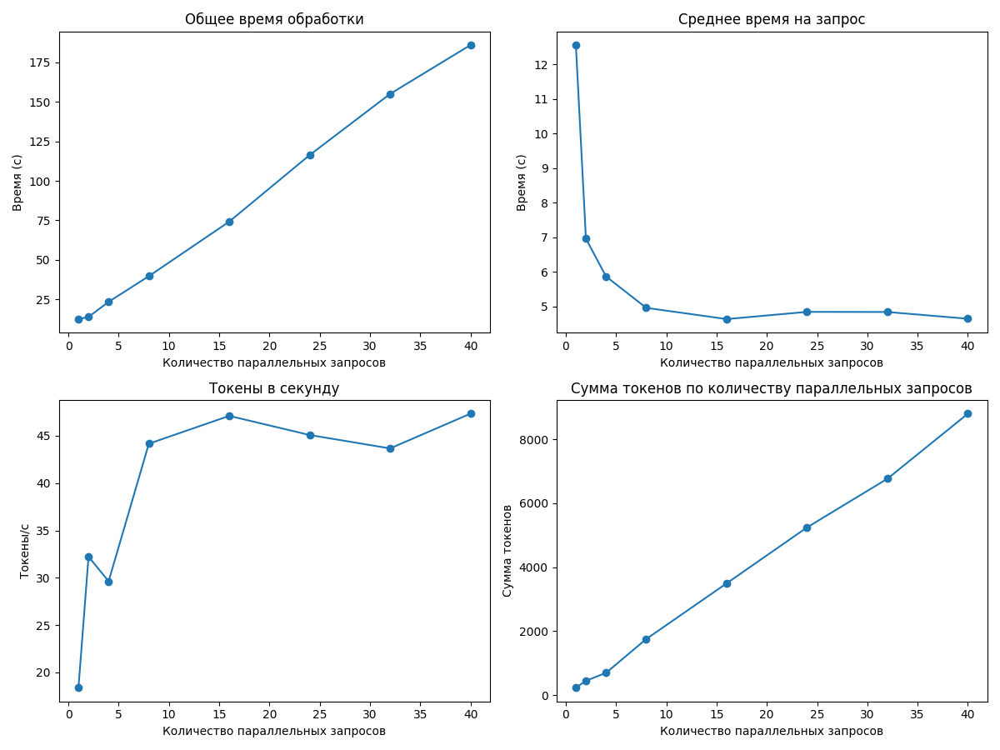

#### Таблица результатов

|   Количество параллельных запросов |   Общее время (с) |   Среднее время на запрос (с) |   Токены в секунду |   Сумма токенов |
|-----------------------------------:|------------------:|------------------------------:|-------------------:|----------------:|
|                                  1 |           12.5644 |                      12.5644  |            18.3853 |             231 |
|                                  2 |           13.9292 |                       6.96458 |            32.2345 |             449 |
|                                  4 |           23.4917 |                       5.87291 |            29.6275 |             696 |
|                                  8 |           39.7177 |                       4.96472 |            44.1616 |            1754 |
|                                 16 |           74.2412 |                       4.64007 |            47.1032 |            3497 |
|                                 24 |          116.365  |                       4.84853 |            45.0823 |            5246 |
|                                 32 |          155.044  |                       4.84512 |            43.6651 |            6770 |
|                                 40 |          185.989  |                       4.64973 |            47.3361 |            8804 |

**Оптимальный размер пакета:** 40

**Максимальная скорость обработки:** 47.34 токенов в секунду

---

### Результаты для 24 параллельных запросов

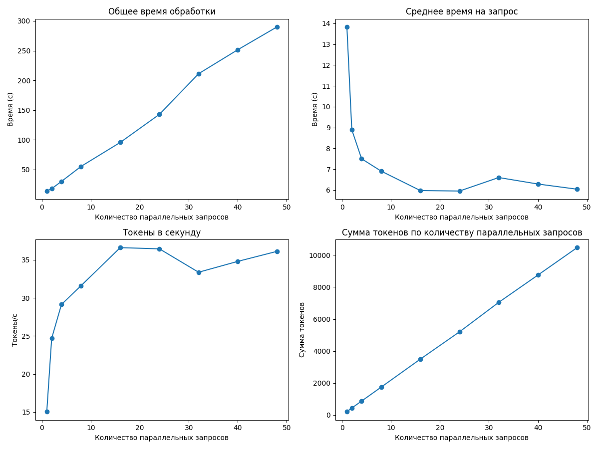

#### Таблица результатов

|   Количество параллельных запросов |   Общее время (с) |   Среднее время на запрос (с) |   Токены в секунду |   Сумма токенов |
|-----------------------------------:|------------------:|------------------------------:|-------------------:|----------------:|
|                                  1 |           13.8288 |                      13.8288  |            15.0411 |             208 |
|                                  2 |           17.7884 |                       8.89419 |            24.679  |             439 |
|                                  4 |           29.9999 |                       7.49997 |            29.1335 |             874 |
|                                  8 |           55.2532 |                       6.90665 |            31.6    |            1746 |
|                                 16 |           95.5753 |                       5.97346 |            36.5994 |            3498 |
|                                 24 |          142.827  |                       5.95114 |            36.4426 |            5205 |
|                                 32 |          211.171  |                       6.5991  |            33.3663 |            7046 |
|                                 40 |          251.506  |                       6.28764 |            34.7944 |            8751 |
|                                 48 |          289.861  |                       6.03877 |            36.1104 |           10467 |

**Оптимальный размер пакета:** 16

**Максимальная скорость обработки:** 36.60 токенов в секунду

---

### Результаты для 28 параллельных запросов

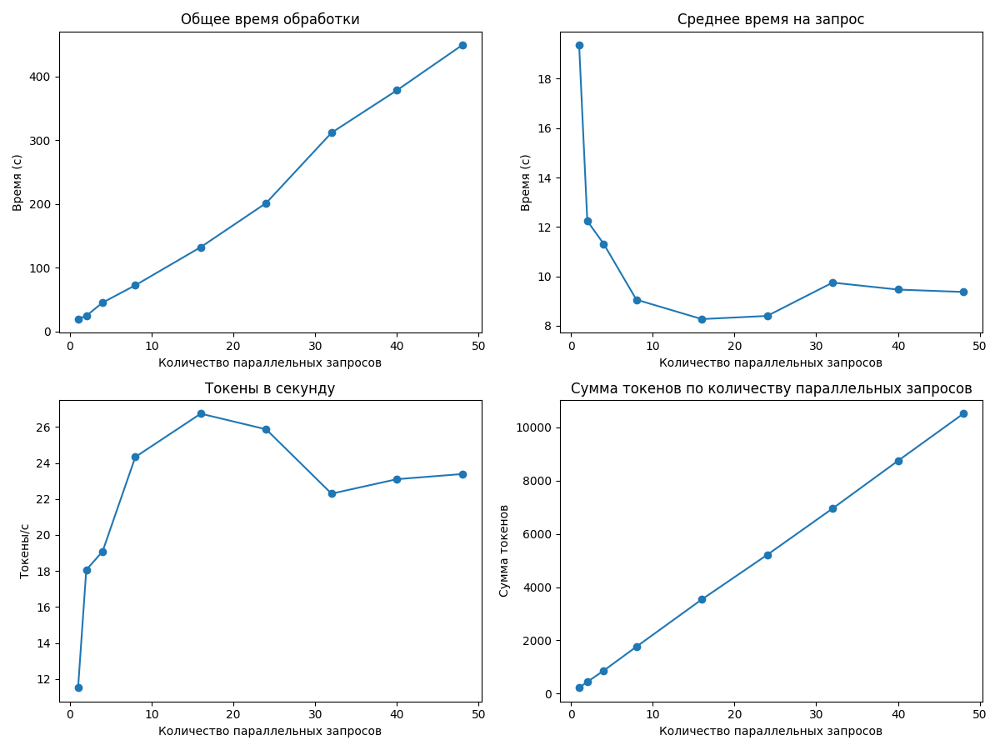

#### Таблица результатов

|   Количество параллельных запросов |   Общее время (с) |   Среднее время на запрос (с) |   Токены в секунду |   Сумма токенов |
|-----------------------------------:|------------------:|------------------------------:|-------------------:|----------------:|
|                                  1 |           19.3663 |                      19.3663  |            11.5148 |             223 |
|                                  2 |           24.4782 |                      12.2391  |            18.0569 |             442 |
|                                  4 |           45.261  |                      11.3153  |            19.0893 |             864 |
|                                  8 |           72.4234 |                       9.05293 |            24.3291 |            1762 |
|                                 16 |          132.257  |                       8.26605 |            26.7359 |            3536 |
|                                 24 |          201.452  |                       8.39382 |            25.8672 |            5211 |
|                                 32 |          311.788  |                       9.74336 |            22.294  |            6951 |
|                                 40 |          378.446  |                       9.46116 |            23.0971 |            8741 |
|                                 48 |          449.495  |                       9.36448 |            23.384  |           10511 |

**Оптимальный размер пакета:** 16

**Максимальная скорость обработки:** 26.74 токенов в секунду

---

