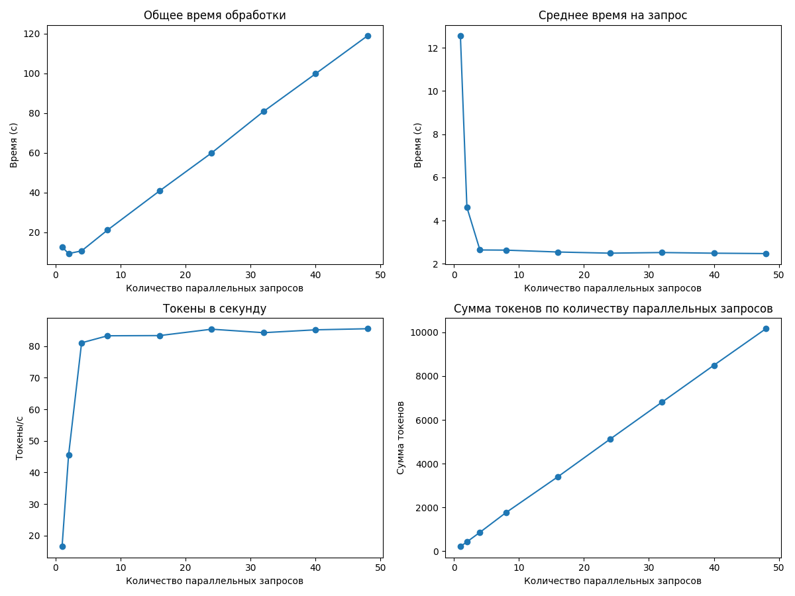
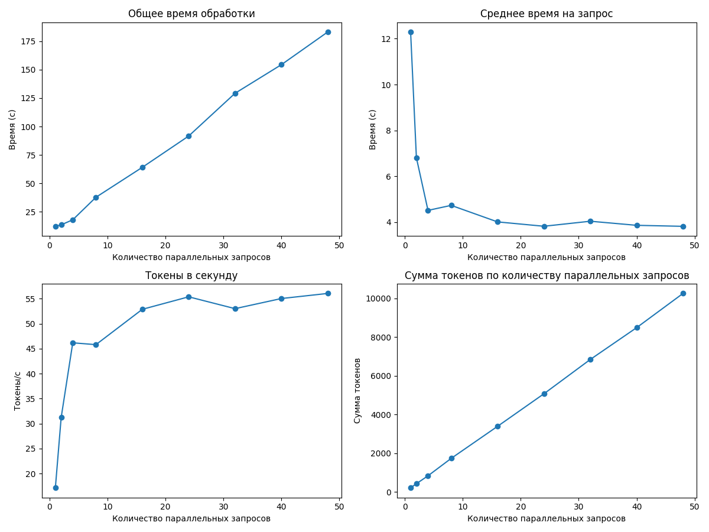
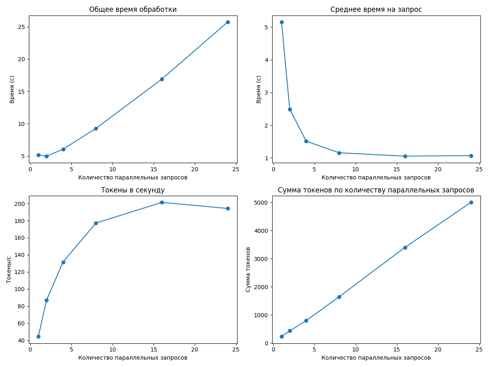
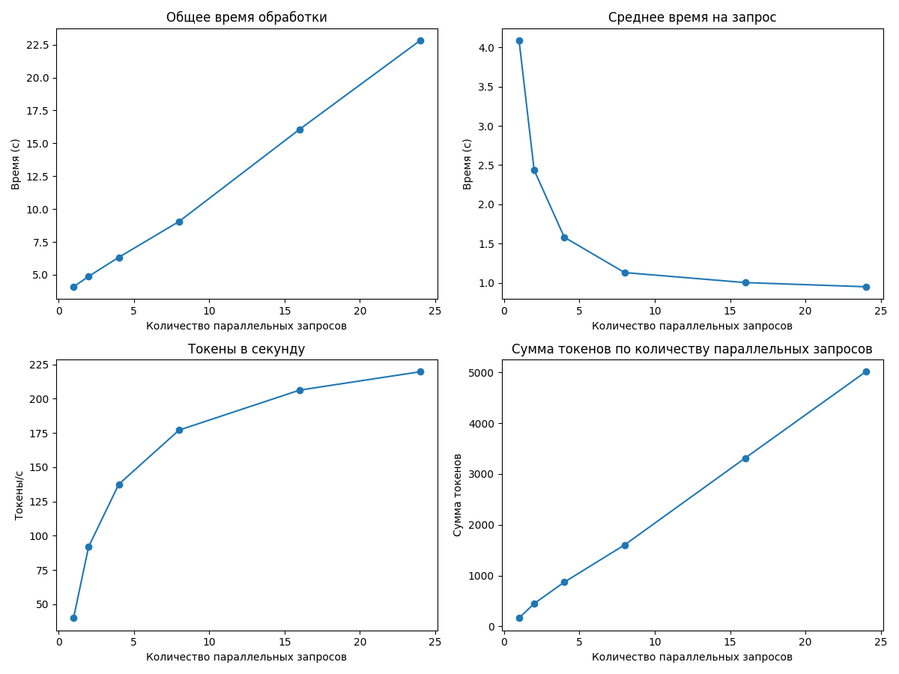
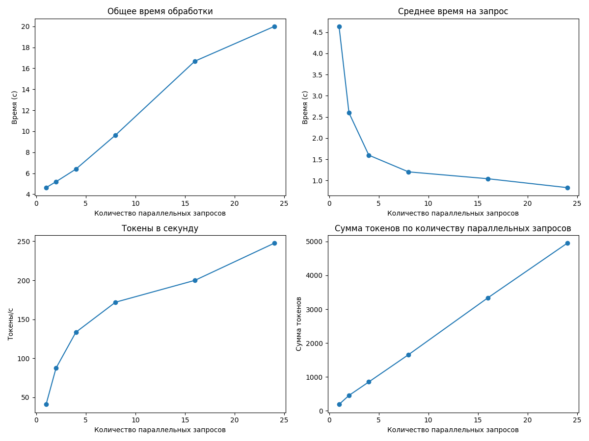
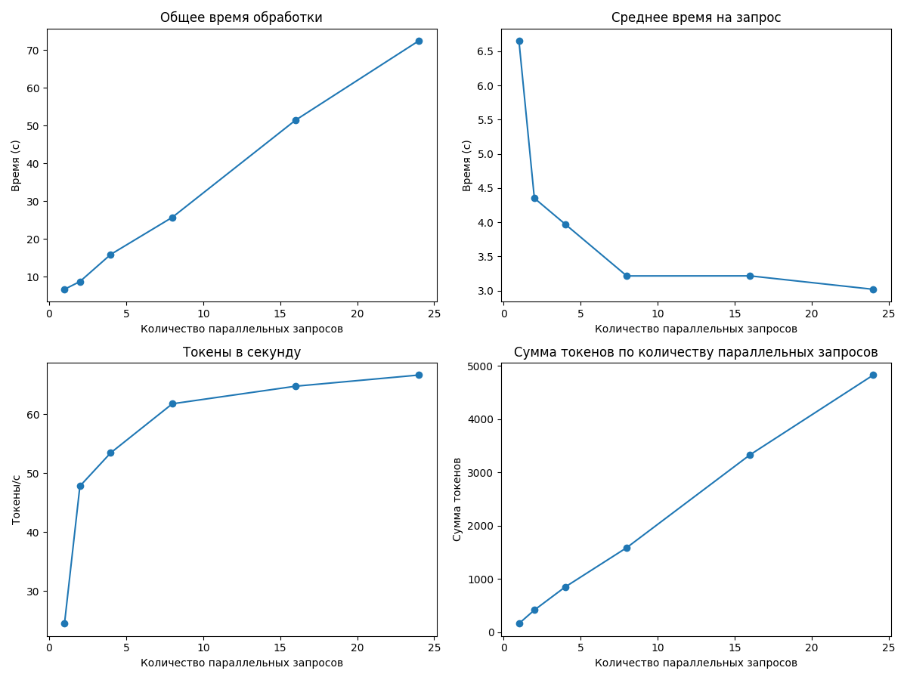
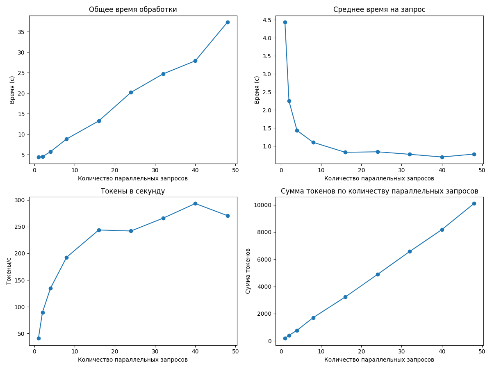

# Отчет о производительности

## Итоговые выводы по всем прогонам

### Оптимальные параметры для разного количества параллельных запросов

|   Количество параллельных запросов |   Оптимальный размер пакета |   Максимальная скорость (токены/сек) |
|-----------------------------------:|----------------------------:|-------------------------------------:|
|                                  4 |                          16 |                              153.303 |
|                                  6 |                          48 |                              189.129 |
|                                  8 |                          24 |                              205.065 |
|                                 10 |                          24 |                              219.66  |
|                                 12 |                          24 |                              247.47  |
|                                 15 |                          24 |                              245.023 |
|                                 20 |                          16 |                              245.086 |

### Наилучшая конфигурация для данного оборудования

- **Количество параллельных запросов:** 12
- **Оптимальный размер пакета:** 24
- **Скорость обработки:** 247.47 токенов/сек

---

## Детальные результаты по каждому прогону

### Результаты для 4 параллельных запросов

#### Таблица результатов

|   Количество параллельных запросов |   Общее время (с) |   Среднее время на запрос (с) |   Токены в секунду |   Сумма токенов |
|-----------------------------------:|------------------:|------------------------------:|-------------------:|----------------:|
|                                  1 |           4.67303 |                       4.67303 |            41.3008 |             193 |
|                                  2 |           4.27433 |                       2.13716 |            90.7746 |             388 |
|                                  4 |           5.83158 |                       1.45789 |           135.469  |             790 |
|                                  8 |          10.6917  |                       1.33647 |           143.101  |            1530 |
|                                 16 |          20.952   |                       1.3095  |           153.303  |            3212 |
|                                 24 |          33.1616  |                       1.38173 |           153.219  |            5081 |

**Оптимальный размер пакета:** 16

**Максимальная скорость обработки:** 153.30 токенов в секунду

---

### Результаты для 6 параллельных запросов

#### Таблица результатов

|   Количество параллельных запросов |   Общее время (с) |   Среднее время на запрос (с) |   Токены в секунду |   Сумма токенов |
|-----------------------------------:|------------------:|------------------------------:|-------------------:|----------------:|
|                                  1 |           4.41806 |                       4.41806 |            41.6473 |             184 |
|                                  2 |           4.45845 |                       2.22922 |            91.9602 |             410 |
|                                  4 |           5.88795 |                       1.47199 |           138.418  |             815 |
|                                  8 |          11.1023  |                       1.38778 |           152.942  |            1698 |
|                                 16 |          18.0671  |                       1.12919 |           178.058  |            3217 |
|                                 24 |          26.162   |                       1.09008 |           184.16   |            4818 |
|                                 32 |          36.4348  |                       1.13859 |           184.522  |            6723 |
|                                 40 |          44.4571  |                       1.11143 |           185.077  |            8228 |
|                                 48 |          53.4396  |                       1.11333 |           189.129  |           10107 |

**Оптимальный размер пакета:** 48

**Максимальная скорость обработки:** 189.13 токенов в секунду

---

### Результаты для 8 параллельных запросов

#### Таблица результатов

|   Количество параллельных запросов |   Общее время (с) |   Среднее время на запрос (с) |   Токены в секунду |   Сумма токенов |
|-----------------------------------:|------------------:|------------------------------:|-------------------:|----------------:|
|                                  1 |           4.86052 |                       4.86052 |            42.7938 |             208 |
|                                  2 |           4.31465 |                       2.15733 |            89.2309 |             385 |
|                                  4 |           5.73824 |                       1.43456 |           134.71   |             773 |
|                                  8 |           8.55329 |                       1.06916 |           175.254  |            1499 |
|                                 16 |          17.4805  |                       1.09253 |           196.048  |            3427 |
|                                 24 |          24.0997  |                       1.00416 |           205.065  |            4942 |

**Оптимальный размер пакета:** 24

**Максимальная скорость обработки:** 205.06 токенов в секунду

---

### Результаты для 10 параллельных запросов

#### Таблица результатов

|   Количество параллельных запросов |   Общее время (с) |   Среднее время на запрос (с) |   Токены в секунду |   Сумма токенов |
|-----------------------------------:|------------------:|------------------------------:|-------------------:|----------------:|
|                                  1 |           4.08767 |                      4.08767  |            39.876  |             163 |
|                                  2 |           4.87506 |                      2.43753  |            91.8962 |             448 |
|                                  4 |           6.32661 |                      1.58165  |           137.514  |             870 |
|                                  8 |           9.05322 |                      1.13165  |           177.064  |            1603 |
|                                 16 |          16.0674  |                      1.00421  |           206.256  |            3314 |
|                                 24 |          22.8262  |                      0.951091 |           219.66   |            5014 |

**Оптимальный размер пакета:** 24

**Максимальная скорость обработки:** 219.66 токенов в секунду

---

### Результаты для 12 параллельных запросов

#### Таблица результатов

|   Количество параллельных запросов |   Общее время (с) |   Среднее время на запрос (с) |   Токены в секунду |   Сумма токенов |
|-----------------------------------:|------------------:|------------------------------:|-------------------:|----------------:|
|                                  1 |           4.63299 |                      4.63299  |            41.0102 |             190 |
|                                  2 |           5.19462 |                      2.59731  |            87.3982 |             454 |
|                                  4 |           6.39292 |                      1.59823  |           133.429  |             853 |
|                                  8 |           9.63804 |                      1.20475  |           171.923  |            1657 |
|                                 16 |          16.6832  |                      1.0427   |           199.902  |            3335 |
|                                 24 |          19.9903  |                      0.832931 |           247.47   |            4947 |

**Оптимальный размер пакета:** 24

**Максимальная скорость обработки:** 247.47 токенов в секунду

---

### Результаты для 15 параллельных запросов

#### Таблица результатов

|   Количество параллельных запросов |   Общее время (с) |   Среднее время на запрос (с) |   Токены в секунду |   Сумма токенов |
|-----------------------------------:|------------------:|------------------------------:|-------------------:|----------------:|
|                                  1 |           5.02573 |                      5.02573  |            45.5656 |             229 |
|                                  2 |           4.61775 |                      2.30888  |            86.8388 |             401 |
|                                  4 |           5.8502  |                      1.46255  |           139.141  |             814 |
|                                  8 |           8.54367 |                      1.06796  |           188.092  |            1607 |
|                                 16 |          14.9067  |                      0.931671 |           206.685  |            3081 |
|                                 24 |          21.7164  |                      0.904848 |           245.023  |            5321 |

**Оптимальный размер пакета:** 24

**Максимальная скорость обработки:** 245.02 токенов в секунду

---

### Результаты для 20 параллельных запросов

#### Таблица результатов

|   Количество параллельных запросов |   Общее время (с) |   Среднее время на запрос (с) |   Токены в секунду |   Сумма токенов |
|-----------------------------------:|------------------:|------------------------------:|-------------------:|----------------:|
|                                  1 |           5.25904 |                      5.25904  |            46.9668 |             247 |
|                                  2 |           5.36712 |                      2.68356  |            88.6882 |             476 |
|                                  4 |           7.05565 |                      1.76391  |           128.124  |             904 |
|                                  8 |           8.4675  |                      1.05844  |           182.817  |            1548 |
|                                 16 |          13.2199  |                      0.826242 |           245.086  |            3240 |
|                                 24 |          20.8623  |                      0.869261 |           239.907  |            5005 |

**Оптимальный размер пакета:** 16

**Максимальная скорость обработки:** 245.09 токенов в секунду

---

