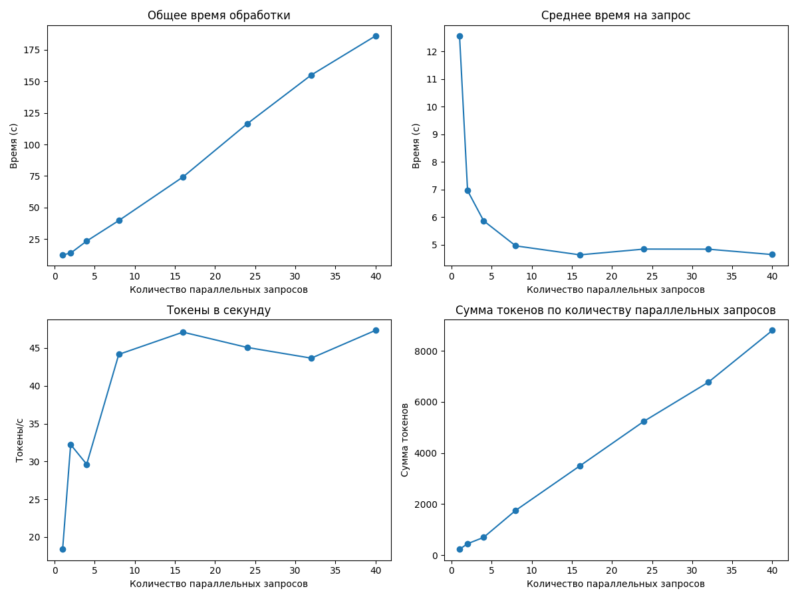

# Отчет о производительности

## Итоговые выводы по всем прогонам

### Оптимальные параметры для разного количества параллельных запросов

|   Количество параллельных запросов |   Оптимальный размер пакета |   Максимальная скорость (токены/сек) |
|-----------------------------------:|----------------------------:|-------------------------------------:|
|                                  4 |                          40 |                              232.02  |
|                                  6 |                          48 |                              224.558 |
|                                  8 |                          48 |                              204.785 |
|                                 10 |                          40 |                              238.537 |
|                                 12 |                          48 |                              254.737 |
|                                 15 |                          48 |                              260.276 |
|                                 18 |                          48 |                              230.437 |
|                                 20 |                          40 |                              293.325 |
|                                 22 |                          40 |                              278.999 |
|                                 24 |                          48 |                              300.842 |
|                                 30 |                          48 |                              233.584 |
|                                 35 |                          24 |                              286.761 |
|                                 40 |                          24 |                              287.555 |
|                                 50 |                          48 |                              117.812 |

### Наилучшая конфигурация для данного оборудования

- **Количество параллельных запросов:** 24
- **Оптимальный размер пакета:** 48
- **Скорость обработки:** 300.84 токенов/сек

---

## Детальные результаты по каждому прогону

### Результаты для 4 параллельных запросов

#### Таблица результатов

|   Количество параллельных запросов |   Общее время (с) |   Среднее время на запрос (с) |   Токены в секунду |   Сумма токенов |
|-----------------------------------:|------------------:|------------------------------:|-------------------:|----------------:|
|                                  1 |           6.81911 |                      6.81911  |            30.9424 |             211 |
|                                  2 |           4.60466 |                      2.30233  |            87.3029 |             402 |
|                                  4 |           6.44395 |                      1.61099  |           134.39   |             866 |
|                                  8 |           9.3083  |                      1.16354  |           179.087  |            1667 |
|                                 16 |          17.0775  |                      1.06735  |           209.339  |            3575 |
|                                 24 |          22.845   |                      0.951877 |           211.293  |            4827 |
|                                 32 |          30.1677  |                      0.94274  |           216.888  |            6543 |
|                                 40 |          35.2987  |                      0.882467 |           232.02   |            8190 |
|                                 48 |          43.0787  |                      0.897472 |           228.048  |            9824 |

**Оптимальный размер пакета:** 40

**Максимальная скорость обработки:** 232.02 токенов в секунду

---

### Результаты для 6 параллельных запросов

#### Таблица результатов

|   Количество параллельных запросов |   Общее время (с) |   Среднее время на запрос (с) |   Токены в секунду |   Сумма токенов |
|-----------------------------------:|------------------:|------------------------------:|-------------------:|----------------:|
|                                  1 |           4.62288 |                      4.62288  |            43.0468 |             199 |
|                                  2 |           4.35595 |                      2.17798  |            85.1708 |             371 |
|                                  4 |           5.71586 |                      1.42896  |           145.035  |             829 |
|                                  8 |           9.55928 |                      1.19491  |           173.549  |            1659 |
|                                 16 |          17.048   |                      1.0655   |           197.795  |            3372 |
|                                 24 |          23.0033  |                      0.958469 |           208.101  |            4787 |
|                                 32 |          30.669   |                      0.958408 |           221.885  |            6805 |
|                                 40 |          37.4506  |                      0.936266 |           222.533  |            8334 |
|                                 48 |          45.6498  |                      0.951036 |           224.558  |           10251 |

**Оптимальный размер пакета:** 48

**Максимальная скорость обработки:** 224.56 токенов в секунду

---

### Результаты для 8 параллельных запросов

#### Таблица результатов

|   Количество параллельных запросов |   Общее время (с) |   Среднее время на запрос (с) |   Токены в секунду |   Сумма токенов |
|-----------------------------------:|------------------:|------------------------------:|-------------------:|----------------:|
|                                  1 |           4.89666 |                      4.89666  |            44.3159 |             217 |
|                                  2 |           5.28526 |                      2.64263  |            88.5481 |             468 |
|                                  4 |           7.17526 |                      1.79382  |           115.675  |             830 |
|                                  8 |          10.1284  |                      1.26605  |           168.734  |            1709 |
|                                 16 |          17.9189  |                      1.11993  |           189.8    |            3401 |
|                                 24 |          24.8927  |                      1.0372   |           197.126  |            4907 |
|                                 32 |          33.5023  |                      1.04695  |           203.09   |            6804 |
|                                 40 |          39.3168  |                      0.982919 |           201.924  |            7939 |
|                                 48 |          50.4235  |                      1.05049  |           204.785  |           10326 |

**Оптимальный размер пакета:** 48

**Максимальная скорость обработки:** 204.79 токенов в секунду

---

### Результаты для 10 параллельных запросов

#### Таблица результатов

|   Количество параллельных запросов |   Общее время (с) |   Среднее время на запрос (с) |   Токены в секунду |   Сумма токенов |
|-----------------------------------:|------------------:|------------------------------:|-------------------:|----------------:|
|                                  1 |           4.69585 |                      4.69585  |            43.6556 |             205 |
|                                  2 |           4.48589 |                      2.24294  |            92.0665 |             413 |
|                                  4 |           6.20935 |                      1.55234  |           142.366  |             884 |
|                                  8 |           9.27941 |                      1.15993  |           180.292  |            1673 |
|                                 16 |          15.5549  |                      0.97218  |           209.645  |            3261 |
|                                 24 |          24.1199  |                      1.005    |           211.651  |            5105 |
|                                 32 |          28.8375  |                      0.901173 |           227.828  |            6570 |
|                                 40 |          35.7219  |                      0.893048 |           238.537  |            8521 |
|                                 48 |          43.8256  |                      0.913032 |           235.89   |           10338 |

**Оптимальный размер пакета:** 40

**Максимальная скорость обработки:** 238.54 токенов в секунду

---

### Результаты для 12 параллельных запросов

#### Таблица результатов

|   Количество параллельных запросов |   Общее время (с) |   Среднее время на запрос (с) |   Токены в секунду |   Сумма токенов |
|-----------------------------------:|------------------:|------------------------------:|-------------------:|----------------:|
|                                  1 |           5.47623 |                      5.47623  |            47.2953 |             259 |
|                                  2 |           4.69321 |                      2.34661  |            88.2125 |             414 |
|                                  4 |           6.28114 |                      1.57029  |           139.465  |             876 |
|                                  8 |           9.14754 |                      1.14344  |           172.833  |            1581 |
|                                 16 |          15.8451  |                      0.99032  |           208.771  |            3308 |
|                                 24 |          20.0383  |                      0.834931 |           252.466  |            5059 |
|                                 32 |          27.8088  |                      0.869026 |           239.564  |            6662 |
|                                 40 |          32.5661  |                      0.814152 |           248.111  |            8080 |
|                                 48 |          40.2219  |                      0.837955 |           254.737  |           10246 |

**Оптимальный размер пакета:** 48

**Максимальная скорость обработки:** 254.74 токенов в секунду

---

### Результаты для 15 параллельных запросов

#### Таблица результатов

|   Количество параллельных запросов |   Общее время (с) |   Среднее время на запрос (с) |   Токены в секунду |   Сумма токенов |
|-----------------------------------:|------------------:|------------------------------:|-------------------:|----------------:|
|                                  1 |           4.16173 |                      4.16173  |            40.3678 |             168 |
|                                  2 |           4.23673 |                      2.11837  |            92.9961 |             394 |
|                                  4 |           5.91224 |                      1.47806  |           140.556  |             831 |
|                                  8 |           8.67661 |                      1.08458  |           180.024  |            1562 |
|                                 16 |          15.8622  |                      0.991388 |           211.131  |            3349 |
|                                 24 |          21.9856  |                      0.916068 |           231.788  |            5096 |
|                                 32 |          26.4889  |                      0.827779 |           250.444  |            6634 |
|                                 40 |          33.5499  |                      0.838748 |           257.08   |            8625 |
|                                 48 |          38.8126  |                      0.808596 |           260.276  |           10102 |

**Оптимальный размер пакета:** 48

**Максимальная скорость обработки:** 260.28 токенов в секунду

---

### Результаты для 18 параллельных запросов

#### Таблица результатов

|   Количество параллельных запросов |   Общее время (с) |   Среднее время на запрос (с) |   Токены в секунду |   Сумма токенов |
|-----------------------------------:|------------------:|------------------------------:|-------------------:|----------------:|
|                                  1 |           4.50943 |                      4.50943  |            41.0252 |             185 |
|                                  2 |           4.89045 |                      2.44522  |            87.3131 |             427 |
|                                  4 |           5.61622 |                      1.40405  |           140.486  |             789 |
|                                  8 |           9.20737 |                      1.15092  |           186.155  |            1714 |
|                                 16 |          16.3984  |                      1.0249   |           205.63   |            3372 |
|                                 24 |          22.5641  |                      0.940169 |           214.367  |            4837 |
|                                 32 |          31.2496  |                      0.976551 |           221.667  |            6927 |
|                                 40 |          36.1784  |                      0.904461 |           226.24   |            8185 |
|                                 48 |          43.0053  |                      0.895944 |           230.437  |            9910 |

**Оптимальный размер пакета:** 48

**Максимальная скорость обработки:** 230.44 токенов в секунду

---

### Результаты для 20 параллельных запросов

#### Таблица результатов

|   Количество параллельных запросов |   Общее время (с) |   Среднее время на запрос (с) |   Токены в секунду |   Сумма токенов |
|-----------------------------------:|------------------:|------------------------------:|-------------------:|----------------:|
|                                  1 |           4.43216 |                      4.43216  |            40.8379 |             181 |
|                                  2 |           4.50171 |                      2.25085  |            89.5216 |             403 |
|                                  4 |           5.73043 |                      1.43261  |           134.719  |             772 |
|                                  8 |           8.82857 |                      1.10357  |           192.67   |            1701 |
|                                 16 |          13.229   |                      0.826815 |           243.782  |            3225 |
|                                 24 |          20.1802  |                      0.840841 |           241.871  |            4881 |
|                                 32 |          24.6992  |                      0.771849 |           265.92   |            6568 |
|                                 40 |          27.8769  |                      0.696923 |           293.325  |            8177 |
|                                 48 |          37.3154  |                      0.777405 |           270.612  |           10098 |

**Оптимальный размер пакета:** 40

**Максимальная скорость обработки:** 293.33 токенов в секунду

---

### Результаты для 22 параллельных запросов

#### Таблица результатов

|   Количество параллельных запросов |   Общее время (с) |   Среднее время на запрос (с) |   Токены в секунду |   Сумма токенов |
|-----------------------------------:|------------------:|------------------------------:|-------------------:|----------------:|
|                                  1 |           5.06812 |                      5.06812  |            45.579  |             231 |
|                                  2 |           4.37987 |                      2.18994  |            87.4455 |             383 |
|                                  4 |           5.51577 |                      1.37894  |           131.985  |             728 |
|                                  8 |           9.12309 |                      1.14039  |           182.394  |            1664 |
|                                 16 |          13.8833  |                      0.867708 |           236.111  |            3278 |
|                                 24 |          20.9575  |                      0.873229 |           243.254  |            5098 |
|                                 32 |          24.6918  |                      0.771618 |           266.566  |            6582 |
|                                 40 |          29.7886  |                      0.744716 |           278.999  |            8311 |
|                                 48 |          36.3292  |                      0.756858 |           276.967  |           10062 |

**Оптимальный размер пакета:** 40

**Максимальная скорость обработки:** 279.00 токенов в секунду

---

### Результаты для 24 параллельных запросов

#### Таблица результатов

|   Количество параллельных запросов |   Общее время (с) |   Среднее время на запрос (с) |   Токены в секунду |   Сумма токенов |
|-----------------------------------:|------------------:|------------------------------:|-------------------:|----------------:|
|                                  1 |           4.26879 |                      4.26879  |            40.761  |             174 |
|                                  2 |           4.28162 |                      2.14081  |            92.4884 |             396 |
|                                  4 |           6.66225 |                      1.66556  |           133.739  |             891 |
|                                  8 |           9.24027 |                      1.15503  |           177.809  |            1643 |
|                                 16 |          13.9401  |                      0.871257 |           239.812  |            3343 |
|                                 24 |          17.6909  |                      0.737119 |           284.215  |            5028 |
|                                 32 |          24.7007  |                      0.771897 |           263.474  |            6508 |
|                                 40 |          30.3261  |                      0.758152 |           272.505  |            8264 |
|                                 48 |          33.1702  |                      0.691046 |           300.842  |            9979 |

**Оптимальный размер пакета:** 48

**Максимальная скорость обработки:** 300.84 токенов в секунду

---

### Результаты для 30 параллельных запросов

#### Таблица результатов

|   Количество параллельных запросов |   Общее время (с) |   Среднее время на запрос (с) |   Токены в секунду |   Сумма токенов |
|-----------------------------------:|------------------:|------------------------------:|-------------------:|----------------:|
|                                  1 |           4.83747 |                      4.83747  |            44.238  |             214 |
|                                  2 |           4.52137 |                      2.26068  |            90.6805 |             410 |
|                                  4 |           6.17369 |                      1.54342  |           126.181  |             779 |
|                                  8 |           8.76026 |                      1.09503  |           180.817  |            1584 |
|                                 16 |          16.3018  |                      1.01887  |           202.492  |            3301 |
|                                 24 |          22.572   |                      0.940499 |           219.786  |            4961 |
|                                 32 |          28.8878  |                      0.902743 |           221.27   |            6392 |
|                                 40 |          36.098   |                      0.902451 |           232.617  |            8397 |
|                                 48 |          43.021   |                      0.896271 |           233.584  |           10049 |

**Оптимальный размер пакета:** 48

**Максимальная скорость обработки:** 233.58 токенов в секунду

---

### Результаты для 35 параллельных запросов

#### Таблица результатов

|   Количество параллельных запросов |   Общее время (с) |   Среднее время на запрос (с) |   Токены в секунду |   Сумма токенов |
|-----------------------------------:|------------------:|------------------------------:|-------------------:|----------------:|
|                                  1 |           4.896   |                      4.896    |            41.4624 |             203 |
|                                  2 |           5.07687 |                      2.53843  |            86.6676 |             440 |
|                                  4 |           5.26226 |                      1.31556  |           139.674  |             735 |
|                                  8 |           8.82726 |                      1.10341  |           183.409  |            1619 |
|                                 16 |          12.7899  |                      0.799369 |           246.21   |            3149 |
|                                 24 |          17.9104  |                      0.746265 |           286.761  |            5136 |
|                                 32 |          23.3169  |                      0.728652 |           282.714  |            6592 |
|                                 40 |          31.7144  |                      0.792861 |           255.814  |            8113 |
|                                 48 |          38.2756  |                      0.797409 |           257.422  |            9853 |

**Оптимальный размер пакета:** 24

**Максимальная скорость обработки:** 286.76 токенов в секунду

---

### Результаты для 40 параллельных запросов

#### Таблица результатов

|   Количество параллельных запросов |   Общее время (с) |   Среднее время на запрос (с) |   Токены в секунду |   Сумма токенов |
|-----------------------------------:|------------------:|------------------------------:|-------------------:|----------------:|
|                                  1 |           5.40169 |                      5.40169  |            43.1346 |             233 |
|                                  2 |           4.51282 |                      2.25641  |            89.3011 |             403 |
|                                  4 |           5.3457  |                      1.33643  |           137.307  |             734 |
|                                  8 |           9.37787 |                      1.17223  |           189.915  |            1781 |
|                                 16 |          13.8049  |                      0.862805 |           235.062  |            3245 |
|                                 24 |          17.3393  |                      0.722471 |           287.555  |            4986 |
|                                 32 |          23.8641  |                      0.745754 |           279.541  |            6671 |
|                                 40 |          30.3375  |                      0.758437 |           271.611  |            8240 |
|                                 48 |          38.1927  |                      0.79568  |           264.632  |           10107 |

**Оптимальный размер пакета:** 24

**Максимальная скорость обработки:** 287.55 токенов в секунду

---

### Результаты для 50 параллельных запросов

#### Таблица результатов

|   Количество параллельных запросов |   Общее время (с) |   Среднее время на запрос (с) |   Токены в секунду |   Сумма токенов |
|-----------------------------------:|------------------:|------------------------------:|-------------------:|----------------:|
|                                  1 |           8.29197 |                       8.29197 |            22.1902 |             184 |
|                                  2 |           9.13088 |                       4.56544 |            40.5218 |             370 |
|                                  4 |          22.4168  |                       5.6042  |            34.6169 |             776 |
|                                  8 |          36.9467  |                       4.61834 |            44.7672 |            1654 |
|                                 16 |          59.5163  |                       3.71977 |            55.8671 |            3325 |
|                                 24 |          84.0686  |                       3.50286 |            60.7956 |            5111 |
|                                 32 |          69.9187  |                       2.18496 |            96.9268 |            6777 |
|                                 40 |          72.7561  |                       1.8189  |           110.726  |            8056 |
|                                 48 |          83.7689  |                       1.74518 |           117.812  |            9869 |

**Оптимальный размер пакета:** 48

**Максимальная скорость обработки:** 117.81 токенов в секунду

---

