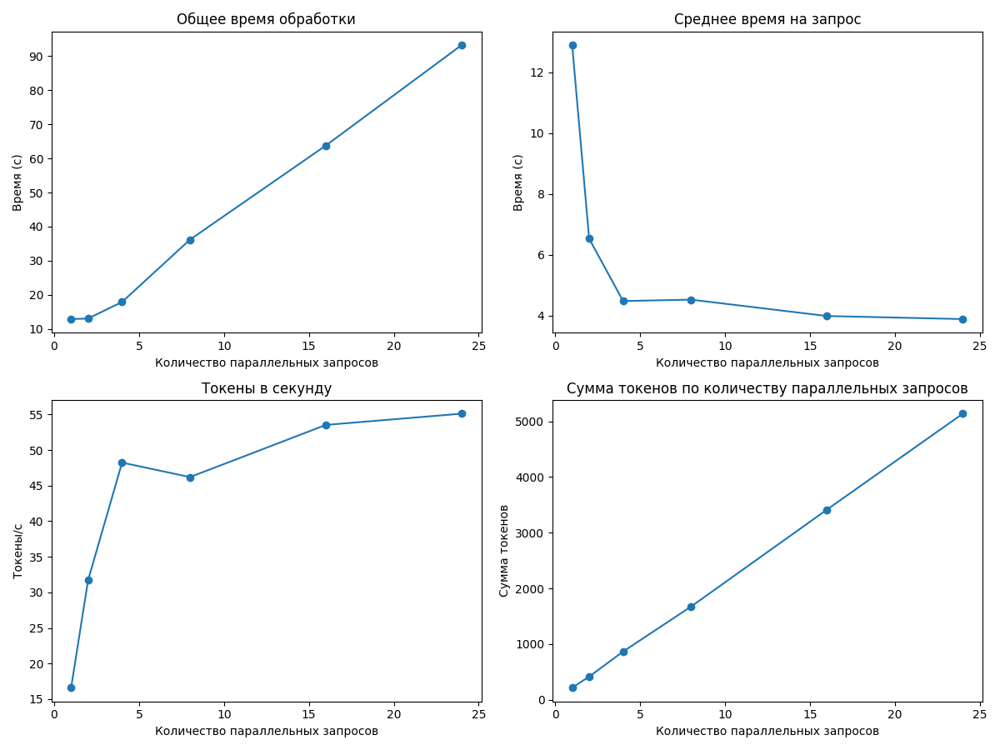
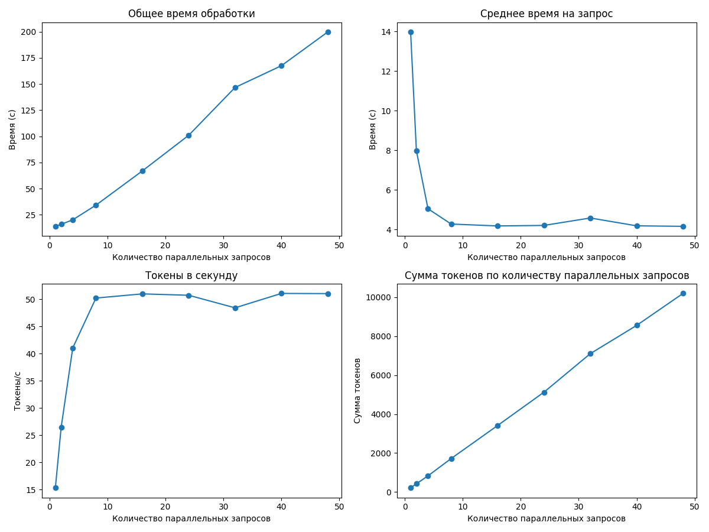

# Отчет о производительности

## Итоговые выводы по всем прогонам

### Оптимальные параметры для разного количества параллельных запросов

|   Количество workers |   Оптимальный размер пакета |   Максимальная скорость (токены/сек) |
|---------------------:|----------------------------:|-------------------------------------:|
|                    1 |                           4 |                              28.5308 |
|                    2 |                           8 |                              48.571  |
|                    4 |                          48 |                              85.4978 |
|                    6 |                          48 |                              56.0449 |
|                    8 |                          40 |                              51.0626 |
|                   10 |                          40 |                              39.3026 |
|                   12 |                          48 |                              31.8703 |
|                   15 |                          40 |                              22.9519 |

### Наилучшая конфигурация для данного оборудования

- **Количество workers:** 4
- **Оптимальный размер пакета:** 48
- **Скорость обработки:** 85.50 токенов/сек

---

## Детальные результаты по каждому прогону

### Результаты для 1 параллельных запросов

#### Таблица результатов

|   Количество параллельных запросов |   Общее время (с) |   Среднее время на запрос (с) |   Токены в секунду |   Сумма токенов |
|-----------------------------------:|------------------:|------------------------------:|-------------------:|----------------:|
|                                  1 |           10.1994 |                      10.1994  |            21.6679 |             221 |
|                                  2 |           14.8385 |                       7.41925 |            28.4395 |             422 |
|                                  4 |           30.3182 |                       7.57954 |            28.5308 |             865 |

**Оптимальный размер пакета:** 4

**Максимальная скорость обработки:** 28.53 токенов в секунду

---

### Результаты для 2 параллельных запросов

#### Таблица результатов

|   Количество параллельных запросов |   Общее время (с) |   Среднее время на запрос (с) |   Токены в секунду |   Сумма токенов |
|-----------------------------------:|------------------:|------------------------------:|-------------------:|----------------:|
|                                  1 |          10.2188  |                      10.2188  |            21.9203 |             224 |
|                                  2 |           9.23755 |                       4.61877 |            46.6574 |             431 |
|                                  4 |          17.8236  |                       4.45591 |            47.5773 |             848 |
|                                  8 |          35.4532  |                       4.43165 |            48.571  |            1722 |

**Оптимальный размер пакета:** 8

**Максимальная скорость обработки:** 48.57 токенов в секунду

---

### Результаты для 4 параллельных запросов

#### Таблица результатов

|   Количество параллельных запросов |   Общее время (с) |   Среднее время на запрос (с) |   Токены в секунду |   Сумма токенов |
|-----------------------------------:|------------------:|------------------------------:|-------------------:|----------------:|
|                                  1 |          12.5518  |                      12.5518  |            16.5714 |             208 |
|                                  2 |           9.22985 |                       4.61493 |            45.5045 |             420 |
|                                  4 |          10.575   |                       2.64374 |            81.0404 |             857 |
|                                  8 |          21.0894  |                       2.63617 |            83.2648 |            1756 |
|                                 16 |          40.7916  |                       2.54947 |            83.326  |            3399 |
|                                 24 |          59.8968  |                       2.4957  |            85.3468 |            5112 |
|                                 32 |          80.7979  |                       2.52493 |            84.2472 |            6807 |
|                                 40 |          99.7882  |                       2.49471 |            85.1503 |            8497 |
|                                 48 |         118.915   |                       2.4774  |            85.4978 |           10167 |

**Оптимальный размер пакета:** 48

**Максимальная скорость обработки:** 85.50 токенов в секунду

---

### Результаты для 6 параллельных запросов

#### Таблица результатов

|   Количество параллельных запросов |   Общее время (с) |   Среднее время на запрос (с) |   Токены в секунду |   Сумма токенов |
|-----------------------------------:|------------------:|------------------------------:|-------------------:|----------------:|
|                                  1 |           12.2957 |                      12.2957  |            17.1604 |             211 |
|                                  2 |           13.6147 |                       6.80733 |            31.2163 |             425 |
|                                  4 |           18.043  |                       4.51074 |            46.1676 |             833 |
|                                  8 |           37.8379 |                       4.72974 |            45.8006 |            1733 |
|                                 16 |           64.1416 |                       4.00885 |            52.8674 |            3391 |
|                                 24 |           91.6451 |                       3.81854 |            55.3658 |            5074 |
|                                 32 |          129.209  |                       4.03778 |            52.9994 |            6848 |
|                                 40 |          154.364  |                       3.85911 |            55.0257 |            8494 |
|                                 48 |          183.121  |                       3.81502 |            56.0449 |           10263 |

**Оптимальный размер пакета:** 48

**Максимальная скорость обработки:** 56.04 токенов в секунду

---

### Результаты для 8 параллельных запросов

#### Таблица результатов

|   Количество параллельных запросов |   Общее время (с) |   Среднее время на запрос (с) |   Токены в секунду |   Сумма токенов |
|-----------------------------------:|------------------:|------------------------------:|-------------------:|----------------:|
|                                  1 |           13.9819 |                      13.9819  |            15.3055 |             214 |
|                                  2 |           15.9569 |                       7.97843 |            26.4463 |             422 |
|                                  4 |           20.1988 |                       5.04971 |            41.042  |             829 |
|                                  8 |           34.2157 |                       4.27696 |            50.2109 |            1718 |
|                                 16 |           66.9088 |                       4.1818  |            50.9799 |            3411 |
|                                 24 |          100.977  |                       4.20737 |            50.7245 |            5122 |
|                                 32 |          146.669  |                       4.5834  |            48.4152 |            7101 |
|                                 40 |          167.481  |                       4.18702 |            51.0626 |            8552 |
|                                 48 |          199.756  |                       4.16159 |            51.0271 |           10193 |

**Оптимальный размер пакета:** 40

**Максимальная скорость обработки:** 51.06 токенов в секунду

---

### Результаты для 10 параллельных запросов

#### Таблица результатов

|   Количество параллельных запросов |   Общее время (с) |   Среднее время на запрос (с) |   Токены в секунду |   Сумма токенов |
|-----------------------------------:|------------------:|------------------------------:|-------------------:|----------------:|
|                                  1 |           15.3089 |                      15.3089  |            13.7175 |             210 |
|                                  2 |           20.3296 |                      10.1648  |            20.4628 |             416 |
|                                  4 |           29.0334 |                       7.25834 |            29.4833 |             856 |
|                                  8 |           48.8172 |                       6.10215 |            34.7419 |            1696 |
|                                 16 |           92.9922 |                       5.81201 |            36.6482 |            3408 |
|                                 24 |          137.552  |                       5.73133 |            37.0551 |            5097 |
|                                 32 |          184.017  |                       5.75053 |            36.8445 |            6780 |
|                                 40 |          215.202  |                       5.38005 |            39.3026 |            8458 |
|                                 48 |          262.531  |                       5.46939 |            38.5479 |           10120 |

**Оптимальный размер пакета:** 40

**Максимальная скорость обработки:** 39.30 токенов в секунду

---

### Результаты для 12 параллельных запросов

#### Таблица результатов

|   Количество параллельных запросов |   Общее время (с) |   Среднее время на запрос (с) |   Токены в секунду |   Сумма токенов |
|-----------------------------------:|------------------:|------------------------------:|-------------------:|----------------:|
|                                  1 |           17.8981 |                      17.8981  |            12.0124 |             215 |
|                                  2 |           28.4375 |                      14.2188  |            14.9099 |             424 |
|                                  4 |           39.1095 |                       9.77738 |            21.6571 |             847 |
|                                  8 |           60.8652 |                       7.60815 |            27.9141 |            1699 |
|                                 16 |          123.253  |                       7.70333 |            27.5855 |            3400 |
|                                 24 |          162.716  |                       6.77983 |            31.1463 |            5068 |
|                                 32 |          222.851  |                       6.96408 |            30.5361 |            6805 |
|                                 40 |          283.183  |                       7.07958 |            30.0053 |            8497 |
|                                 48 |          320.267  |                       6.67222 |            31.8703 |           10207 |

**Оптимальный размер пакета:** 48

**Максимальная скорость обработки:** 31.87 токенов в секунду

---

### Результаты для 15 параллельных запросов

#### Таблица результатов

|   Количество параллельных запросов |   Общее время (с) |   Среднее время на запрос (с) |   Токены в секунду |   Сумма токенов |
|-----------------------------------:|------------------:|------------------------------:|-------------------:|----------------:|
|                                  1 |           20.5243 |                      20.5243  |            10.4267 |             214 |
|                                  2 |           41.7531 |                      20.8765  |            10.0591 |             420 |
|                                  4 |           55.4379 |                      13.8595  |            14.9176 |             827 |
|                                  8 |           89.0993 |                      11.1374  |            19.2706 |            1717 |
|                                 16 |          158.943  |                       9.93394 |            21.5549 |            3426 |
|                                 24 |          232.027  |                       9.66779 |            22.144  |            5138 |
|                                 32 |          312.401  |                       9.76255 |            21.7028 |            6780 |
|                                 40 |          370.993  |                       9.27483 |            22.9519 |            8515 |
|                                 48 |          449.017  |                       9.35453 |            22.6005 |           10148 |

**Оптимальный размер пакета:** 40

**Максимальная скорость обработки:** 22.95 токенов в секунду

---

