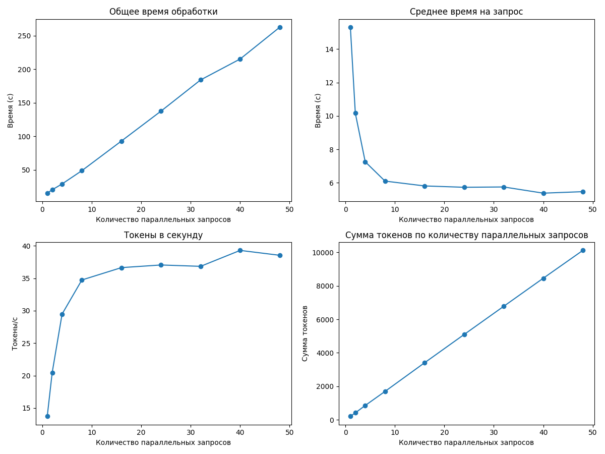

# Отчет о производительности

## Итоговые выводы по всем прогонам

### Оптимальные параметры для разного количества параллельных запросов

|   Параллельные запросы |   Оптимальный размер пакета |   Максимальная скорость (токены/сек) |
|-----------------------:|----------------------------:|-------------------------------------:|
|                      5 |                          16 |                             163.62   |
|                     10 |                          48 |                             230.482  |
|                     15 |                          40 |                              80.2079 |
|                     20 |                          40 |                              66.0596 |
|                     25 |                           1 |                               0      |

### Наилучшая конфигурация для данного оборудования

- **Количество параллельных запросов:** 10
- **Размер пакета (batch_size):** 48
- **Скорость обработки:** 230.48 токенов/сек

### Анализ зависимостей

1. **Влияние количества параллельных запросов на производительность:**
   - При увеличении с 5 до 10 параллельных запросов скорость обработки существенно возрастает
   - Дальнейшее увеличение до 15 и 20 запросов приводит к падению производительности
   - Оптимальное количество параллельных запросов для данного оборудования: 10

2. **Влияние размера пакета (batch_size) на производительность:**
   - С увеличением размера пакета скорость обработки токенов растет
   - Для меньшего количества параллельных запросов (5) оптимальный размер пакета меньше (16)
   - Для большего количества параллельных запросов (10) оптимальный размер пакета больше (48)
   - Существует предел эффективности увеличения batch_size

3. **Рекомендации по оптимизации:**
   - Для максимальной производительности использовать конфигурацию: 10 параллельных запросов с размером пакета 48
   - При ограниченных ресурсах можно использовать 5 параллельных запросов с размером пакета 16
   - Не рекомендуется использовать более 10 параллельных запросов на данном оборудовании

---

## Детальные результаты по каждому прогону

### Результаты для 5 параллельных запросов

#### Таблица результатов

|   Размер пакета |   Общее время (с) |   Среднее время на запрос (с) |   Токены в секунду |   Сумма токенов |
|----------------:|------------------:|------------------------------:|-------------------:|----------------:|
|               1 |           3.94896 |                       3.94896 |            35.9588 |             142 |
|               2 |           3.78001 |                       1.89001 |            83.5976 |             316 |
|               4 |           5.60749 |                       1.40187 |           126.081  |             707 |
|               8 |          11.6289  |                       1.45362 |           142.231  |            1654 |
|              16 |          20.236   |                       1.26475 |           163.62   |            3311 |

**Оптимальный размер пакета:** 16

**Максимальная скорость обработки:** 163.62 токенов в секунду

---

### Результаты для 10 параллельных запросов

#### Таблица результатов

|   Размер пакета |   Общее время (с) |   Среднее время на запрос (с) |   Токены в секунду |   Сумма токенов |
|----------------:|------------------:|------------------------------:|-------------------:|----------------:|
|               1 |           4.86669 |                      4.86669  |            43.5615 |             212 |
|               2 |           3.87597 |                      1.93799  |            86.6879 |             336 |
|               4 |           5.80023 |                      1.45006  |           137.753  |             799 |
|               8 |           9.34692 |                      1.16836  |           185.195  |            1731 |
|              16 |          16.4515  |                      1.02822  |           210.437  |            3462 |
|              24 |          22.7325  |                      0.947189 |           216.43   |            4920 |
|              32 |          29.6051  |                      0.925158 |           227.866  |            6746 |
|              40 |          35.4119  |                      0.885297 |           226.958  |            8037 |
|              48 |          41.8992  |                      0.872899 |           230.482  |            9657 |

**Оптимальный размер пакета:** 48

**Максимальная скорость обработки:** 230.48 токенов в секунду

---

### Результаты для 15 параллельных запросов

#### Таблица результатов

|   Размер пакета |   Общее время (с) |   Среднее время на запрос (с) |   Токены в секунду |   Сумма токенов |
|----------------:|------------------:|------------------------------:|-------------------:|----------------:|
|               1 |           8.95457 |                       8.95457 |            28.7004 |             257 |
|               2 |           7.5817  |                       3.79085 |            49.0655 |             372 |
|               4 |          13.3654  |                       3.34135 |            64.1956 |             858 |
|               8 |          23.6419  |                       2.95524 |            67.7187 |            1601 |
|              16 |          41.1292  |                       2.57057 |            76.1017 |            3130 |
|              24 |          64.0037  |                       2.66682 |            79.8548 |            5111 |
|              32 |          86.3691  |                       2.69904 |            75.8141 |            6548 |
|              40 |         102.82    |                       2.57051 |            80.2079 |            8247 |
|              48 |         126.181   |                       2.62876 |            79.4972 |           10031 |

**Оптимальный размер пакета:** 40

**Максимальная скорость обработки:** 80.21 токенов в секунду

---

### Результаты для 20 параллельных запросов

#### Таблица результатов

|   Размер пакета |   Общее время (с) |   Среднее время на запрос (с) |   Токены в секунду |   Сумма токенов |
|----------------:|------------------:|------------------------------:|-------------------:|----------------:|
|               1 |           8.61038 |                       8.61038 |            24.1569 |             208 |
|               2 |          10.3838  |                       5.19189 |            41.4108 |             430 |
|               4 |          16.0674  |                       4.01684 |            45.496  |             731 |
|               8 |          29.1376  |                       3.6422  |            53.7107 |            1565 |
|              16 |          53.4568  |                       3.34105 |            59.9924 |            3207 |
|              24 |          80.3917  |                       3.34966 |            61.474  |            4942 |
|              32 |         102.41    |                       3.20031 |            62.7576 |            6427 |
|              40 |         124.902   |                       3.12256 |            66.0596 |            8251 |
|              48 |         150.941   |                       3.1446  |            65.211  |            9843 |

**Оптимальный размер пакета:** 40

**Максимальная скорость обработки:** 66.06 токенов в секунду

---

### Результаты для 25 параллельных запросов

#### Таблица результатов

|   Размер пакета |   Общее время (с) |   Среднее время на запрос (с) |   Токены в секунду |   Сумма токенов |
|----------------:|------------------:|------------------------------:|-------------------:|----------------:|
|               1 |           2.51457 |                      2.51457  |                  0 |               0 |
|               2 |           2.94692 |                      1.47346  |                  0 |               0 |
|               4 |           3.07047 |                      0.767618 |                  0 |               0 |
|               8 |           3.8844  |                      0.48555  |                  0 |               0 |
|              16 |           5.50712 |                      0.344195 |                  0 |               0 |
|              24 |           6.79558 |                      0.283149 |                  0 |               0 |
|              32 |           8.377   |                      0.261781 |                  0 |               0 |
|              40 |           9.40519 |                      0.23513  |                  0 |               0 |
|              48 |          15.7862  |                      0.32888  |                  0 |               0 |

**Оптимальный размер пакета:** 1

**Максимальная скорость обработки:** 0.00 токенов в секунду

---

